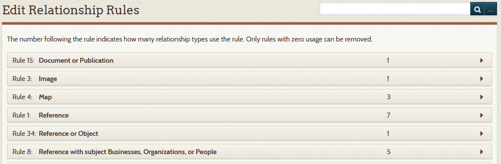
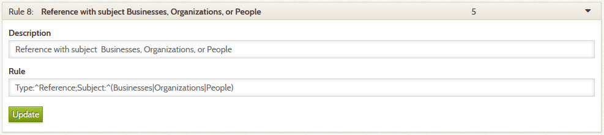

# Relationship Rules

The validity of a relationship between any two items is enforced by rules that ensure that each item
has the right **_Type_** and **_Subject_** for the relationship. For example, only a person can captain a boat.
Therefore, in the *captain of* relationship, the first item must be a person and the second must be
a vessel. When the direction of this relationship is applied in reverse, the first item must be a
vessel which is captained by a person.

Though archivists are careful to properly enter data into the collection, it’s easy to make mistakes
and so the Digital Archive software catches and prevents them whenever possible. When an archivist
[adds a relationship](/archivist/add-relationship/) between two items, the software checks the rules
for that particular [relationship type](/relationships/relationship-types/) and only allows the
relationship to be added if both items satisfy the relationship type’s rules. If the validation
fails, the software tells the archivist what is wrong and what correction is necessary.

Rules help ensure data integrity by preventing unintended relationships from creeping into the collection
by mistake or due to improper understanding of how two items relate to each other. While use of rules is
not required, they make the archivist’s life easier and provide end users with more reliable information.

**This page explains relationship rules and how you define them.**

---

!!! Note "Advanced Topic"
    Defining relationship rules is something an organization does once initially
    and then extends over time. It is not an everyday activity. The instructions
    that follow are for a Digital Archive administrator who has a solid understanding of
    [The Archive Relational Model](/relationships/archive-relational-model) and is
    comfortable with technical explanations. **This information is not intended for 
    users or for archivists**.

## Rule editor

To add or edit a relationship rule:

-   Click the **_Relationships_** button in the left admin menu
-   On the **_Relationships_** page, click the **_Edit Relationship Rules_** button
-   You will see a page similar to the one shown below

Rules appear in alphabetical order to make them easier to find in the list.
That’s why the rule Id numbers are not in numerical order.

!!! note ""
    A new installation of the [AvantRelationships plugin](/plugins/avantrelationships) only provides
    a small number of commonly used relationship rules. As such, your installation might not have
    some of the rules shown in the screenshots in this documentation.

### Add, edit, or remove a relationship rule

To add a new relationship rule, click the **_Add Relationship Rule_** button located at the bottom of
the page **_Edit Relationship Rules_** page (the button is not shown in the screenshot above). To edit an existing
relationship rule, click the arrow icon to the far right of the rule. This opens a panel that lets you
make changes. If the relationship rule is not in use, a **_Remove_** button will appear in the panel.
You can only remove a relationship rule that is not in use.

The screenshot below shows what you see when you edit a rule.

### Rule description

The description is a concise statement that summarizes the rule so that you’ll know what the rule is
for when choosing to use it as part of the definition of a [relationship type](/relationships/relationship-types/).
The description also appears in error messages when rule validation fails. When adding or editing a rule’s
description, make sure the words you choose are consistent with the descriptions for existing rules.

### Rule syntax and semantics

Specifying a rule can be a bit tricky because you must do so precisely using the proper metadata fields names
like **_Type_** and **_Subject_** as well and correct syntax for Regular Expressions as explained in the
[MySQL documentation](https://dev.mysql.com/doc/refman/8.0/en/regexp.html); however, 
if you look at existing rules, you’ll notice that they all follow the same pattern and so you should be
able to or create a new rule, by carefully following the pattern carefully used in existing rules.

This section explains relationship rules in detail. The screenshot from above is repeated below for convenience
while reading this section.

In the example above, the rule is saying that the item to which the rule applies must have a **_Type_** field value
that starts with `Reference` and a **_Subject_** field value that starts with either `Businesses` or `Organizations`
 or `People`.

The pattern for a rule has the following syntax and semantics:

-   A rule consists of a semicolon-separated list of name/pattern pairs. The example above has these two pairs:
    -   `Type:^Reference`
    -   `Subject:^(Businesses|Organizations|People)`
-   Each pair consists of metadata field name followed by a colon followed by a pattern
    (with no spaces in between). In the example above:
    -   The 1st pair's field name is `Type` and the pattern is `^Reference`
    -   The 2nd pair's field name is `Subject` and the pattern is `^(Businesses|Organizations|People)`
-   The pattern is a MySQL Regular Expression (REGEX).
    -   The `^` means match the beginning of a string.
    -   The vertical-bar-separated list in parenthesis means match any of the values.
-   The name/pattern pairs are ANDed together and the vertical-bar-separated values are ORed together.
    Thus the rule in the example means that the item to which the rule applies must have:
    -   A **_Type_** field value that starts with the word `Reference` AND it must have
    -   A **_Subject_** field value that starts with `Businesses` OR `Organizations` OR `People`
-   The [AvantRelationships](/plugins/avantrelationships) plugin will translate this example
    into a SQL WHERE clause like this:
        `(_advanced_0.text REGEXP '^Reference' AND _advanced_1.text REGEXP '^People')`
-   In the WHERE clause,  `_advanced_0.text` is the value of the item’s **_Type_** field value and
    `_advanced_1.text` is the value of the item’s **_Subject_** field value.
-   The SQL for a rule gets executed when you add a relationship to an item, or update an existing
    relationship. This is done to ensure that the relationship is valid between that item and the related item.
    The Digital Archive software validates all of an item’s relationships whenever you save the item.
    This protects against the situation where a relationship becomes invalid because you 
    edited one of the item’s fields, e.g. its **_Type_** or **_Subject_**, in a way
    that no longer satisfies a relationship’s rules. That's why you'll sometimes get an error when
    you save an item that previously had no errors when saved. 
