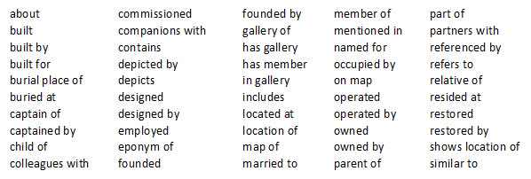
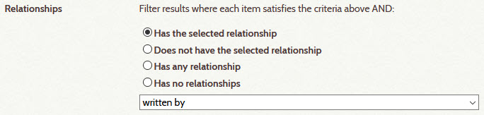
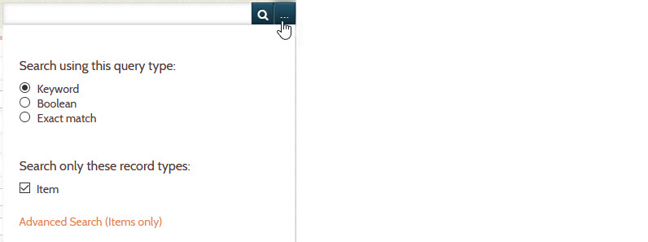
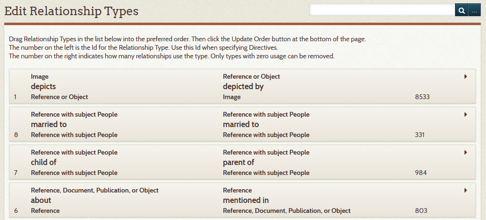
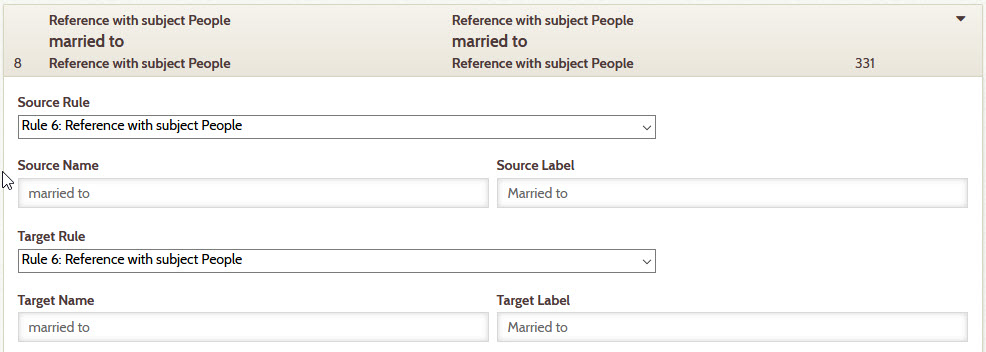
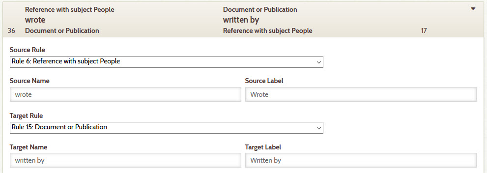
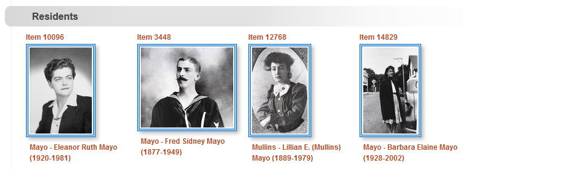
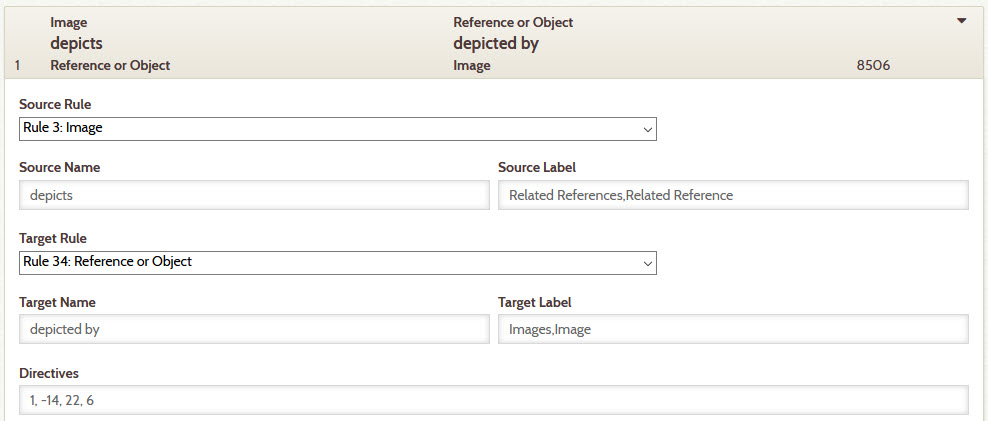
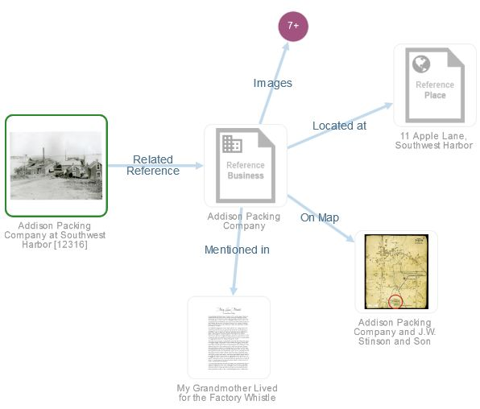
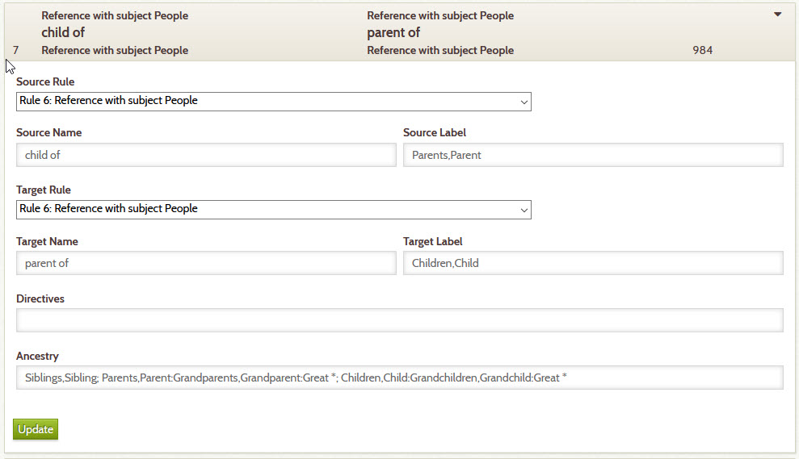

# Relationship Types

A relationship's type indicates the nature of the association between two items
Below are the relationship types for a collection that
has a lot of information about people, organizations, houses, and boats. The choice of
relationship types for a different collection could be different.



**This page explains relationship types and how you define them.**

---

!!! Note "Advanced Topic"
    Defining relationship types is something an organization does once initially
    and then extends over time. It is not an everyday activity. The instructions
    that follow are for a Digital Archive administrator who has a solid understanding of
    [The Archive Relational Model](/relationships/archive-relational-model) and is
    comfortable with technical explanations. **This information is not intended for 
    users or for archivists**.

## Relationship semantics

An item in a Digital Archive collection can have a relationship with one or more other items.
A relationship's type indicates how two items are related. For instance, a relationship can exist
between two people (Mary is *married to* John), between a person and a thing (John *designed* a house),
between a thing and a place (John’s house was *located at* a village) and so on. To only say that
Mary has a relationship with John, or that John has a relationship with a house, without stating
the nature of the relationships, would not tell the whole story.

The semantics of a relationship must make sense with the two items it relates. For example, only people
can be *married to* each other. A house can be *designed by* a person or a business, but not by a
place or another house. A place can be the *location of* a house, but a house cannot be located
in an event or in a person. Which kinds of items are semantically compatible with a specific relationship type
is determined by [relationship rules](/relationships/relationship-rules/).

## Relationship direction

A relationship can be either uni-directional or bi-directional. A bi-directional relationship
reads the same in both directions. For example, John *is married* to Mary and Mary *is married*
to John. The *married to* relationship type accurately describes the relationship in either direction.

A uni-directional relationship reads one way in the forward direction and another way in the reverse
direction. For example, John *designed* a house and the house was *designed by* John. These phrases
sound right because the order of the items (John and the house) matches the direction of the relationship. If the
direction was wrong, the relationship would be non-nonsensical such as
a house that *designed* John, and John being *designed by* a house. Fortunately, the
[rules](/relationships/relationship-rules/) for a
relationship’s type ensure that an archivist can only add a relationship in the correct direction.

## Genealogical relationships

The Digital Archive recognizes [genealogical relationships](/relationships/kinds-of-relationships/#genealogical-relationships).
To relate family members, an archivist only ever has to choose *one* of the relationship types below to indicate how
two family members are related to each other:

-   *child of*
-   *parent of*

From just these two relationships, the Digital Archive software automatically determines a person's ancestors,
descendants, and siblings. As such there is no need for relationship types like *grandparent of* or
*grandchild of* or *sibling of*. The Digital Archive does not determine cousins. You can use the general purpose
*relative of* relationship for cousins.

## Searching for relationships

You can search for items that have a specific type of relationship by using the **_Relationships_**
option that appears at the bottom of the Omeka **_Search Items_** page shown in the screenshot below.
The results will appear on the Omeka **_Browse Items_** page.



To get to the Omeka **_Search Items_** page, go to the
[**_Avant Dashboard_**](/archivist/logging-in/#avant-dashboard) page and click the ellipses located to
the right of the admin search box. On the panel that drops down, click the
**_Advanced Search (Items only)_** link. The screenshot below shows the ellipses and the panel.



## Relationship editor

To add or edit a relationship type:

-   Click the **_Relationships_** button in the left admin menu
-   On the **_Relationships_** page, click the **_Edit Relationship Types_** button
-   You will see a page similar to the one shown below



!!! note ""
    A new installation of the [AvantRelationships plugin](/plugins/avantrelationships) only provides
    a small number of commonly used relationship types. As such, your installation might not have
    some of the types shown in the screenshots in this documentation.

### Order

The relationship types in the screenshot above appear in the order in which you want users to see groups of
related items when viewing an item page.
You can drag the rows up or down to change the order and then click the **_Update Order_** button
that will appear at the bottom of the page.

### Add, edit, or remove a relationship type

To add a new relationship type, click the **_Add Relationship Type_** button located at the bottom of the
**_Edit Relationship Types_** page (the button is not shown in the screenshot above). To edit an existing relationship
type, click the arrow icon to the far right of the type. This opens a panel that lets you make changes.
If the relationship type is not in use, a **_Remove_** button
will appear in the panel. You can only remove a relationship type that is not in use.

## Editing a relationship type

### Bi-directional type

A bi-directional relationship reads the same in both directions.



The *married to* type is simple because the relationship is bi-directional and therefore
both items in the relationship use the same name, label, and rule. The relationship rules for this
relationship require that both items have a type of `Reference` and a subject of `People`.

The only way to make this type even simpler would be to not use source and target rules, but then
an archivist could inadvertently allow a man be married to a boat, or a boat to be married to a house,
and so on. **Do not create relationship types that have no rules** unless you have a very good reason
for doing so.

### Source and target

The terms *source* and *target* refer to the two items that a relationship relates. The distinction is
necessary when the [relationship direction](#relationship-direction) is uni-directional and therefore
the order of the two items matters. The source item is the first item in the forward direction. The
target item is the second item in the forward direction. For an inverse relationship, the direction is
reversed and thus the source item is the second item and the target item is the first item.

The importance of and distinction between source and target should make more sense after discussing
the screenshot below which shows the *wrote / written by* relationship. The
terms source and target are used only when editing a relationship and at no other time. Archivists
need not become familiar with this terminology unless they will be adding or editing relationship types.

### Uni-directional type

A uni-directional relationship reads one way in the forward direction and another way in the reverse
direction.

A relationship type that is uni-directional uses separate *labels* for its source and target. The example
below is for the *wrote / written by* relationship type which is just one type, but with two
different labels *wrote* and *written by*. From an archivist's perspective, this one type will seem
like two different types which is exactly the intention.



The definition above says that the source item must be a person that wrote a document or publication.
In the inverse direction it says that the target item must be a document or publication written by a person.

What this means in practice is that an archivist can edit a person item and add a *wrote* relationship to
a document or publication item. Or they can edit a document or publication item and set a *written by* relationship
to a person item.

### Names and Labels

#### Names
Continuing with the example for the *wrote / written by* relationship type, the **_Source Name_**
and the **_Target Name_** are what appear in the relationship type dropdown list that an archivist
chooses from when they [add a relationship](/archivist/add-relationship/) between two items.
The dropdown list will display the source and target names of every uni-directional type. For bi-directional
types, it will display the source which is the same as the target.
For example, the dropdown will contain *wrote*, *written by*, *married to* plus all other types
that you have defined for the site.

Your choice for these names should be based on what you think will make the most sense to
an archivist when they are choosing from the list. End users don’t see the source and target names.
What they see are the source and target labels.

#### Labels
The source and target labels are what appear to users as the text in the gray bars of related item groups when
[viewing related items](/user/viewing-related-items/). The labels also appear on the arrows in
[visualizations](/user/viewing-related-items/#visualization). In the example above for the *wrote / written by* relationship, except for
the letter casing, the names and labels are the same. However, for other types
they can be different. For example, in the *resided at / occupied by* type, the target name is
*occupied by*, but the target label is `Residents,Resident`. The screenshot below shows a group
of four Reference Items for people who *resided at* the same house.



When English grammar dictates the use of different spelling for multiple items than for a single
item, you specify the plural spelling followed by a comma and then the singular spelling.
In the example above, the Digital Archive software found multiple residents and used the group name 
`Residents`, but if there was only one, the group name would have been `Resident`.

## Advanced Features

Most relationship types are defined by specifying only names, labels, and rules, but to utilize the
software’s capabilities for displaying indirect relationships, and genealogies, you need to specify
 *directives* for certain relationships.

### Directives

The **_Directives_** field lets you specify which
[indirect relationships](/relationships/kinds-of-relationships/#indirect-relationships)
the software will recognize and display to users. The screenshot below shows directives
for the *depicts* relationship type. The rest of this section uses *depicts* as an example,
but you can specify directives for other relationship types.



The comma-separated numbers in the **_Directives_** field are relationship type Ids:

-   1 is the Id for *depicts / depicted by*
-   -14 is the Id for *located at / location of* 
-   22 is the Id for *shows location / on map*
-   6 is the Id for *about / mentioned in*

A positive Id indicates the relationship type’s forward direction. A negative Id indicates the
relationship type’s reverse direction.

In this example, the directives apply when viewing a source item that has a *depicts* relationship to
a target item. In the explanation that follows, each of those source items is 
[directly related](/relationships/kinds-of-relationships/#direct-relationships) to the target item.
The software applies the directives to each direct relationship as follows:

1.  Get the item for the target of the direct relationship.
2.  For each positive Id in the Directives:
    -   Find every relationship in the database where the relationship type Id is the same as the
        directive Id and the target of that relationship is the directly related item.
    -   For each of those relationships, add the source item of the relationship to the list
        of indirectly related items.
3.  For each negative Id in the Directives:
    -   Find every relationship in the database where the relationship type Id is the same as the
        directive Id and the source of that relationship is the directly related item.
    -   For each of those relationships, add the target item of the relationship to the list of
        indirectly related items.
4.  Display the indirectly related items, grouped by the relationship types represented by the
    Ids in the Directives.

To better understand the algorithm above, consider item 12316 titled *Addison Packing Company at Southwest Harbor*.
The item, a photograph of a factory, has a *depicts* relationship to item 13087 which is the Reference Item
for the factory. That Reference Item has direct relationships to several other items. The screenshot below
shows just four of the Reference Item’s direct relationships which in turn are indirect relationships to the photograph.



The idea behind [indirect relationships](/relationships/kinds-of-relationships/#indirect-relationships)
is to provide context for the item a user is viewing. The purpose of directives is to specify which
indirect relationships the software displays so that the user is not presented with an overwhelming
amount of information. If the user wants to know more about the factory than is shown above, they can click
on the graphic for the factory Reference Item to view that item and all of its relationships.

The algorithm for applying the Directives `1, -14, 22, 6` results in the visualization above showing
relationship types 1 *Images*, 14 *Located At*, 22 *On Map*, and 6 *Mentioned in*. The italicized 
words are the label values for the relationship types. Explained another way,
the directives caused the software to:

-   1: Find all other images (in addition to item 12316) that depict the factory.
-   -14: Find a Reference item for the location of the factory.
-   22: Find a Map showing where the factory was located.
-   6: Find a document that tells a story about the factory.

In the relationships for Ids 1, 22, and 6, the factory Reference Item in the center of the visualization
is the target of the relationship from the related item to the factory Reference Item. In the relationship
for Id -14, the factory Reference Item is the source of the relationship from the factory Reference Item
to the Apple Lane Reference Item. Specification of a negative Id (-14) instead of a positive Id (14) is
what tells the software to look for inverse indirect relationships.

Typically a Digital Archive site specifies directives only for the *depicts* and *shows location of* relationship
types. The *depicts* relationship is used to relate images and *shows location of* is used to relate maps.
Maps are similar to images in that maps depict places. In practice, these are the cases where indirect
relationships make most sense, but you may find other useful cases in your collection.

### Ancestry

The Ancestry value lets you specify how the software displays
[genealogical relationships](/relationships/relationship-types/#genealogical-relationships).
The screenshot below shows the specification of an ancestry value for the *child of* relationship.
This relationship is used with people, though in another collection,  a *child of* relationship
could be used with other types of items in a non-genealogical hierarchy.



The ancestry specification applies when viewing an item that has a *child of* relationship to one
or more items, for example, a mother and/or a father. When adding this relationship, an archivist
can choose either *child of* or *parent of* depending on which item they are working with (the child or the parent).

The software applies the ancestry to the source item in a *child of* relationship by finding the source item’s:

-   Siblings
-   Ancestors
-   Descendants

**Siblings** are items that have a *child of* relationship to the same parent items as the item being
viewed. For instance, if the user is viewing Louise who is a child of Frank, then every other item in
the collection that is also a *child of* Frank is a sibling of Louise. The logic treats half brothers
and half sisters as siblings. For example, if Louise is Frank’s daughter from his first marriage, but
Frank had another child, Carol, with his second wife, then Louise and Carol are siblings by virtue of
having the same father.

**Ancestors** are the items in the chains of *child of* relationships from the item being viewed to that
item’s parents, grandparents, and so on until the chains end. The plural “chains” considers that one
person can have two parents, and each parent can have two parents and so on. The software follows
these ancestor chains upward until coming to the end of each chain.

**Descendants** are the items in the chains of *parent of* relationships (the inverse of the *child of*
relationship) from the item being viewed to that item’s children, grandchildren, and so on until the
chains end. The plural “chains” considers that one person can have multiple children, and each child
can have multiple children and so on. The software follows these descendant chains downward until coming
to the end of each chain.

By specifying a value in the **_Ancestory_** field, you tell the software to apply its ancestry logic to the
*child of* relationship. The syntax of the value is what dictates the actual words the software will use to label
the related items groups when displaying siblings, ancestors, and descendants. The syntax rules are
explained below. The ancestry specification in the example above is provided below on three lines
for easier reading.

```
Siblings,Sibling;
Parents,Parent:Grandparents,Grandparent:Great *;
Children,Child:Grandchildren,Grandchild:Great *
```

Here is what the ancestry specification means:

-   The Ancestry specification is divided into three semicolon-separated groups for siblings, ancestors,
    and descendants.
-   Within the ancestors and descendants groups are colon-separated levels containing one word pair for
    each level. The siblings group has just a single word pair.
-   The comma-separated word pairs are the plural and singular versions respectively of a word, for example
    `Grandchildren` is the plural of `Grandchild`.
-   Spaces are allowed before and/or after the semicolons and colons.
-   You can specify terms for as many ancestor or descendant levels as you like. The example shows just
    three levels `Parent`, `Grandparent`, and `Great *` where the asterisk means to use the last term `Great `
    as a prefix for levels four and above. The software automatically applies the prefix to the term used
    for the previous level. For example, it prefixes level 2’s `Grandparent` with `Great ` to get
    `Great Grandparent` at level 3, and prefixes level 3 to get `Great Great Grandparent` at level 4 and so on.
-   The terms in this example are ones commonly used in English genealogies, but you can use any words you prefer.

