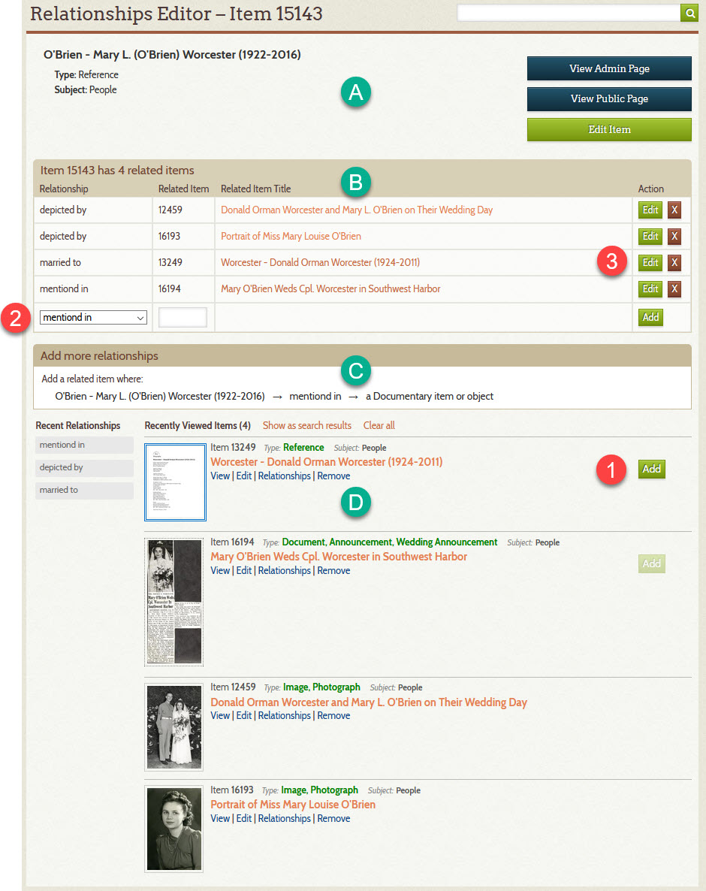

# Relationships Editor

The **_Relationships Editor_** page is where an archivist goes to add, edit, or remove related items.
You get to it by clicking an item's [quick access](/archivist/special-features-archivist/#quick-access-links)
**_Relationships_** link
or by clicking the **_Relationships_** button on the [admin Item page](/archivist/items/#admin-item-page-features).

This page explains how the **_Relationships Editor_** works. To learn how to use the **_Relationships Editor_**,
see [Add Relationships to an Item](/archivist/add-relationship/).

The screenshot below shows an example of what the **_Relationships Editor_** looks like for an item with four relationships.

## Part of the page

Refer to the letters in the green circles and the numbers in the red circles.

Section &ndash; A
:   Displays the title, type, and subject of the *primary item*. The primary
    item is the one to which you add relationships to. In the documentation for 
    [relationship type](/relationships/relationship-types/), the primary item
    is the [source](/relationships/relationship-types/#source-and-target)
    item in a relationship.

Section &ndash; B
:   Displays a list of the items that are related to the primary item.

Section &ndash; C
:   Shows what kind of item can be the target of the primary item for the
    relationship selected in the dropdown list (2). In this example, the target item must satisfy the
    [relationship rule](/relationships/relationship-rules/) for  
    `a Documentary item or object`. 

Section &ndash; D
:   Lists flagged items and indicates with an **_Add_** button which ones can be
    added as a related item for the primary item. 

**_Add_** button  &ndash; 1
:   An **_Add_** button means the item can be related to the primary item. A disabled **_Add_** button means
    the item is already related. No button means the item is not eligible because it does not satisfy
    the rule in (C).

Relationship selector  &ndash; 2
:   Lets you select what kind of relationship to add. You can also add a related item by typing its identifier
    in the text field that appears to the right of the selector, and then clicking the **_Add_** button
    at far right in that row.

**_Edit_** and X buttons  &ndash; 3
:   Lets you change or delete an existing relationship.

## How it works

The **_Relationships Editor_** page is designed to work in conjunction with the
[Flagged Items](/user/recently-viewed/#flagged-items-page) list. That is, before going to the
**_Relationships Editor_** page, you should have populated the flagged items list with only those items that
you want to work with on the **_Relationships Editor_** page, though if a few rogue items sneak in, you can
simply click their **_Remove_** link to get rid of them.

When the **_Relationships Editor_** page loads, and each time you select a new relationship in the relationship
selector (2), the software evaluates:

-   The **_Type_** and **_Subject_** of the primary item
-   The selected relationship
-   The flagged item

Based on the evaluation, the software:

-   Populate the relationship selector (2) with only those relationships that the primary item  can be the source of
-   Displays an **_Add_** button next to flagged items that satisfy the rules to be the target of the primary
    item for the selected relationship

This mechanism ensures that you cannot add an invalid relationship. It does not, however, prevent you from adding an
inappropriate relationship. For instance, in the screenshot above, an **_Add_** button appears on item 13249 because
it satisfies the rule for being a `a Documentary item or object`; however, that item is the Reference Item for the husband of
the woman represented by the primary item. The Reference Item's attached PDF mentions her as being his spouse, but that's
not the kind of mention intended by the *about/mentioned by* relationship. An appropriate use of the relationship is the
one for item 16194 which is their wedding announcement.

In summary, the **_Relationships Editor_** page makes it very easy to add relationships, but it the archivist's
responsibility to a) go the page after having first populated the Flagged Items list with related items, and b) be
careful to add relationships that are not just valid, but appropriate.

