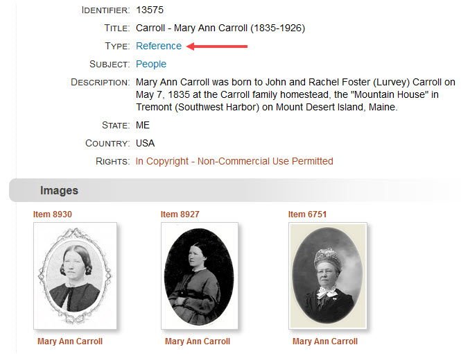
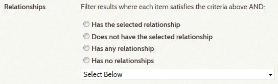
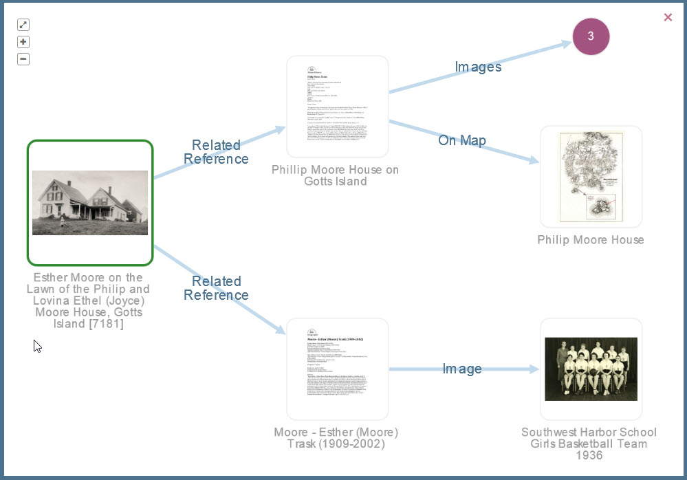

# Understanding Relationships

Relationships are the heart and soul of the Digital Archive. They are what make the
Digital Archive different from other databases or [Omeka](https://omeka.org/classic) projects
you may have worked with. Relationships are like the lines that connect the dots in those
puzzles you did as a kid. Until you drew the lines, all you saw was dots and numbers,
but once you connected the dots, you saw a picture!

Relationships in the Digital Archive are like relationships in the real world. They tell us how
two or more people, places, or things are connected to each other. For example, a man owned
a boat, resided in a house, and was married to a woman. The words *owned*, *resided in*, and
*married to* name the relationships that tell us how the man was connected to the boat
and the house and the woman.

[Learn more about The Archive Relational Model](/archivist/archive-relational-model).

## Reference Items

Reference Items serve as the “glue” that binds other items together. A Reference Item is simply an
item that has its **_Type_** metadata field set to `Reference`. [Learn about items and metadata](/).
These special items serve as stand-ins for things in the real world that are typically not part of
a collection, but that tie other items in the collection together via relationships.

The most common use of Reference Items is to provide biographical information about a person, or to
provide historical information about a structure, vessel, business, organization, or event. The *amount*
of information contained in a Reference Item is not always as important as the relationships between
the Reference Item and other items in the collection. As such, a Reference Item
with very little metadata still plays a key role in “connecting the dots” between related items.

To better understand the importance of Reference Items, consider a collection that has three photographs
of the same women. Even if you only knew the woman's name, a Reference Item could be used to tie the
photograps together. In the example below, item 13575 has its **_Type_** set to `Reference` (red arrow).
Items 8930, 8927, and 6751 each have a *depicts* relationship to item 13575 which automatically binds
the four items together such than when you find one of the items, you find them all. Item 13575
itself contains very little information. In a case where you have a lot of information, you could
attach the information to the Reference Item as a PDF file. Learn about [Learn about attachments](/).

[Learn more about Reference Items](/archivist/archive-relational-model/#reference-items).

## Relationship Types

The type of a relationship must make sense with the two items it relates. For example, only people
can be married to each other. A house can be *designed by* a person or a business, but not by a
place or another house. A place can be the *location of* a house, but a house cannot be located
in an event or in a person. What kind of items are compatible with a specific relationship type
is determined by Relationship Rules.

To get a better sense of relationship types, take a look at the Relationship Types & Rules table.
It lists every type of relationship currently in use among items in the Archive. It also spells
out the rules that apply to the two items involved in the relationship.

An item in a Digital Archive collection can have a relationship with one or more other items.
A relationship's type indicate how two items are related. For instance, a relationship can exist
between two people (Mary is married to John), between a person and a thing (John designed a house),
between a thing and a place (John’s house was located in a village) and so on. To only say that
Mary has a relationship with John, or that John has a relationship with a house, without stating
the nature of the relationship, would not tell the whole story.

The visualization graph below illustrates the **direct** relationships between Reference
Item 14894 titled *Princess Anne Power Cruiser* and three other items directly related to it.
From left to right, the directly related items are an image that *depicts* the boat, a
Reference Item about the man who *designed* the boat, and another Reference Item about the
business that *built* the boat. Those last two Reference Items each have a PDF attached to them
which you can see as their thumbnails in the graph. Item 14894 has no attachment which is
why its thumbnail ishas a placeholder image.

## Relationship Direction

A relationship can be either uni-directional or bi-directional. A bi-directional relationship reads the same in both directions. For example, John is married to Mary and Mary is married to John. Married to is a label that describes the relationship in either direction.

A uni-directional relationship reads one way in the forward direction and another way in the reverse direction. For example, John designed a house and the house was designed by John. These phrases sound right because the order of the items matches the direction of the relationship. If the item order or direction is wrong, you end up with the non-nonsensical relationships of a house that designed John, and John being designed by a house. Fortunately, the rules for a relationship’s type ensure correct item order and direction when an archivist adds or edits a relationship.

A uni-directional relationship has two different labels. In the relationship between John and his house, designed is one label and designed by is the other. Each label is the inverse of the other, but they describe the same relationship. If you look  again at the Relationship Types & Rules table, you’ll see that the row for designed has the same Id 17 as the row for designed by. You’ll also see that there is only one row for married to which has Id 8. This is because the married to label is used in both directions. Note that the table lists relationships in alphabetical order by label, which is why the Id numbers do not appear sequentially.

## Genealogical Relationships

An archivist only ever specify a child of or parent of relationship between two people (there is no, grandparent, grandchild, or sibling relationship type) and the software does the rest. This feature sometimes reveals long ancestry chains that would never be apparent when looking at a single item. Two examples in the Archive are item 3687 for Ralph Warren Stanley that shows great great great grandparents, and item 13572 for John Carroll that shows great great grandchildren.

## Relationship Order

All relationships are important, but the curator decides which ones a user will see first when viewing an item. In the Digital Archive, images of an item such as a person, house, or boat, are considered most important and always appear immediately after the item’s metadata. Genealogical relationships come next followed by Reference items that mention the item, and then places where the item is located, and so on. By always presenting related items in the same order, users quickly become comfortable with the interface and know what to expect as they go from item to item.
Viewing Relationships

The fact that every relationship in the archive has a type, direction, and order, makes it possible for the Digital Archive software to present related items most effectively when users are viewing relationships for an item. The software:

    Groups related items by relationship type.
    Groups indirectly related items with their directly related item.
    Displays the relationship label for each group relative to the item being viewed, that is, in a direction from that item to its related items.
    Derives ancestor and descendant chains starting from a People item’s parents and children.
    Lists groups in order of importance.

Administrators can search for items with specific relationships using the Relationship options at the bottom of the Advanced Search page in the admin interface as shown in the screenshot below.

## Indirect Relationships

When one item is related to another, it is inevitable that the other item is related to yet another
item and so on. The idea of [six degrees of separation](https://en.wikipedia.org/wiki/Six_degrees_of_separation)
makes for interesting reading on this topic and illustrates how seeing too many relationships
would get confusing. In the Digital Archive, when viewing an item, a user sees at most two degrees
of separation to related items. The first degree is the direct relationship from the item being viewed to
a directly related item. The second degree is the direct relationship from a directly related item to
an indirectly related item.

The visualization graph below illustrates the **indirect** relationships a user sees when viewing item 7181,
a photograph of Esther Moore as a small child in front of her home on Gotts Island. The graph shows two
direct relationships from item 7181 to Reference item for the house and the child. Each Reference item
is in turn directly related to other items shown at the far right: a map of showing the location of the
house on Gotts Island, and a school photograph showing Esther as an adult when she was the girl's
basketball team coach at Southwest Harbor High School. The basketball team photograph and the map
are *indirectly* related to item 7181.

## Genealogical Relationships

While the Digital Archive is not intended to be a genealogy tool, it automatically finds ancestor
and descendant chains. This ancestry feature works for Reference Items
having a subject of `People`. It automatically follows *child of* relationships to
locate parents, grandparents, and so on until the chain ends. It follows the inverse relationship
parent of to locate children, grandchildren, and so on. The mechanism also automatically identifies siblings.
