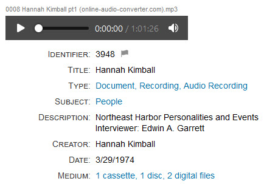
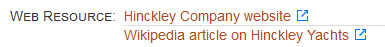
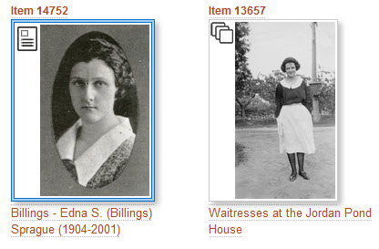

# New Features

---

**April 12, 2022**

### Audio player

Items that have MP3 files attached to them now display an audio player that allows you to start, stop, scrub, and mute the sound. A screenshot taken from an [item that uses the new feature](https://swhplibrary.net/digitalarchive/items/show/12751) appears below.

---
!!! note ""
    Thank you to Sadie Cooley of the [Southwest Harbor Public Library](https://swhplibrary.org/digital-archive/) for suggesting this feature.
---

**April 11, 2022**

### Flagged items replaces Recently Viewed items

The [Flagging Items to View Later](/user/recently-viewed/#flagging-items-to-view-later) feature has been modified to create a list of flagged items instead of a list of recently viewed items. Previously, whenever you visited an item, it was added to the list even if that was not your intention. Now you explicitly flag items that you want to visit later. As before, you can flag items from the search results page, and now you can also flag an item when you are viewing it.

### Custom text option

The AvantCommon plugin has a new [Custom Text](/plugins/avantcommon/#custom-text-option) option that lets you provide your own text to use in place of the default text that the Digital Archive displays for some user interface elements.

### AvantLocation plugin

The new [AvantLocation](/plugins/avantlocation/) plugin provides a way for an organization, such as a museum, to track the physical location of an object over time as it moves from one place to another. For example, suppose you have a Digital Archive item for a bird carving that is in storage. You then move the object to be on view in the museum, later move it back to storage, then loan it to to another museum, and finally return it to storage. The plugin lets you record date and location for each move. When you view the object's Digital Archive item, you'll see a history of where the object has been.

### Simple page shortcode

A [shortcode](https://omeka.org/classic/docs/Content/Shortcodes/) named `[avant_simple_page_css]` is now provided by the [AvantAdmin](/plugins/avantadmin/#avant-simple-page-shortcode) plugin. Placing the shortcode at the begining of the text for a page created with the [Simple Pages](https://omeka.org/classic/docs/Plugins/SimplePages) plugin will allow your simple page content to use the entire page area below the banner and menu without the width limitation, padding, borders, and white space that would otherwise exist.

To see an example of a simple page that uses the shortcode, see the Wendell Gilley Museum's [Digital Archive Collections](https://wendellgilleymuseum.net/digitalarchive) page.

---
!!! note ""
    Thank you to the [Wendell Gilley Musuem](https://www.wendellgilleymuseum.org) for contributing these features and to the [Stephen & Tabitha King Foundation](https://www.stkfoundation.org) for providing the funding.
---

**April 5, 2022**

### AvantElements
The following new options have been added to the [AvantElements](/plugins/avantelements) plugin:

- [Placeholder](/plugins/avantelements/#placeholder-option)
- [Textarea Rows](/plugins/avantelements/#textarea-rows-option)
- [Show Comment](/plugins/avantelements/#show-comment-option)
- [Show Description](/plugins/avantelements/#show-description-option) (replaces the old Hide Descriptions option)
- [External Link Icon](/plugins/avantelements/#external-link-icon-option)

Below is an example of what the external link icon looks like. It helps users to know that the link will take them away from the Digital Archive site to go to another website.

Additionally, you can now specify `all_elements` as the value for the options list below. Use it, for example, if you want to show descriptions for all elements instead of just for specific elements.

- [Allow Add](/plugins/avantelements/#allow-add-input-option)
- [Allow HTML](/plugins/avantelements/#allow-html-option)
- [Show Comment](/plugins/avantelements/#show-comment-option)
- [Show Description](/plugins/avantelements/#show-description-option)

The following new validation types have been added to the [Validation](/plugins/avantelements/#validation-option) option:

- number
- upper-case
- lower-case

---
!!! note ""
    Thank you to [Daniele Binaghi](https://forum.omeka.org/u/danieleb/summary) who contributed the code for the new AvantElements features.
---    

### Icons for Reference Items and Item Sets

It is now easier to identify [Reference items](/relationships/reference-items/#relating-reference-items-to-each-other) and  [Item Sets](/relationships/kinds-of-relationships/#dividing-a-large-subject-into-smaller-parts) when viewing search results. The thumbnail for these two kinds of items now includes an icon that indicates what the item is.

In the screenshot below, the item on the left is a Reference Item for Edna Sprague with a picture of her as the item's [cover image](/relationships/reference-items/#what-a-cover-image-looks-like). The item on the right is an Item Set for Jordan Pond House waitresses. It has a picture from an item in the set  as the Item Set's cover image.

---
