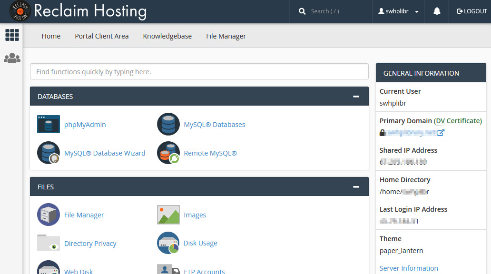

# Reclaim Hosting

This page explains how to perform Digital Archive related tasks on Reclaim Hosting.

---

## cPanel
[cPanel](https://cpanel.net/) is a control panel that lets you manage many aspects of your
web host environment. The cPanel home page is divided into sections like DATABASES, FILES etc.
as shown in the screenshot below. Each section contains a set of related features you can choose from.

!!! note "Tip"
    Use the search box at the top to quickly find a feature. For example, as you type `ftp`,
    the sections and features will immediately narrow down to just those related to FTP.

To use cPanel on Reclaim Hosting:

-	Login to your Reclaim Hosting account
-   Click on `cPanel` in the top menu, and choose your domain from the dropdown list
-   Click on the feature you want to use
-   The user interface for the feature will appear

## Upload and extract a zip file

Follow these steps to upload a zip file to the web server and extract (unzip) its contents.

!!! note
    A zip file's contents are always extracted into a new folder having the same name
    as the zip file. The contents are never extracted directly into an existing folder.
    As such, you may have to move the contents after you unzip them.

### Upload the zip file

-   Go to [cpanel] and choose `File Manager`
-   Navigate to the folder where a new folder should be created for the zip file contents
-   Click `Upload` in the top menu        
-	Select or drag-in the zip file to begin uploading it
-   Wait for the upload to complete. When complete, the progress bar will:
    -   Show 100% *and* change color from blue to green  
        
-   Click the `Go Back toGo to [cpanel] and choose ` link at the bottom of the page to return to the parent folder
-   Verify that the zip file is there. If not, click `Reload` in the menu above the file list

### Extract the zip file contents

-	Right click on the zip file name and choose `Extract`
-   Click the `Extract File(s)` button
-   On the `Extraction Results` dialog, click the `Close` button
-   A new folder will appear having the same name as the zip file

### Delete the zip file
-   Right click on the file name and choose `Delete`
-   On the `Trash` dialog, check the box that says `Skip the trash`
-   Click the `Confirm` button

## Create a subdomain
Follow these steps to create a subdomain in an existing account.

-   Go to [cpanel] and choose `Subdomains`
-   In the `Subdomain` field enter the subdomain name
-   Don't change the `Domain` and `Document Root` fields
-   Click the `Create` button
-   Return to the [cpanel] home page and choose `File Manager`
-   Verify that a new folder for the domain exists,  
    for example: `/home/avantlog/mysubdomain.avantlogic.net`

## Create a new account
Follow these steps to create a new Reclaim Hosting account.

-   If you already have an account with Reclaim Hosting and want to add another:
    -	Login to your account
    -	Choose `Accounts` > `Add an Account`
-   If you don't have an account:
    -   Find and click the `Sign Up` button
-	Choose `Organization Plan` ($100/year) and click `Order Now`
-	Verify that the domain is available and choose the `Register a new domain` radio button
-	Choose billing cycle $100.00 USD Annually
-	Click `Checkout`
-	On the `Domains Configuration` page click `Continue`
-	On the `Review & Checkout` page
    -	Total should be $100
    -	The `Existing Customer` tab should be selected
    -	For `Payment Method` choose `Use Existing Card (PayPal)`
    -	Click `Complete Order`
-	Open the New Account Information email from reclaim and copy the cPanel information into the passwords spreadsheet.
-	Verify that you can login to cPanel directly as this organization (as opposed to from the administrator account)

[cPanel]: #cpanel