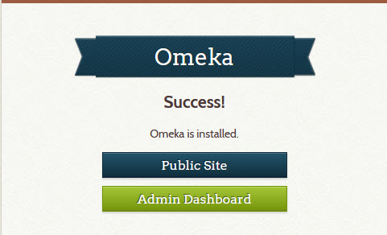

# Install a new Digital Archive site

This page explains how to install and configure a new Digital Archive installation
on a [reclaimhosting.com](web-host.md) server. You can also read [Omeka's installation instructions](https://omeka.org/classic/docs/Installation/Installation/); however, this
page covers installation of Omeka Classic and much more.

---

Many steps are required to install the Digital Archive. They are listed on this page in the order
in which you must perform them.

> The navigation panel at left shows all the steps

## Prerequisites
The first step is to:

-   Verify that the web host meets the necessary requirements
-   Choose a site name
-   Decide where to install the Digital Archive files on the server

**Hosting requirements**

The web host must be an Apache web server that satisfies the 
[system requirements](https://omeka.org/classic/docs/Installation/System_Requirements/)
for [Omeka Classic](https://omeka.org/classic/). AvantLogic uses
[Reclaim Hosting](https://reclaimhosting.com/) as its host.
Learn now to [Create a new Reclaim account](web-host.md#create-a-new-account).

**Site name**

Some of the installation steps require that you specify a site name. Choose a concise and
meaningful name that you and others will recognize when performing system administration. An acronym
is usually a good choice. For example, the site name for the Southwest Harbor Public Library is `swhpl`.
Use the name you choose in subsequent steps that refer to the *site name*.

**Installation folder**

All Digital Archive files will be installed within a single folder named `digitalarchive`.

!!! warning "Important"
    **Do not** create the `digitalarchive` folder at this time.  
    It will get created later during the *Install Omeka Classic files* step.

The `digitalarchive` folder can be a subfolder of:

- The Apache server's `public_html` folder, *or*
- A subdomain's folder

Examples:

```
public_html/digitalarchive

mysubdomain.avantlogic.net/digitalarchive
```

!!! note
    AvantLogic uses the `digitalarchive` folder as a way of isolating the Digital Archive files
    from other applications on the server. For example, some installations use a `digitalarchive`
    folder and a `wp` folder side-by-side where the `wp` folder contains a WordPress application
    for content related to the Digital Archive collection. If would be very messy, and
    make application updates difficult, if the Digital Archive and WordPress files were
    together in the the same `public_html` or subdomain folder. However, use of the `digitalarchive`
    folder is not required and you can install directly in `public_html` or a subdomain folder.

**Subdomain installation**

If you want to install the Digital Archive in a subdomain, [create the subdomain](web-host.md#create-a-subdomain) now.

---

## Create a MySQL database

A new Reclaim Hosting account does not come with a database.  
Follow the steps below to create a new empty database and user for the Digital Archive.

!!! warning "Important"
    [cpanel] will automatically prefix any database or user name that you choose with the
    first seven letters of the domain name, followed by `_`. For example, if you specify
    the name `foo` and the domain name is `avantlogic` the actual name will be `avantlog_foo`.
    Keep this in mind because the name you choose will really be a suffix.

    Note that if you install the Digital Archive in more than one subdomain on the
    same host, the corresponding database and user names will all share the same
    prefix. As such, the steps below recommend different choices for subdomains.

### Create a database

-	Go to [cpanel] and choose `MySQL Database Wizard`
-	In wizard Step 1:
    -   Decide on the database name suffix
    -   If the `digitalrchive` folder will be in `public_html`:
        -   A good choice is `omeka`
        -   Example: `avantlog_omeka`
    -   If the `digitalrchive` will be in a subdomain:
        -   A good choice is the *site name*
        -   Example: `avantlog_swhpl`
    -   Enter the database name in the `New Database` field
-	Click `Next Step`

### Create a user

-	In wizard Step 2:
    -   Decide on the user name suffix
    -   If the `digitalrchive` will be in `public_html`:
        -   A good choice is `archivist`
        -   Example: `avantlog_archivist`
    -   If the `digitalrchive` will be in a subdomain:
        -   A good choice is the *site name*
        -   Example: `avantlog_swhpl`
    -   Enter the user name in the `Username` field
-   Click the `Password Generator` button
-   In the popup dialog:
    -   If you don't like the password, click the `Generate Password` button to get another
    -   **Copy the password to a password vault or other safe place**
    -   Click the checkbox confirming that you copied the password to a safe place
    -   Click the `Use Password` button
    -   The two password fields get filled in with the generated password automatically
-	Click `Create User`
-	In wizard Step 3, Check the `ALL PRIVILEGES` checkbox at the top
-	Click the `Next Step` button

### Add a MySQL Workbench connection

-   [Add the database to MySQL Workbench](mysql-workbench.md#add-a-database-connection)

---

## Copy a MySQL database

This section explains how to use an existing database for a new installation.

!!! note ""
    **Skip this step** if you need to move a database from one installation to another.

### Export a MySQL database to a `.sql` file

-	Go to [cpanel] and choose `phpMyAdmin`
-	On the far left, click on the <name-of DB-to-export> database
-	In the top menu, click on `Export`
-	For **Export method** choose `Quick`
-	For **Format** choose `SQL`
-	Click `Go`
-	When the `Save` dialog appears, choose a location to save on local computer  

### Create an empty database
If you have not done so already, create a database and add it to MySQL Workbench
following the instructions above to [create a MySQL database](#create-a-mysql-database).

### Import a MySQL database from a `.sql` file

-	Run MySQL Workbench
-	Double click on the name of the new database (make sure the name becomes bold)
-	Choose `File` > `Open SQL Script`
-	Select the `.sql` file exported in the subsection above
-	Click `Open`
-	Click the lightning bolt button to execute the script

---

## Change database storage engine

These steps change the storage engine for the `search_texts` table from `MyISAM` to `InnoDB`. They also add a `FULLTEXT` index to the `title` column of the `search_texts` table. To learn the reason for making these changes, see the AvantSearch
plugin topics on [improving search results](../../plugins/avantsearch/avantsearch/#improving-search-results)
and the [Titles Only option](../../plugins/avantsearch/avantsearch/#titles-only-option).

Follow these steps to change the storage engine:

-	Go to [cpanel] and choose `phpMYAdmin`
-	In the left panel, click on the Omeka database name to see its tables
-	Click on the `omeka_search_texts` table in the left panel
-	Click on the `Operations` tab
-	In the `Table Options` section, change **Storage Engine** from `MyISAM` to `InnoDB`
-	Click the `Go` button in the lower right of the section
-	Click on the `omkea_search_texts` table
-	Click the `Structure` tab
-	On the row for `title`, click `Fulltext` among the actions at the far right.
    If the browser window is too narrow to see all the options, click on `More`
    and choose `Fulltext` from the dropdown menu
-	On the `Confirm` dialog click the `OK` button to alter the table
-	`Title` now appears in the `Indexes` section showing with Type as `FULLTEXT`
-	Close the phpMyAdmin browser tab

---

## Install Omeka Classic files

Follow these steps to upload the Omeka Classic files to the web server.

-	Download the latest Omeka Classic release from <http://omeka.org/classic/download>  
    As of 2/6/2020, the latest release was `omeka-2.7.1.zip`
-	Go to [cpanel] and choose `File Manager`
-   Navigate to the folder that will contain the `digitalrchive` folder;
    -   If the folder is `public_html` go to `public_html`
    -   If the folder is a subdomain, go to the subdomain folder  
        for example: `mysubdomain.avantlogic.net`
-   [Upload and extract the zip file](web-host.md#upload-and-extract-a-zip-file) into a new folder
-   Rename the new folder from the zip file's name to `digitalarchive`

---

## Edit the database configuration

Follow these steps to configure Omeka to use the database you created.
The database *username*, *password*, and *dbname* come from the [create a MySQL database](#create-a-mysql-database) step.


-	Go to [cpanel] and choose `File Manager`
-	Navigate *into* the `digitalarchive` folder
-   Edit `db.ini`
-	Replace occurrences of `"XXXXXXX"` as follows:
    -	**host**     = `"localhost"`
    -	**username** = "*database username*"
    -	**password** = "*database password*"
    -	**dbname**   = *"database name*"
    -	**prefix**   = `"omeka_"`
    -	**charset**  = `"utf8"`
    -	Leave **port** commented out
-	Save your changes and close the file

To learn more, see the Omeka documentation for the [database configuration file](https://omeka.org/classic/docs/Technical/DatabaseConfigurationFile/).

!!! warning "Important"
    The `db.ini` file tells Omeka how to access the database. Any errors, typos, or incorrect information
    in this file will prevent Omeka from running and result in the display of a fatal error.

---

## Enable errors and logging

### Error reporting

This step allows PHP errors to appear in the browser. Normally you would not want
this for a production site, but it's better to become aware of a problem if it occurs.

-	Go to [cpanel] and choose `File Manager`
-   Allow hidden files to be displayed:
    -   Click the `Settings` button in the upper right of the File Manager
    -   Check th box for `Show Hidden Files`)
-	Navigate *into* the `digitalarchive` folder
-   Edit `.htaccess`
-	Uncomment `SetEnv APPLICATION_ENV development`
-	Save your changes and close the file

!!! warning "Important"
    The `.htaccess` file in the `digitalarchive` folder is different than `.htaccess` in the
    installation's root folder. You'll edit the root folder's copy later in the steps to
    [configure site security](#configure-site-security).

### Error logging

Follow these steps to enable Omeka error logging so that a history of errors will be recorded.
To learn more, see the Omeka documentation for [retrieving error messages](https://omeka.org/classic/docs/Troubleshooting/Retrieving_Error_Messages/#activate-error-logging).

-	Go to [cpanel] and choose `File Manager`
-	Navigate *into* the `digitalarchive/application/config/` folder
-   Edit `config.ini`
-	In the `Logging` section, change **log.errors** from `false` to `true`
-	Save your changes and close the file

Errors will now be written to `digitalarchive/application/logs/errors.log`.

---

## Configure Omeka

You are now ready to launch Omeka and configure site settings.

-	Open a browser and visit the site URL, for example:
```
    avantlogic.net/digitalarchive
    mysubdomain.avantlogic.net/digitalarchive
```
-	The Omeka `Configure Your Site` page should appear


### Enter configuration settings

You can now configure the Omeka site. See the Omeka
[general settings](https://omeka.org/classic/docs/Admin/Settings/General_Settings/)
documentation and the
[appearance settings](https://omeka.org/classic/docs/Admin/Appearance/Appearance_Settings/)
documentation for an explanation of the configuration settings.

-   Set:
    -	**Username**: *a valid user name*  
    -	**Password**: *admin password*
    -	**Re-type the Password**: *admin password*
    -	**Email**: *a valid email address*  
    -	**Administrator Email**: *same as admin email*
    -	**Site Title**: *the organization name*  
    -	**Site Description**: *leave blank*
    -	**Site Copyright Information**: *the organization name*    
    -	**Site Author Information**: *your name or company*  
    -	**Tag Delimiter**: `,` (a comma)
    -	**Fullsize Image Size**: `600`
    -	**Thumbnail Size**: `300`
    -	**Square Thumbnail Size**: `100`
    -	**Items Per Page (admin)**: `50`
    -	**Items Per Page (public)**: `50`
    -	**Show Empty Elements**: *Unchecked*
    -	**ImageMagick Directory Path**: `/usr/bin`
-	Click the `Install` button
-   You should see the `Success!` page



!!! note "Super"
    The username and password you specify above are for an Omeka user with `Super` access.
    See the [Omeka Users](https://omeka.org/classic/docs/Admin/Users/) documentation to learn about user
    levels and access.

### Login to Omeka

Follows these steps to login to Omeka.

-	On the `Success!` page, click the `Admin Dashboard` button
-	Login with the user name and password from the previous steps
-   Check the `Remember Me` checkbox
-   Click the `Login` button
-   The `Dashboard` page should display.

### Additional settings

Follows these steps to finishing configuring Omeka.

-	On the `Dashboard page`, click `Appearance` on the top menu bar
    -   Click `Settings` on the `Appearance` page menu
    -	At the bottom of the page, uncheck `Show Element Set Headings`
    -	Click the `Save Changes` button
-	On the `Settings` on the top menu bar
-   Click `Search` on the `Settings` page menu
    -	Uncheck all `Search Record Types` except `Item`
    -	Click the `Save Changes` button
-   Click `General` on the `Settings` page menu
    -	Click the `Test` at the bottom of the page  
        You should see `The ImageMagick directory path works`
    -   If the message says that the path does *not* work:
        -   Go to [cpanel] and choose `Terminal`
        -   In the terminal window, type `which convert` and press `Enter`
        -   Use the response to determine the correct path and try again 
            or contact your host's technical support and ask them to tell you the path 

---

## Verify PDF support

These steps verify that a program called `pdftotext` is installed on your server.
It is used by the `PdfText` plugin which in turn is used by the `AvantElastic` plugin to 
make PDF files searchable. If you won't be using `AvantElastic`, you can skip this step.

-   Go to [cpanel] and choose `Terminal`
-   In the terminal window, type `pdftotext -v` and press `Enter`
-   The `pdftotext` program should display its version
-   If instead you see `command not found`, ask your host to install `pdftotext`

---

## Configure site security

By default, an Omeka installation uses HTTP for every page except the login page which uses HTTPS.
Best practices for security require HTTPS for all pages. You also need to ensure that when someone
visits your Digital Archive site, they are directed to the correct default page.

How you configure site security depends on where you installed Omeka. Choose
which instructions to follow for your installation.

!!! danger "Warning"
    The instructions require that you edit the site's `.htaccess` file. Even the slightest
    error in this file can result in an **internal server error** which will prevent the site
    from loading. Be very careful.

### Instructions 1

If you installed Omeka in a `digitalarchive` folder, follow these instructions.  
Otherwise, use [instructions 2](#instructions-2). 

-	Go to [cpanel] and choose `File Manager`
-	Navigate *into* the folder that *contains* the `digitalarchive` folder, usually `public_html` or a subdomain folder
-   If the folder does not contain a `.htaccess` file, create a new empty `.htaccess` file
-   Edit `.htaccess`
-   Add the code shown below at the top of the file
-   Save your changes and close the file
-   Test that all pages are HTTPS and that the redirect works correctly

```
    # Turn on rewrites.
    RewriteEngine on

    # Force all URLs to HTTPS
    RewriteCond %{HTTPS} off
    RewriteRule (.*) https://%{HTTP_HOST}%{REQUEST_URI} [R,L]

    # Redirect the root and only the root to the default folder
    RedirectMatch ^/$ /digitalarchive
```

!!! warning ""
    If the redirect does not appear to be working, flush the browser cache.

!!! note
    The code above redirects to `digitalarchive` which is the root of the Omeka installation.
    Omeka will in turn redirect to the site's default home page. You can change the default
    home page on the `Navigation` tab of the Omeka admin `Appearance` page as described in the
    [Omeka documentation](https://omeka.org/classic/docs/Admin/Appearance/Navigation/).
    Alternatively, you can change the `.htaccess` redirect as explained below.

You can change the `RedirectMatch` line to redirect to another location.
For example, if the Omeka installation has an `About` page, you could redirect there like this:

```
    RedirectMatch ^/$ /digitalarchive/about
```
You can even redirect to a page of search results, for example, to display a site content index:

``` plaintext
    RedirectMatch ^/$ /digitalarchive/find?view=2&index=53
```    

See [this post](https://stackoverflow.com/questions/990392/htaccess-rewrite-to-redirect-root-url-to-subdirectory)
to learn why using RedirectMatch works than RewriteRule for this purpose.

### Instructions 2
If you installed Omeka in the `public_html` or a subdomain folder, follow these instructions.  
Otherwise use [instructions 1](#instructions-1).

-	Go to [cpanel] and choose `File Manager`
-	Navigate *into* the Omeka installation's top-level folder
-   Edit the Omeka `.htaccess`
-   Add the code shown below to the top of the file, right after the `RewriteEngine on` line
-   Save your changes and close the file
-   Test that all pages are HTTPS

```
    # Force all URLs to HTTPS
    RewriteCond %{HTTPS} off
    RewriteRule (.*) https://%{HTTP_HOST}%{REQUEST_URI} [R,L]
```
---

## Install ArchiveRepertory plugin

This Omeka plugin controls where files that you attach to an Omeka item are stored.

!!! warning "Important"
    Install this plugin now *before adding any items to Omeka* because the plugin overrides Omeka's
    default file storage mechanism and it won't work correctly if some files have already been stored.

    Use release **2.15.5** because AvantLogic has not tested the newer releases.

    Southwest Harbor Public Library uses its own custom version of this plugin based on release 2.14.
    The modified version uses a flat file structure instead of the better hierarchical structure.
    Eventually SWHPL should convert to use the newer structure.

Follow these steps to install and configure the plugin.

-   Add the plugin to the Omeka installation ([learn how](web-host.md#add-an-omeka-plugin))
-	Go to the Omeka `Plugins` page
-	Click the `Install` button for `Archive Repertory`
-	Set:
    -   Collections option:
        - **How do you want to name ...**: `Don’t add folder`
    -   Items options:
        - **How do you want to name ...**: `Identifier`
        - **Prefix for Item**: leave blank
        - **Convert folder names**: `Full conversion to Ascii`
    -   Files option:
        - **Convert filenames**: `Full conversion to Ascii`
        - **Keep only base...**: Unchecked
    - Special derivative folders options:
        - **Other derivative folders**: leave blank
        - **Process**: `Omeka internal`
        - **Max downloads**: `30000000`
        - **Legal**: `I agree with terms of use.`
- Click the `Save Changes` button

---

## Create the site Item Type

Omeka installs with a number of different *Item Types* and *Elements*. In Omeka, think
of an element as being synonymous with a field, and an Item Type as a set of fields. To keep things simple,
and to make data entry easier and faster, the Digital Archive uses only one Item type having all the elements
an organization needs. To learn more, see the Omeka documentation for
[Item Types](https://omeka.org/classic/docs/Content/Item_Types/).

Follow the steps below to create a single Item Type and to remove unused Item Types and Elements.

###	Create a new Item Type:
-   Login to Omeka 
-	Click `Items Types` in Omeka's left admin menu
-	Click the green `Add an Item Type` button
-	For **Name** use the *site name* in all caps, for example `NEHL` for Northeast Harbor Library
-	Leave the description blank
-	Click the `Add Item Type` button
-	Click the `Edit` button on the newly added Item type e.g. `NEHL`
-	Add non-Dublin Core elements one at a time:
    -	Choose the `New` radio button at the bottom of the page
    -   Click the `Add Element button`
    -	Type the **Element Name** and leave the description blank
    -	Click the `Add Element` button again to add the next element
    -	Repeat until done
-	When done adding elements, click the `Save Changes` button

###	Delete unused item types and elements:
-   Open the database in [MySQL Workbench](mysql-workbench.md#open-a-database)
-	Right click on the `omeka_item_types` table and choose `Select Rows`
-	Select all the rows
-	Right click on the selection and choose `Delete Rows`
-	Click the `Apply` button in the lower right
-	Click the `Apply` button on the `Apply SQL Script to Database` dialog
-   When the deletion completes, click the `Finish` button

###	Delete unused elements
-	Right click on the `omeka_elements` table and choose `Select Rows`
-	Select all the non Dublin Core element row. These all have an 
    `element_set_id` value of `3` and are `Text`, `Interviewer`, `Interviewee` etc.
-	Right click on the selection and choose `Delete Rows`
-	Click the `Apply` button in the lower right
-	Click the `Apply` button on the `Apply SQL Script to Database` dialog
-   When the deletion completes, click the `Finish` button

You can now quit MySQL Workbench.


[cPanel]: web-host.md#cpanel
