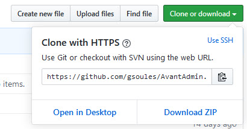
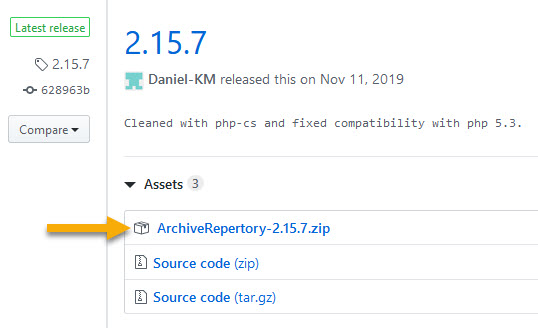
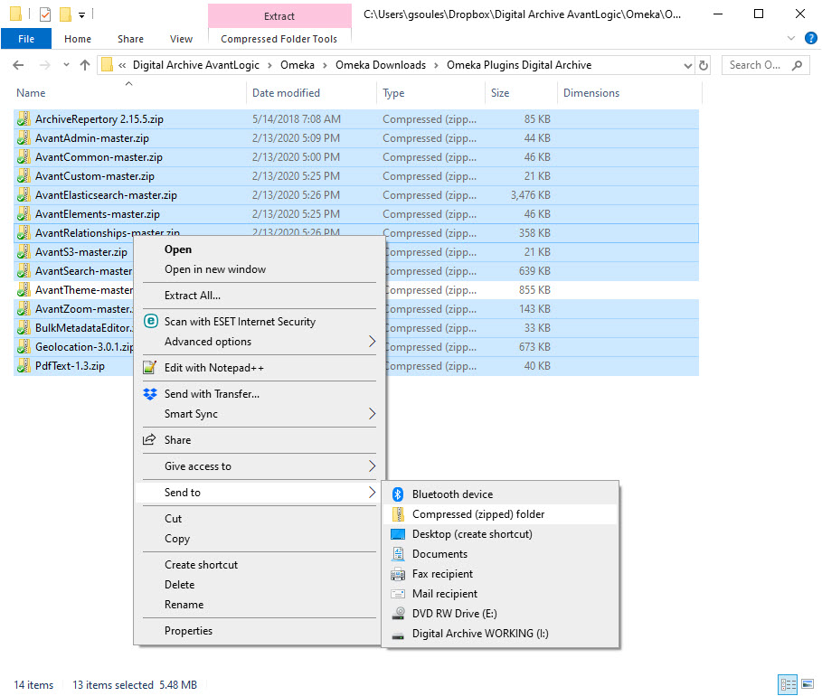
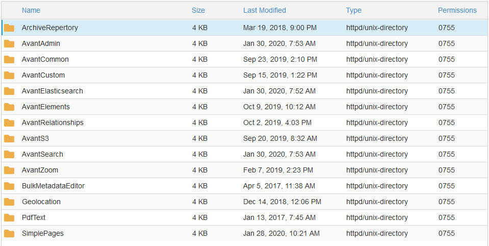
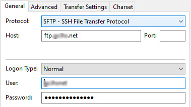
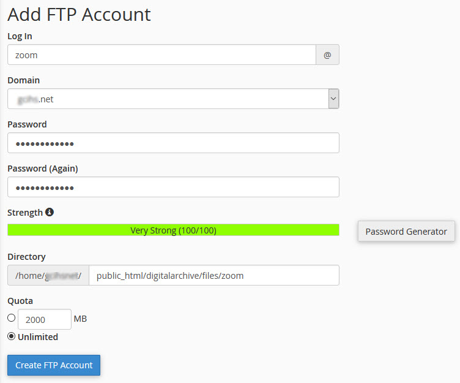

# Install a new Digital Archive site

This page explains all of the tasks that AvantLogic performs to install and configure a new Digital Archive installation. For each task, it lists the steps necessary to perform the task.

!!! note ""
    Installation tasks appear in the navigation panel at left. Perform them one at a time in the order listed.

    **[Print this checklist](installation-checklist.pdf)**

---
## Prerequisites
---

**Hosting requirements**

The web host must be an Apache web server that satisfies the 
[system requirements](https://omeka.org/classic/docs/Installation/System_Requirements/)
for [Omeka Classic](https://omeka.org/classic/). AvantLogic uses
[Reclaim Hosting](https://reclaimhosting.com/) as its host.
Learn now to [Create a new Reclaim account](web-host.md#create-a-new-account).

**Site name**

Some of the installation steps require that you specify a *site name*. Choose a concise and
meaningful name that you and others will recognize when performing system administration. An acronym
is usually a good choice. For example, the site name for the Southwest Harbor Public Library is `swhpl`.

**Installation folder**

The Digital Archive files will be installed in `public_html/digitalarchive`. AvantLogic uses
the `digitalarchive` folder to isolate the Digital Archive files
from other applications on the web server. For example, some installations use a `digitalarchive`
folder and a `wp` folder side-by-side where the `wp` folder contains a WordPress application
for content related to the Digital Archive collection. If would be very messy, and
make application updates difficult, if the Digital Archive and WordPress files were
together in the the same `public_html`.

!!! warning ""
    **Do not** create the `digitalarchive` folder at this time.  
    It will get created later during the *Install Omeka Classic files* step.

---
## Create MySQL database
---

A new Reclaim Hosting account does not come with a database. Follow the steps below to
use [cPanel] to create a new empty database and a database user for the Digital Archive.

!!! warning "Important"
    cPanel will automatically prefix any database or user name that you choose with the
    first seven letters of the domain name, followed by `_`. For example, if you specify
    the name `foo` and the domain name is `avantlogic` the actual name will be `avantlog_foo`.
    Keep this in mind because the name you choose will really be a suffix.

### Create a database

-	Go to [cPanel] and choose `MySQL Database Wizard`
-	In wizard Step 1:
    -   Decide on the database name suffix
        -   A good choice is `omeka`
        -   Example: `avantlog_omeka`
    -   Enter the database name in the **New Database** field
-	Click the `Next Step` button

### Create a user

-	In wizard Step 2:
    -   Decide on the user name suffix
        -   A good choice is `archivist`
        -   Example: `avantlog_archivist`
    -   Enter the user name in the **Username** field
-   Click the `Password Generator` button
-   In the popup dialog:
    -   If you don't like the password, click the `Generate Password` button to get another
    -   **Copy the password to a password vault or other safe place**
    -   Click the checkbox confirming that you copied the password to a safe place
    -   Click the `Use Password` button
    -   The two password fields get filled in with the generated password automatically
-	Click the `Create User` button
-	In wizard Step 3:
    -   Check the `ALL PRIVILEGES` checkbox at the top
    -	Click the `Next Step` button

### Configure MySQL Workbench

-   [Add the database to MySQL Workbench](mysql-workbench.md#add-a-database-connection)

---

### Copy a MySQL database

This section explains how to use an existing database for a new installation.

!!! warning ""
    **Only perform this task** if you need to move a database from one installation to another.

#### Export a MySQL database to a `.sql` file

-	Go to [cPanel] and choose `phpMyAdmin`
-	On the far left, click on the name of the database to export
-	In the top menu, click on `Export`
-	For **Export method** choose `Quick`
-	For **Format** choose `SQL`
-	Click `Go`
-	On the `Save` dialog, choose where to save the file on your computer  
-   If not done already, follow the instructions
    above to [create a MySQL database](#create-mysql-database)

#### Import a MySQL database from a `.sql` file

-	Run MySQL Workbench
-	Double click on the name of the new database (make sure the name becomes bold)
-	Choose `File` > `Open SQL Script` from the top menu
-	Select the `.sql` file exported in the Export section above
-	Click the `Open` button
-	Click the lightning bolt button to execute the script

---

### Change database storage engine

These steps change the storage engine for the `search_texts` table from `MyISAM` to `InnoDB`. They also add a `FULLTEXT` index to the `title` column of the `search_texts` table. To learn the reason for making these changes, see the AvantSearch
plugin topics on [improving search results](../../plugins/avantsearch/avantsearch/#improving-search-results)
and the [Titles Only option](../../plugins/avantsearch/avantsearch/#titles-only-option).

Follow these steps to change the storage engine:

-	Go to [cPanel] and choose `phpMYAdmin`
-	In the left panel, click on the Omeka database name to see its tables
-	Click on the `omeka_search_texts` table in the left panel
-	Click on the `Operations` tab
-	In the `Table Options` section, change **Storage Engine** from `MyISAM` to `InnoDB`
-	Click the `Go` button in the lower right of the section
-	Click on the `omkea_search_texts` table
-	Click the `Structure` tab
-	On the row for `title`, click `Fulltext` among the actions at the far right.
    If the browser window is too narrow to see all the options, click on `More`
    and choose `Fulltext` from the dropdown menu
-	On the `Confirm` dialog click the `OK` button to alter the table
-	`Title` now appears in the `Indexes` section showing with Type as `FULLTEXT`
-	Close the phpMyAdmin browser tab

---
## Install Omeka
---

### Copy installation files to server

Follow these steps to upload the Omeka Classic files to the web server. You can also read
[Omeka's installation instructions](https://omeka.org/classic/docs/Installation/Installation/).

-	Download the latest Omeka Classic release from <http://omeka.org/classic/download>  
    As of 2/6/2020, the latest release was `omeka-2.7.1.zip`
-	Go to [cPanel] and choose `File Manager`
-   Navigate to the `public_html` folder
-   [Upload and extract the zip file](web-host.md#upload-and-extract-a-zip-file)
-   A new folder having the same name as the zip file will appear
-   Rename the new folder from the zip file's name to `digitalarchive`

---

### Edit database configuration

Follow these steps to configure Omeka to use the database you created.
The *username*, *password*, and *dbname* values come from the [create MySQL database](#create-mysql-database) task.


-	Go to [cPanel] and choose `File Manager`
-	Navigate *into* the `digitalarchive` folder
-   Edit `db.ini`
-	Replace occurrences of `"XXXXXXX"` as follows:
    -	**host**     = `"localhost"`
    -	**username** = "*database username*"
    -	**password** = "*database password*"
    -	**dbname**   = *"database name*"
    -	**prefix**   = `"omeka_"`
    -	**charset**  = `"utf8"`
    -	Leave **port** commented out
-	Save your changes and close the file

To learn more, see the Omeka documentation for the [database configuration file](https://omeka.org/classic/docs/Technical/DatabaseConfigurationFile/).

!!! warning "Important"
    The `db.ini` file tells Omeka how to access the database. Any errors, typos, or incorrect information
    in this file will prevent Omeka from running and result in the display of a fatal error.

---

### Enable error reporting

This step allows PHP errors to appear in the browser. Normally you would not want
this for a production site, but it's better to become aware of a problem if it occurs.

-	Go to [cPanel] and choose `File Manager`
-   Allow hidden files to be displayed:
    -   Click the `Settings` button in the upper right of the File Manager
    -   Check th box for `Show Hidden Files`
-	Navigate *into* the `digitalarchive` folder
-   Edit `.htaccess`
-	Uncomment `SetEnv APPLICATION_ENV development`
-	Save your changes and close the file

!!! warning "Important"
    The `.htaccess` file in the `digitalarchive` folder is different than `.htaccess` in the
    installation's root folder. You'll edit the root folder's copy later in the steps to
    [configure site security](#configure-site-security).

---

### Enable error logging

Follow these steps to enable Omeka error logging so that a history of errors will be recorded.
To learn more, see the Omeka documentation for [retrieving error messages](https://omeka.org/classic/docs/Troubleshooting/Retrieving_Error_Messages/#activate-error-logging).

-	Go to [cPanel] and choose `File Manager`
-	Navigate *into* the `digitalarchive/application/config/` folder
-   Edit `config.ini`
-	In the `Logging` section, change `log.errors` from `false` to `true`
-	Save your changes and close the file

Errors will now be written to `digitalarchive/application/logs/errors.log`.

---
## Configure Omeka
---

You are now ready to launch Omeka and configure site settings.

-	Open a browser using the URL for the `digitalarchive` folder, for example:
    `avantlogic.net/digitalarchive`.

The Omeka `Configure Your Site` page should appear.


### Enter configuration settings

You can now configure the Omeka site. See the Omeka
[general settings](https://omeka.org/classic/docs/Admin/Settings/General_Settings/)
documentation and the
[appearance settings](https://omeka.org/classic/docs/Admin/Appearance/Appearance_Settings/)
documentation for an explanation of the configuration settings.

!!! note "Super administrator"
    The username and password you will specify below are for an Omeka *super administrator*.  
    See [Omeka terminology](../../administrator/omeka/#terminology) to learn what it means to be a super administrator.

-   Set:
    -	**Username**: *a super administrator user name*  
    -	**Password**: *super administrator password*
    -	**Re-type the Password**: *super administrator password*
    -	**Email**: *a valid email address*  
    -	**Administrator Email**: *same as Email*
    -	**Site Title**: *the organization name*  
    -	**Site Description**: leave blank
    -	**Site Copyright Information**: *the organization name*    
    -	**Site Author Information**: *your name or company*  
    -	**Tag Delimiter**: `,` (a comma)
    -	**Fullsize Image Size**: `600`
    -	**Thumbnail Size**: `300`
    -	**Square Thumbnail Size**: `100`
    -	**Items Per Page (admin)**: `50`
    -	**Items Per Page (public)**: `50`
    -	**Show Empty Elements**: *Unchecked*
    -	**ImageMagick Directory Path**: `/usr/bin`
-	Click the `Install` button
-   You should see the `Success!` page.


-	Click the `Admin Dashboard` button
-	Login with the super administrator user name and password
-   Check the `Remember Me` checkbox
-   Click the `Login` button
-   The `Dashboard` page should display.

---

### Configure additional settings

Follows these steps to finishing configuring Omeka.

** Appearance settings**

-	On the `Dashboard page`, click `Appearance` in the top menu bar
-   Click `Settings` in the `Appearance` page menu bar
-	At the bottom of the page, uncheck `Show Element Set Headings`
-	Click the `Save Changes` button

** Search settings**

-	Click `Settings` in the top menu bar
-   Click `Search` in the `Settings` page menu bar
-	Uncheck all `Search Record Types` except `Item`
-	Click the `Save Changes` button

** General settings**

-   Click `General` in the `Settings` page menu bar
-	Click the `Test` at the bottom of the page  
    You should see `The ImageMagick directory path works`
-   If the message says that the path does *not* work:
    -   Go to [cPanel] and choose `Terminal`
    -   In the terminal window, type `which convert` and press `Enter`
    -   Use the response to determine the correct path and try again 
        or contact your host's technical support and ask them to tell you the path 

---
## Configure web server settings
---

### Configure site security

By default, an Omeka installation uses HTTP for every page except the login page which uses HTTPS.
Perform the steps below to follow the best practice of using HTTPS for all pages.

!!! danger "Warning"
    This task requires that you edit the site's `.htaccess` file. Even the slightest
    error in this file can result in an **internal server error** which will prevent the site
    from loading. Be very careful.

-	Go to [cPanel] and choose `File Manager`
-	Navigate *into* the `public_html` folder
-   If the folder does not contain a `.htaccess` file, create a new empty .htaccess file
-   Edit `.htaccess`
-   Add the code shown below at the top of the file
-   Save your changes and close the file
-   Test that all pages are HTTPS and that the redirect works correctly

```
# Turn on rewrites.
RewriteEngine on

# Force all URLs to HTTPS
RewriteCond %{HTTPS} off
RewriteRule (.*) https://%{HTTP_HOST}%{REQUEST_URI} [R,L]

# Redirect the root and only the root to the default folder
RedirectMatch ^/$ /digitalarchive
```

!!! warning ""
    If the redirect does not appear to be working, flush the browser cache.

!!! note
    The code above redirects root requests. For instance, if someone attempts to go to `avantlogic.net`
    which is the web server root, they will be redirected to `avantlogic.net/digitalarchive` which
    is the root of the Omeka installation. Omeka will in turn redirect to the default home page.
    You can change the default home page on the `Navigation` tab of the Omeka admin `Appearance`
    page as described in the [Omeka documentation](https://omeka.org/classic/docs/Admin/Appearance/Navigation/).
    For example, you could set the default home page to be an *About* page that you created with
    the Simple Pages plugin. Alternatively, you can change `.htaccess` to redirect to a specific
    URL as explained below.

You can change the `RedirectMatch` line to redirect to a specific URL.
For example, if the Omeka installation has an `About` page, you could redirect there like this:

```
RedirectMatch ^/$ /digitalarchive/about
```
You can even redirect to a page of search results, for example, to display a site content index:

``` plaintext
RedirectMatch ^/$ /digitalarchive/find?view=2&index=53
```    

See [this post](https://stackoverflow.com/questions/990392/htaccess-rewrite-to-redirect-root-url-to-subdirectory)
to learn why using RedirectMatch works than RewriteRule for this purpose.

---

### Configure PHP settings

-	Go to [cPanel] and choose `MultiPHP INI Editor`
-   Select the `Basic Mode` tab
-   Choose the site from the dropdown menu
-   Set:
    -   **max_execution_time**: 120
    -   **memory_limit**: 512M
    -   **post_max_size**: 128M
    -   **upload_max_filesize**: 128M
-   Click the `Apply` button

---

### Verify PDF support

These steps verify that a program called `pdftotext` is installed on the web server.
It is used by the  `AvantElasticsearch` plugin to 
make PDF files searchable. If you won't be using `AvantElasticsearch`, you can skip this task.

-   Go to [cPanel] and choose `Terminal`
-   In the terminal window, type `pdftotext -v` and press `Enter`
-   The `pdftotext` program should display its version
-   If instead you see `command not found`, ask your host to install `pdftotext`

---

### Verify that background processing works
Some Omeka operations are performed in the background. Examples are a request to reindex records
and using the Bulk Edit plugin to perform bulk edits in the background.

Follow these steps to determine if the default configuration for background processing is working properly.

-	Click `Settings` in the top menu bar
-   Click `Search` in the `Settings` page menu bar
-	Click the `Index Records` button (even though there are no records to index)
-   You should see a green message `Indexing records. This may take a while...`
-	If instead you get an error that the configured PHP path is invalid:
    -	Look at this [article](https://community.reclaimhosting.com/t/setting-the-php-cli-path-in-omeka-classic/231) to determine the correct background path
    -	Edit `digitalarchive/application/config/config.ini`
    -	Set `background.php.path` to the correct path for the server
    -   Save changes and close the `config.ini` file
    -	Verify that the Index Records operations works with no error

!!! note ""
    Finding the right path might be a trial and error process. Leaving `background.php.path = ""` seems to work correctly.
    However, in some installations it's set to `/usr/local/bin/php` and in others to `/usr/bin/php-cli`.
    If you are not successful, contact the host to ask for the right path.

---
## Add plugins and theme
---

The Digital Archive is an Omeka installation combined with a set of plugin and a theme
which all together provide the Digital Archive functionality. At this point in the
installation process, Omeka is installed and now the plugins and theme for the Digital
Archive need to be added to the installation so that later you can install and configure
each plugin. To *add* them means to upload them to the web server into the proper
installation folders.

### Get Digital Archive zip files

The following zip files are required for most Digital Archive installations.
Those marked with an asterisk are needed only if using Elasticsearch and/or Amazon S3.

Type         | Name               | Zip file name
-------------|--------------------|--------------
Omeka plugin |ArchiveRepertory    |ArchiveRepertory 2.15.5.zip
Avant plugin |AvantAdmin          |AvantAdmin-master.zip
Avant plugin |AvantCommon         |AvantCommon-master.zip
Avant plugin |AvantCustom         |AvantCustom-master.zip
Avant plugin |AvantElasticsearch *|AvantElasticsearch-master.zip
Avant plugin |AvantElements       |AvantElements-master.zip
Avant plugin |AvantRelationships  |AvantRelationships-master.zip
Avant plugin |AvantS3 *           |AvantS3-master.zip
Avant plugin |AvantSearch         |AvantSearch-master.zip
Avant theme  |AvantTheme          |AvantTheme-master.zip
Avant plugin |AvantZoom           |AvantZoom-master.zip
Omeka plugin |BulkMetadataEditor  |BulkMetadataEditor.zip
Omeka plugin |Geolocation         |Geolocation-3.0.1.zip
Omeka plugin |SimpleVocab         |SimpleVocab-2.2.2.zip

#### Get Avant plugin or theme zip file

!!! warning ""
    **Imprtant:** Don't use plugins from the development server in place of zip files, because the development
    folders contain GIT repositories which should not be uploaded to the web server.

    **Warning:** The instructions below download the latest revision of the plugins and theme.
    If you are not sure if those files are for a stable version, download the latest release instead.

Follow these steps to locate and download the Avant plugins and theme zip files

-   Go to <https://github.com/gsoules?tab=repositories>
-   Click on a plugin or theme name to go to its GitHub repository page
-   Click the green `Clone or download` dropdown as shown below
-   Choose `Download ZIP`
-   Save the file to a folder on your computer



#### Get Other Omeka plugin zip file

Follow these steps to locate and download other Omeka plugin zip files

-   Go to <https://omeka.org/classic/plugins/>
-   Locate the plugin and click its `Download` button as shown below
-   Save the file to a folder on your computer



!!! note 
    The sections that follow assume that you are familiar with the process to
    [upload and extract a zip file](web-host.md#upload-and-extract-a-zip-file).

### Upload and extract the theme

-   Upload `AvantTheme-master.zip` into `public_html/digitalarchive/themes`
-   Extract `AvantTheme-master.zip`
-   Click the cPanel `Reload` menu item to see the resulting folder
-   Delete `AvantTheme-master.zip`
-   Rename the `AvantTheme-master` folder to `AvantTheme`

### Upload the plugin zip files

-   Go to the folder where you downloaded the zip files
-   Select all the files, except for the theme
-   Right click the selection and choose `Send to ` > `Compressed (zip) folder`



-   Rename the newly created zip file to `plugins.zip`
-   Upload `plugins.zip` into `public_html/digitalarchive/plugins`
-   Extract `plugins.zip` to get the individual plugin zip files
-   Delete `plugins.zip`

### Extract individual plugin zip files

For each of the plugin zip files:

-   Extract the zip file
-   Click the cPanel `Reload` menu item to see the resulting folder
-   Delete the zip file
-   Rename the folder from the zip file name to the plugin name from the table above


### Remove unused plugins
Delete these two folders for plugins that the Digital Archive does not use:

``` plaintext
public_html/digitalarchive/plugins/Coins
public_html/digitalarchive/plugins/ExhibitBuilder
```    
The `plugins` folder on the web server should now look like this:


---
## Install AvantTheme
---
AvantTheme, and many of the AvantPlugins, depend on the AvantCommon plugin being installed.
Before you can install the theme, install AvantCommon by following these steps:

-   Login to Omeka as a super administrator
-	Click `Plugins` in the top menu bar
-   Many of the plugins added in the previous task will be shaded in pink
-   Click the `Install` button for AvantCommon
-   On the `Configure Plugin: AvantCommon` page:
    -   Don't enter any values for now
    -   Click the `Save Changes` button
-   The pink shading should be gone from all of the plugins except for AvantS3
-	Click `Appearance` in the top menu bar
-   On the `Themes` page, click the `Use this theme` button for AvantTheme
-   AvantTheme is now the current theme
-   Click the `Configure Theme` button
-   For **Logo File** browse to `Digital Archive AvantLogic\Installations\Template`
-   Choose `logo.jpg`
-   Click the `Save Changes` button

### Remove unused themes

-   Use [cPanel] to navigate *into* `public_html/digitalarchive/themes`
-	Delete all the theme folders except AvantTheme

---
## Define Item elements
---

Omeka installs with a number of different *Item Types* and *Elements*; however, the Digital Archive
uses only one Item Type which contains all of the Dublin Core elements plus only those additional elements
that the organization needs. Having just one Item Type makes data entry easier and faster. To
learn more, see the Omeka documentation for [Item Types](https://omeka.org/classic/docs/Content/Item_Types/).

Follow the steps below to remove unused Item Types and Elements and
create a single Item Type having the elements needed by the organization.

---

###	Delete unused item types
-   Open the database in [MySQL Workbench](mysql-workbench.md#open-a-database)
-	Right click on the `omeka_item_types` table and choose `Select Rows`
-	Select all the rows
-	Right click on the selection and choose `Delete Rows`
-	Click the `Apply` button in the lower right
-	Click the `Apply` button on the `Apply SQL Script to Database` dialog
-   When the deletion completes, click the `Finish` button

---

###	Delete unused elements
-	Right click on the `omeka_elements` table and choose `Select Rows`
-	Select all the non Dublin Core element rows. Those rows have an  
    `element_set_id` value of `3` and are named `Text`, `Interviewer`, `Interviewee` etc.
-	Right click on the selection and choose `Delete Rows`
-	Click the `Apply` button in the lower right
-	Click the `Apply` button on the `Apply SQL Script to Database` dialog
-   When the deletion completes, click the `Finish` button

You can now quit MySQL Workbench.

---

###	Create a new Item Type
-   Login to Omeka 
-	Click `Items Types` in Omeka's left admin menu
-	Click either of the green `Add an Item Type` buttons
-	For **Name** use the *site name* in all caps, for example `NEHL` for Northeast Harbor Library
-	Leave the description blank
-	Click the `Add Item Type` button

The new Item Type contains all of the Dublin Core elements. If you know what other elements
the organization needs, you can add them now, or you can
[add additional elements](#add-additional-elements) as the last task of the installation.
The Administrator documentation explains how to [add a new element](../../administrator/omeka/#add-a-new-element).    

---
### Add additional elements

See the Administrator documentation on how to [add a new element](../../administrator/omeka/#add-a-new-element).    
Also, arrange the order of all elements.

---

### Arrange element order
The default order in which the Dublin Core elements appear when editing an item is not
suitable because the Identifier and Type fields appears near the end. Follow the instructions to
[arrange the element order](../../administrator/omeka/#arrange-element-order) into the
recommended sequence for the Digital Archive.

---
## Set up FTP access
---

This section describes how to set up FTP access for a superuser and how to create a limited
FTP account for a Digital Archive administrator.

### Set up superuser FTP access

Follow these steps to access the Digital Archive web server via FTP.

!!! note "Note"
    The settings below are for the site's primary FTP account which can use the SSH protocol.
    The [settings for a limited FTP account](../../administrator/zoomable-images#filezilla-ftp-settings)
    are restricted to using the FTP protocol. To learn more see [this post](https://community.reclaimhosting.com/t/can-i-ssh-using-an-ftp-account/967).

-	Run FileZilla
-	Choose `File` > `Site Manager` from the top menu bar
-	On the `Site Manger` dialog click the `New site` button
-	Fill in the site name in the `My Sites` tree
-	On the `General Tab` set:
    -	**Protocol**: `SFTP – SSH File Transfer Protocol`
    -	**Host**: Example: `ftp.mydomain.net`
    -	**Port**: leave blank
    -	**Logon Type**: `Normal`
    -	**User**: *cPanel username*
    -	**Password**: *cPanel password*
-	Click the `Connect` button
-	On the `Unknown host key` dialog:
    -   Check the `Always trust this host` checkbox
    -   Click the `OK` button



---

### Create limited FTP account

Follow these steps to create a limited access FTP account that will allow an administrator to upload
zoomable image tiles to the `zoom` folder, but will prevent them from seeing any other
installation folders.

-	Go to [cPanel] and choose `FTP Accounts`
-	Type `zoom` for the **Log in** name and generate a password
-	Set the **Directory**  to `public_html/digitalarchive/files/zoom`
-	Leave the Quota as `Unlimited`
-	Click the `Create FTP Account` button
-	The FTP username will look like this example: `zoom@mydomain.net`
-   Test the account using the documentation for
    [zoomable images upload methods](../../administrator/zoomable-images/#upload-methods).



---
## Configure Beyond Compare
---

[Beyond Compare](https://www.scootersoftware.com/) is a tool for comparing and synchronizing local
files and folders with their remote counterparts on the Digital Archive server. It does this using
its builtin FTP support.

To add a Digital Archive site to Beyond Compare, you need to specify the location of the local site
and the remote site and then save two comparison sessions, one for the `themes` folder and one for the
`plugins` folder.

### Create theme comparison session
-	Run Beyond Compare
-	Click on the `Folder Compare` option on the home page
-	Set the local site
    -	Click the folder icon in the upper right of the left pane
    -   Click `Local File System` in the left panel
    -	Navigate to `C:\xampp\htdocs\omeka-2.6` in the right panel
    -   Click the `OK` button
-	Set the FTP site
    -	Click the folder icon in the upper right of the right pane
    -	Click on `Quick Connect` > `FTP Profile` in the left panel
    -	Enter the FTP credentials for the remote server
    -	Click the `Connect & Browse` button to verify that you can access the site
    -	Click the OK button
-	In each pane:
    -   Navigate to the `themes` folder
    -	Right click on the folder and choose `Set as Base Folder`
-	On the main menu, click `Session` > `Save Session As`
-	In the `Save current settings as` field, type e.g. `SWHPL Theme`
-   In the `Create in` tree click `Digital Archive`
-	Click the `OK` button

### Create plugin comparison session    
-	In each pane:
    -   Navigate to the `plugins` folder
    -	Right click on the folder and choose `Set as Base Folder`
-	On the main menu, click `Session` > `Save Session As`
-	In the `Save current settings as` field, type e.g. `SWHPL Plugins`
-   In the `Create in` tree click `Digital Archive`
-	Click the `OK` button
-   In the top menu bar click `Session` > `Session Settings...`
-   On the `Session Settings` dialog click the `Name Filters` tab
-   Past the list below in the `Exclude folders:` panel
-   Click the `OK` button

``` plaintext
.git
.\ArchiveRepertory
.\AvantDpla
.\AvantElasticsearch\vendor
.\BulkMetadataEditor
.\CsvExport
.\CsvImportPlus
.\Dropbox
.\ExhibitBuilder
.\Gcihs
.\Geolocation
.\OaiPmhRepository
.\SimplePages
.\SimpleVocab
```

To rename or delete existing sessions, click on the `Home` button in the ribbon
and then access the session of interest in the Sessions tree at left.

---
## Configure plugins
---
You are now ready to install the plugins that turn an Omeka installation into the Digital Archive.


### Archive Repertory

The Archive Repertory plugin controls where files are stored when you attach files, such as images or documents,
to Omeka items.

!!! warning "Important"
    Install this plugin now *before adding any items to Omeka* because the plugin overrides Omeka's
    default file storage mechanism and it won't work correctly if some files have already been stored.

    Use release **2.15.5** because AvantLogic has not tested the newer releases.

    Southwest Harbor Public Library uses its own custom version of this plugin based on release 2.14.
    The modified version uses a flat file structure instead of the better hierarchical structure.
    Eventually SWHPL should convert to use the newer structure.

Follow these steps to install and configure the Archive Repertory plugin.

-	Go to the Omeka `Plugins` page
-	Click the `Install` button for `Archive Repertory`
-	Set:
    -   Collections option:
        - **How do you want to name ...**: `Don’t add folder`
    -   Items options:
        - **How do you want to name ...**: `Identifier`
        - **Prefix for Item**: leave blank
        - **Convert folder names**: `Full conversion to Ascii`
    -   Files option:
        - **Convert filenames**: `Full conversion to Ascii`
        - **Keep only base...**: Unchecked
    - Special derivative folders options:
        - **Other derivative folders**: leave blank
        - **Process**: `Omeka internal`
        - **Max downloads**: `30000000`
        - **Legal**: `I agree with terms of use.`
- Click the `Save Changes` button

Verify that the plugin is working as expected.

#### Add a test item
-	Click `Items` in Omeka's left admin menu
-   Click the `Add an item` link
-	Enter `12345` in the **Identifier** field
-   Enter `Test 1` in the **Title** field
-   Click the `Add Item` button

#### Upload a test image
-   On the `Browse Items` page, click the `Edit` link under the `Test 1` item
-	Click on the `Files` tab at the top of the page
-   Click the `Browse...` button
-   Browse for an image
-	Click the `Save Changes` button
-   You should now be on the `Item` page for new item.
-   Use FTP or cPanel to navigate to the `/digitalarchive/files` folder
-   Verify that the subfolders (`fullsize`, `original` etc) contain a subfolder named `12345`
-   Verify that the`12345` folder contains the uploaded image

#### Delete the test item
-   On the `Item` page, click the `Delete` button
-   Click `Delete` on the `Are you sure` dialog
-	Verify that the `12345` folders got deleted from the `/digitalarchive/files` folders

!!! note ""
    If using Filezilla, you may need to disconnect and reconnect to verify that the files got deleted
    because the Refresh option does not always seem to work. Or do the verification using the cPanel
    File Manager.

---

### AvantAdmin        

Follow these steps to install and configure [AvantAdmin]:

-	Go to the Omeka `Plugins` page
-	Click the `Install` button for `AvantAdmin`
-   Enter the **Item Type** name for the organization (usually all caps e.g. `SWHPL`)
-   Click the `Save Changes` button

---

### AvantCommon 

The AvantCommon plugin was installed as part of the task to [install AvantTheme](#install-avanttheme).

Follow these steps to configure [AvantCommon]:

-	Go to the Omeka `Plugins` page
-	Click the `Configure` button for `AvantAdmin`
-	Enter the **Identifier** as `Identifier`
-   Enter an **Alias** if applicable
-	Enter any **Private Elements**
-	Enter the **Unused Elements** shown below plus any others

```
Source
Contributor
Relation
Format
Language
Coverage
```

-	Check the **Enable Lightbox** checkbox
-   Leave **Request Image URL** blank
-   Click the `Save Changes` button

---

### AvantCustom       

AvantCustom has no configuration options.
Follow these steps to install [AvantCustom]:

-	Go to the Omeka `Plugins` page
-	Click the `Install` button for `AvantCustom`

---

### Simple Vocab       

You'll install the Simple Vocab plugin next because it is needed by the AvantElements plugin.

Follow these steps to install and configure Simple Vocab:

-	Go to the Omeka `Plugins` page
-	Click the `Install` button for `Simple Vocab`
-   Leave **Apply to Files** unchecked
-   Click the `Save Changes` button
-   Click `Simple Vocab` in Omeka's left admin menu
-   Add vocabularies for the **Rights**, **Subject**, and **Type** elements  
    For each element:
    -   Choose the element name from the **Element** dropdown
    -   Copy/paste the values from another installation into **Vocabulary Terms**
-   Click the `Save Changes` button

---

### AvantElements 

Follow these steps to install and configure [AvantElements]:

-	Go to the Omeka `Plugins` page
-	Click the `Install` button for `AvantElements`
-   Enter the **Display Order** elements shown below plus any others

``` plaintext
Identifier
Title
Type
Subject
Description
Creator
Publisher
Date
Rights
```    

-   Enter the **Implicit Link** elements shown below plus any others

``` plaintext
Type
Subject
```    

-   Leave **External Link** blank
-	Check the **Hide Descriptions** checkbox
-   Enter the **Validation** specifiers shown below plus any others

``` plaintext
Title: required, simple-text
Type: required
Subject: required
Creator: simple-text
Publisher: simple-text
Date: date
Rights: required
```    

-   Enter the **Allow Add Input** elements shown below plus any others

``` plaintext
Title
Creator
Subject
```

-   Leave **Allow HTML** blank
-   Enter the **Text Field** specifiers shown below plus any others
``` plaintext
Identifier: 70
Date: 160
Creator
```

-   Enter the **SimpleVocab** specifiers shown below plus any others
``` plaintext
Type: 320
Subject: 320
Rights
```

-   Leave **Checkbox field** blank
-   Leave **Read-only Field** blank
-   Leave **Default Value** blank
-   Enter the **Suggest** elements shown below plus any others
``` plaintext
Creator
Publisher
```

-   Enter the **Title Sync** specifiers shown below plus any others
``` plaintext
Creator
Publisher
```

-   Enter the **Custom Callback** specifiers shown below plus any others
``` plaintext
Identifier, default: DigitalArchive, getDefaultIdentifier
Identifier, validate: DigitalArchive, validateIdentifier
Rights, filter: DigitalArchive, filterRights
Date, filter: Swhpl, filterDate
```

-   Verify that you have set all of the options correctly
-   Click the `Save Changes` button

---

## Configure AvantRelationships

Follow these steps to install and configure [AvantRelationships]:

-	Go to the Omeka `Plugins` page
-	Click the `Install` button for `AvantRelationships`
-	Set **Visualization Preview** to `At designated location`
-   Set **Max Direct Items** to `6`
-   Set **Max Indirect Items** to `8`
-   Enter the **Implicit Relationship** specifier shown below plus any others

``` plaintext
Creator: Created
Publisher: Published
```
-   Leave **Custom Relationships** blank
-   Leave **Delete Tables** blank

---

## Configure AvantSearch       

Follow these steps to install and configure [AvantSearch]:

-	Go to the Omeka `Plugins` page
-	Click the `Install` button for `AvantSearch`
-	Titles Only
-	Checked

---

### AvantZoom         

!!! note ""
    Skip this task if the installation will not be using the AvantZoom plugin.

Follow these steps to install and configure [AvantZoom]:

-	Go to the Omeka `Plugins` page
-	Click the `Install` button for `AvantZoom`
-	Create a zoom folder in the files folder.
-	Create an images folder in the zoom folder.
-	Copy the zoomify control icons into the images folder (these are icons used by Openseadragon)
-	Could this be done by the AvantImages plugin during installation? Would it have rights?

---

### AvantS3    

!!! note ""
    Skip this task if the installation will not be using the AvantS3 plugin.

Follow these steps to install and configure [AvantS3]:

-	Go to the Omeka `Plugins` page
-	Click the `Install` button for `AvantS3`


- Configure the AvantElements plugin:
    -   Add the **Custom Callback** specifier shown below
``` plaintext
Identifier, filter: DigitalArchive, filterIdentifierS3
```

---

### AvantElasticsearch

!!! note ""
    Skip this task if the installation will not be using the AvantElasticsearch plugin.

Follow these steps to install and configure [AvantElasticsearch]:

-	Go to the Omeka `Plugins` page
-	Click the `Install` button for `AvantElasticsearch`
-	Create an `elasticsearch` folder in the files folder.
-	Create IAM credentials
    -	Login aws.amazoncom
    -	In the top menu, under SWHPL Digital Archive, choose My Security Credentials
    -	Click Users in the left menu
    -	Click the Add User button
    -	Use the organization name for the user name e.g. gcihs
    -	For the Access type check the Programmatic Access box
    -	Click the Next: Permissions button
    -	In the Add User to Group section, click the contributor group
    -	Click the Next: Tags button
    -	Click the Next: Review button
    -	Click the Create User button
    -	Copy the Access Key ID and Secret Access Key to the configurations Excel sheet
    Important: This is the only opportunity to obtain the secret key
    -	Click the Close button
---

### BulkMetadataEditor

Follow these steps to install and configure Bulk Metadata Editor:

-	Go to the Omeka `Plugins` page
-	Click the `Install` button for `Bulk Metadata Editor`

---

### Geolocation

!!! note ""
    Skip this task if the installation will not be using the Geolocation plugin.

Follow these steps to install and configure Geolocation:

-	Go to the Omeka `Plugins` page
-	Click the `Install` button for `Geolocation`

---

### Simple Pages

Follow these steps to install and configure Simple Pages:

-	Go to the Omeka `Plugins` page
-	Click the `Install` button for `Simple Pages`
-	Install the plugin (it comes with the Omeka installation)
-	To allow all HTML, e.g.  tags, go to Settings > Security and uncheck the Enable HTML Filtering box. Otherwise, filtered elements get removed when you save the Simple page.
-	Note: When adding Simple pages, be sure to check the box for Publish this page so it will show up in the Omeka navigation section.

Add an About page

---
## Style the site
---

### Set navigation

-	Click `Appearance` in the top menu bar
-   Click `Navigation` on the `Appearance` page menu bar
-	Uncheck `Browse Items`
-   Uncheck `Browse Collections`
-	In the `Add a Link to the Navigation` section
    -	**Label**: About
    -	*URL*: the organization’s home page
    -	Click the `Add Link`
    -	Check the box for `About`
    -	Click the `Save Changes` button 
-	Add any other menu items    

### Logo and styling

-	Create a logo JPEG image approximately 500px X 110px
-   Login to Omeka as a super administrator
-	Click `Appearance` in the top menu bar
-   Click the `Configure Theme` button for AvantTheme
-   For **Logo File** browse to the folder containing the logo file
-   Choose the logo file
-	Configure:
    -	Set the CSS file name
    -	Enter the footer text
-	Adjust the custom CSS as necessary.
-   Click the `Save Changes` button
-	Remove the CSS files for other organization’s theme customization e.g. swhpl.css


[AvantAdmin]:         ../../plugins/avantadmin/avantadmin
[AvantCommon]:        ../../plugins/avantcommon/avantcommon
[AvantCustom]:        ../../plugins/avantcustom/avantcustom
[AvantDPLA]:          ../../plugins/avantdpla/avantdpla
[AvantElements]:      ../../plugins/avantelements/avantelements
[AvantElasticsearch]: ../../plugins/avantelasticsearch/avantelasticsearch
[AvantRelationships]: ../../plugins/avantrelationships/avantrelationships
[AvantSearch]:        ../../plugins/avantsearch/avantsearch
[AvantS3]:            ../../plugins/avants3/avants3
[cPanel]:             web-host.md#cpanel
