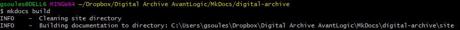
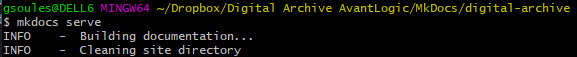

# MkDocs for the Digital Archive

---
    
> [MkDocs](https://www.mkdocs.org/) is a static website generator for building project
> documentation written in [Markdown](https://www.markdownguide.org/). Markdown is a very
> simple markup language used to create formatted documentation (like you see on this page)
> in a plain text file without having to use a program like Microsoft Word.
> The combination of MkDocs and Markdown makes it possible for multiple authors to produce
> consistent looking documentation, keep it up to date, and make it accessible online.

Virtually all documentation about the Digital Archive is created and maintained using MkDocs.
Some Digital Archive sites present information about their collection using either a sister 
WordPress website or the Omeka [Simple Pages plugin](https://omeka.org/classic/docs/Plugins/SimplePages/).

## About this MkDocs website

This MkDocs website is hosted at <https://digitalarchive.avantlogic.net/docs>

The website's files and folders are maintained in the AvantLogic `MkDocs repository`.

!!! note "MkDocs repository"
    Wherever this page refers to the `MkDocs repository` it means the location of the
     MKDocs working files and folders. That location is 
    an `AvantLogic Digital Archive Dropbox` folder named `\MkDocs\digital-archive`.
    Additionally, these files are stored on [GitHub](../developer/github.md) at <https://github.com/gsoules/MkDocs>
    which is currently a private repository accessible only to its collaborators.

The navigation structure for the website is configured in the `mydocs.yml` file.

The website uses the [Windmill](https://github.com/gristlabs/mkdocs-windmill) theme for MkDocs.

Some documentation pages contain information that is not accessible to the general public. [Learn how to password protect a page](../../protected/mkdocs-protected).

Whenever you edit, add, move, or delete any of the MkDocs files, you must build and
deploy the MkDocs website so that other people can see your changes.

## Build the MkDocs website

To build the MkDocs website:

- Go to the `MkDocs repository`
- Open a Command or Git Bash window
- CD to the `digital-archive` folder if not there already
- Run the following command:

```
mkdocs build
```


The build updates the files in the `site` folder in the `MkDocs repository` with any changes made since the last build.
You can now deploy these files to the server.

Also see the MkDocs documentation for [building the website](https://www.mkdocs.org/#building-the-website).

## Deploy the MkDocs website
Use Beyond Compare to sync the `site` folder in the `MkDocs repository` with the
corresponding folder on the server `https://digitalarchive.avantlogic.net/docs`.
To learn how, see the [Beyond Compare section](install-digital-archive.md#add-site-to-beyond-compare)
in the instructions for installing a Digital Archive site.

!!! Warning
    Be very careful that the `docs/protected/.htaccess` file does not get removed during synchronization because it is
    necessary to support password protection. If the file gets deleted, replace it with the copy in Dropbox which is located in 
    the `protected` folder in the `MkDocs repository`.

## Writing documentation

MkDocs comes with a built-in dev-server that lets you preview your documentation as you work on it. To run the server:

- Go to the `MkDocs repository`
- Open a Command or Git Bash window
- CD to the `digital-archive` folder if not there already
- Run the following command:

```
mkdocs serve
```



With the server running, you can now open <http://127.0.0.1:8000> in your browser to see the default home page being displayed.
When you edit a Markdown file and then save it, your changes automatically appear in the browser.

Editing and reviewing using the dev-server is much better than using a Markdown editor's preview window to see your changes
That's because the dev-server displays the content *exactly* as it will appear when deployed on the server
whereas an editor's preview pane will display its own flavor of Markdown of which there are many. However, if you need to
edit Markdown and don't have access to the dev-server, using a Markdown editor is the next best way to go.

When you need to exit the server, type `ctrl-C` in the command window to return to the command prompt.

### Edit an existing file
Follow these steps to edit an existing Markdown file:

- Locate the `.md` file in the `docs` folder in the`MkDocs repository`
- Make your changes
- [Build the MkDocs website]
- [Deploy the MkDocs website]

### Add a new file
Follow these steps to add a new page to the MkDocs website:

- Create the new `.mk` file in the `docs` folder in the `MkDocs repository`
- Add content written in Markdown
- Edit the `mkdocs.yml` file in the `MkDocs repository` to add the file to the navigation hierarchy
- [Build the MkDocs website]
- [Deploy the MkDocs website]

### Delete a new file
Follow these steps to remove a page from the MkDocs website:

- Delete the `.mk` file from the `docs` folder in the`MkDocs repository`
- Edit the `mkdocs.yml` file in the `MkDocs repository` to remove the file from the navigation hierarchy
- [Build the MkDocs website]
- [Deploy the MkDocs website]

See also the MkDocs documentation for [Adding pages](https://www.mkdocs.org/#adding-pages).

[Build the MkDocs website]: #build-the-mkdocs-website
[Deploy the MkDocs website]: #deploy-the-mkdocs-website