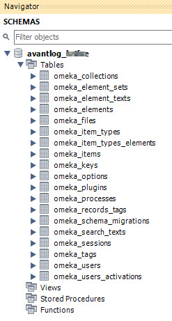

# MySQL Workbench

This page explains how to use [MySQL Workbench](https://www.mysql.com/products/workbench/)
to manage a Digital Archive database.

MySQL Workbench is a tool that lets database administrators and developers visually manage a
MySQL or MariaDB database. As an alternative, you can use [phpMyAdmin](https://www.phpmyadmin.net/),
but MySQL Workbench is more powerful and easier to use in many situations.

!!! warning ""
    AvantLogic uses MySQL Workbench Community edition
    [8.0.18](https://dev.mysql.com/downloads/workbench/). Version 8.0.19 would not load.

---

## Open a database

-   Run MySQL Workbench
-   On the home page, click the box with the name of the Digital Archive installation
-   Ignore a `Connection Warning` if it displays
-   The database should appear at left under the `Schemas` tab of the navigator
-   Click the triangle icons to expand/contract the database, its tables, and table columns

!!! warning ""
    If you can't connect, or you get a `Cannot Connect to Database Server` error, you may need
    to allow remote access to the database as explained in the following section. This can
    happen if your IP address changed since your last successful connection.

## Allow remote access to a database

For security reasons, a web host will not allow remote connections to a database
unless you explicitly grant access from the remote source. Follow these steps to
allow MySQL Workbench to remotely access a database.

-   Get the IP address of the computer on which use MySQL Workbench
    -	In a browser window type `myipaddress` in the address bar
    -   Your IP address will appear, or there will be links to sites that will show the address
-	Go to [cPanel](web-host.md#cpanel)
-	In the `DATABASES` section, click `Remote MySQL`
    -	Paste the IP address in the **Host** field under `Add Access Hosts`
    -	Click the `Add Host` button
-   If your IP address ever changes, you'll need to perform these steps again

## Add a database connection

Before you can work with a database using MySQL Workbench, you need to add a
connection to the database to your MySQL Workbench installation. Follow these steps
to add a database connection.

### Add a new connection

-   Allow remote access to the database as explained in the previous section.
-   Run MySQL Workbench
-	Choose `Database` > `Manage Connections` from the top menu
-	Click the `New` button at the bottom of the `Manage Server Connections` dialog
-	Set:
    -	**Connection Name:** the site name  
        Examples: `mydomain.net` or `mysubdomain.mydomain.net`
    -	**Connection Method:** `Standard (TCP/IP)`
    -	**Hostname:** same as the **Connection Name**
    -	**Port:** `3306`
    -	**Username:** the database username
-	Click `Store in Vault` to set the password. On the popup dialog:
    -   Enter the database password in the **Password** field
    -   Click the `OK` button
-	Click `Test Connection` to verify the credentials.
    -   Ignore a `Connection Warning` for incompatible/nonstandard server version.
        It will display if the database is MariaDB instead of MySQL.
    -   Click the `Continue Anyway` button
-   Click the `OK` button on the `Successfully made the MySQL connection` dialog
-	Click the `Close` button at lower right
-	**Quit MySQL Workbench** to work around a bug where new connections don't open
-   [Open the database](#open-a-database) to verify that you can connect to it
