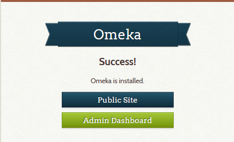
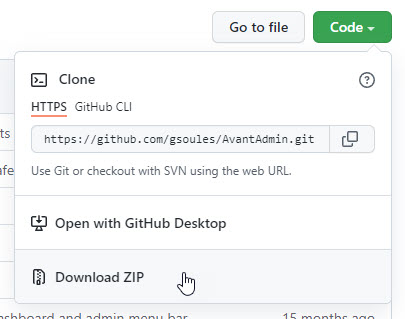
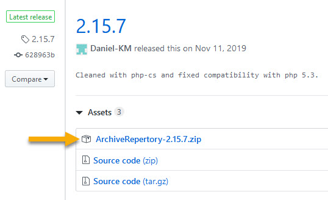
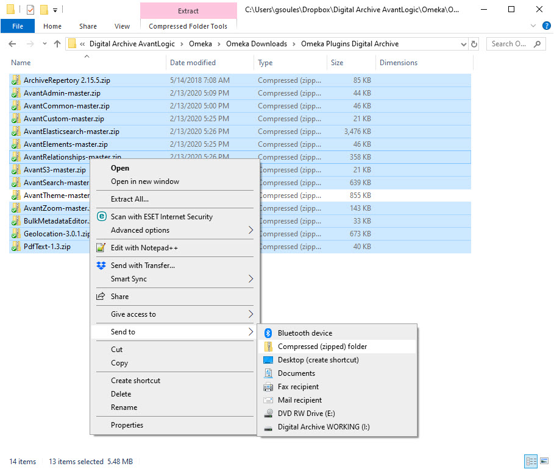
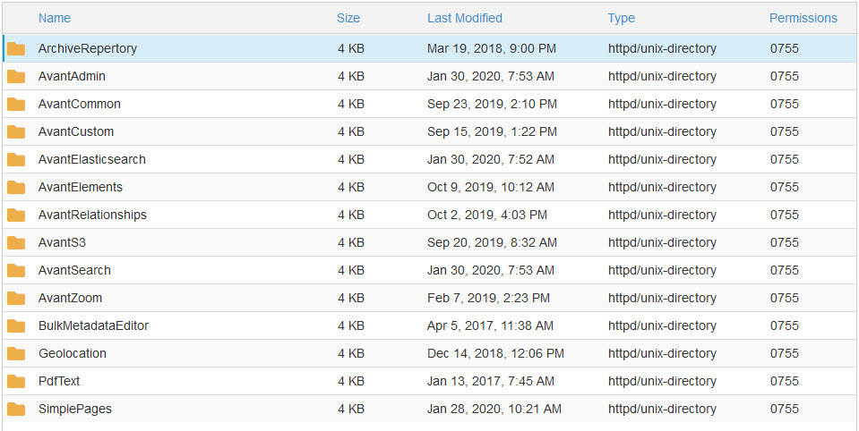
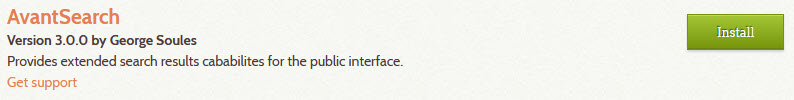
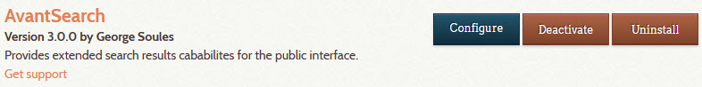
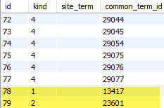

# Install a new Digital Archive site

This page explains all of the tasks that AvantLogic performs to install and configure a new Digital Archive installation. For each task, it lists the steps necessary to perform the task.

!!! note "Step by step"
    Installation tasks appear in the navigation panel at left. Perform them one at a time in the order listed.

    **[Print an installation checklist](installation-checklist.pdf)**

---
## Prerequisites
---

**Hosting requirements**

The web host must be an Apache web server that satisfies the 
[system requirements](https://omeka.org/classic/docs/Installation/System_Requirements/)
for [Omeka Classic](https://omeka.org/classic/). AvantLogic uses
[InMotion Hosting](https://inmotionhosting.com/) as its host.

**Site name**

Some of the installation steps require that you specify a *site name*. Choose a concise and
meaningful name that you and others will recognize when performing system administration. An acronym
is usually a good choice. For example, the site name for the Southwest Harbor Public Library is `swhpl`.

**Installation folder**

The Digital Archive files will be installed in `public_html/digitalarchive`. AvantLogic uses
the `digitalarchive` folder to isolate the Digital Archive files
from other applications on the web server. For example, some installations use a `digitalarchive`
folder and a `wp` folder side-by-side where the `wp` folder contains a WordPress application
for content related to the Digital Archive collection. If would be very messy, and
make application updates difficult, if the Digital Archive and WordPress files were
together in the same `public_html`.

!!! warning ""
    **Do not** create the `digitalarchive` folder at this time.  
    It will get created later during the *Install Omeka Classic files* step.

---
## MySQL database

A new cPanel account does not come with a database. Follow the steps below to
use [cPanel] to create a new empty database and a database user for the Digital Archive.

### Create a database

!!! warning "Important"
    cPanel will automatically prefix any database or user name that you choose with the
    first seven letters of the domain name, followed by `_`. For example, if you specify
    the name `omeka` and the domain name is `swhpl` the actual name will be `shwpl_omeka`.
    Keep this in mind because the name you choose will really be a suffix.

-   In WHM, select the account where the installation will be performed
-	Go to [cPanel] and choose `MySQL Database Wizard`
-	In wizard Step 1 Create a Database:
    -   Decide on the database name suffix
        -   A good choice is `omeka`
    -   Enter the suffix in the **New Database** field
-	Click the `Next Step` button

!!! note
    If you want to populate the new database with data from an existing Digital Archive database, follow the instructions to
    [copy a MySQL database](/technology/mysql/#copy-a-server-database-to-use-on-localhost).

### Create a user

-	In wizard Step 2 Create Database Users:
    -   Decide on the user name suffix
        -   A good choice is `archivist`
    -   Enter the suffix in the **Username** field
-   Click the `Password Generator` button
-   In the popup dialog:
    -   If you don't like the password, click the `Generate Password` button to get another
    -   **Copy the password to a password vault or other safe place**
    -   Click the checkbox confirming that you copied the password to a safe place
    -   Click the `Use Password` button
    -   The two password fields get filled in with the generated password automatically
-	Click the `Create User` button
-	In wizard Step 3 Add user to the database:
    -   Check the `ALL PRIVILEGES` checkbox at the top
    -	Click the `Next Step` button

### Configure MySQL Workbench

-   [Add a database connection to MySQL Workbench](mysql.md#add-a-database-connection)

---

### Change database storage engine
!!! note ""
    This step is only necessary when using AvantSearch **without** AvantElasticsearch. 

These steps change the storage engine for the `search_texts` table from `MyISAM` to `InnoDB`. They also add a `FULLTEXT` index to the `title` column of the `search_texts` table. To learn the reason for making these changes, see the AvantSearch
plugin topics on [improving search results](../../plugins/avantsearch/#improving-search-results)
and the [Titles Only option](../../plugins/avantsearch/avantsearch/#titles-only-option).

Follow these steps to change the storage engine:

-	Go to [cPanel] and choose `phpMYAdmin`
-	In the left panel, click on the Omeka database name to see its tables
-	Click on the `omeka_search_texts` table in the left panel
-	Click on the `Operations` tab
-	In the `Table Options` section, change **Storage Engine** from `MyISAM` to `InnoDB`
-	Click the `Go` button in the lower right of the section
-	Click on the `omkea_search_texts` table
-	Click the `Structure` tab
-	On the row for `title`, click `Fulltext` among the actions at the far right.
    If the browser window is too narrow to see all the options, click on `More`
    and choose `Fulltext` from the dropdown menu
-	On the `Confirm` dialog click the `OK` button to alter the table
-	`Title` now appears in the `Indexes` section showing with Type as `FULLTEXT`
-	Close the phpMyAdmin browser tab

---
## Omeka installation

### Copy installation files to server

Follow these steps to upload the Omeka Classic files to the web server. You can also read
[Omeka's installation instructions](https://omeka.org/classic/docs/Installation/Installation/).

-	Download the latest Omeka Classic release from <http://omeka.org/classic/download>  
    As of 8/12/2022, the latest release was `omeka-3.0.3.zip`
-	Go to [cPanel] and choose `File Manager`
-   Navigate into the `public_html` folder
-   [Upload and extract the zip file](linux-server.md#upload-and-extract-a-zip-file)
-   A new folder having the same name as the zip file will appear
-   Rename the new folder from the zip file's name to `digitalarchive`
-   Delete the zip file.
-   Copy `C:\xampp\htdocs\favicon.png` to the `public_html` folder

---

### Edit database configuration

Follow these steps to configure Omeka to use the database you created.
The *username*, *password*, and *dbname* values come from the [create MySQL database](#create-mysql-database) task.


-	Go to [cPanel] and choose `File Manager`
-	Navigate *into* the `public_html/digitalarchive` folder
-   Edit `db.ini`
-	Replace occurrences of `"XXXXXXX"` as follows:
    -	**host**     = `"localhost"`
    -	**username** = "*database username*"
    -	**password** = "*database password*"
    -	**dbname**   = *"database name*"
    -	**prefix**   = `"omeka_"`
    -	**charset**  = `"utf8"`
    -	Leave **port** commented out
-	Save your changes and close the file

To learn more, see the Omeka documentation for the [database configuration file](https://omeka.org/classic/docs/Technical/DatabaseConfigurationFile/).

!!! warning "Important"
    The `db.ini` file tells Omeka how to access the database. Any errors, typos, or incorrect information
    in this file will prevent Omeka from running and result in the display of a fatal error.

---

### Enable error reporting

This step allows PHP errors to appear in the browser. Normally you would not want
this for a production site, but it's better to become aware of a problem if it occurs.

In these steps you'll also add code to force URLs to https. The code gets added here and in the root-level `.htaccess` file
and in the steps to [configure site security](#configure-site-security).

-	Go to [cPanel] and choose `File Manager`
-   Allow hidden files to be displayed:
    -   Click the `Settings` button in the upper right of the File Manager
    -   Check th box for `Show Hidden Files`
-	Navigate *into* the `digitalarchive` folder
-   Edit `.htaccess`
-	Uncomment `SetEnv APPLICATION_ENV development`
-   Add the code below to force URLs to HTTPs
-	Save your changes and close the file

Put the code below immediately after the line `RewriteEngine on`

```
# Force all URLs to HTTPS
RewriteCond %{HTTPS} off
RewriteRule (.*) https://%{HTTP_HOST}%{REQUEST_URI} [R,L]
```

---

### Enable error logging and background process

Follow these steps to enable Omeka error logging so that a history of errors will be recorded.
To learn more, see the Omeka documentation for [retrieving error messages](https://omeka.org/classic/docs/Troubleshooting/Retrieving_Error_Messages/#activate-error-logging).

-	Go to [cPanel] and choose `File Manager`
-	Navigate *into* the `digitalarchive/application/config/` folder
-   Edit `config.ini`
-	Change `log.errors` from `false` to `true`
-   Change `background.php.path` from blank to `/usr/local/bin/php`
-	Save your changes and close the file

Errors are written to:

-   `digitalarchive/error_log`
    -   Okay to delete – it gets recreated automatically. Shows PHP errors.
-   `digitalarchive/admin/error_log`
    -   Okay to delete – it gets recreated automatically
-   `digitalarchive/application/logs/errors.log`
    -   Must exist – will get Omeka error if not present and writable.  
        If the file gets too
        big for cPanel  to allow editing, you can delete the file and create a new one with the same name.


If errors are not appearing in the browser, make sure that display_errors=On and error_reporting=32767 (or E_ALL).
These two settings can be applied in php.ini, but since there can be multiple php.ini files, it's not always clear
which applies.

---
## Omeka configuration

You are now ready to launch Omeka and configure site settings.

-	Open a browser using the URL for the `digitalarchive` folder, for example:
    `avantlogic.net/digitalarchive`.

The Omeka `Configure Your Site` page should appear.


### Enter configuration settings

You can now configure the Omeka site. See the Omeka
[general settings](https://omeka.org/classic/docs/Admin/Settings/General_Settings/)
documentation and the
[appearance settings](https://omeka.org/classic/docs/Admin/Appearance/Appearance_Settings/)
documentation for an explanation of the configuration settings.

!!! note "Super user"
    The username and password you will specify below are for an Omeka *super user*.  
    See [Omeka terminology](../../administrator/omeka-elements/#terminology) to learn what it means to be a super user.

-   Set:
    -	**Username**: *a super user name*  
    -	**Password**: *super user password*
    -	**Re-type the Password**: *super user password*
    -	**Email**: *a valid email address*  
    -	**Administrator Email**: *same as Email*
    -	**Site Title**: *the organization name*  
    -	**Site Description**: leave blank
    -	**Site Copyright Information**: *the organization name*    
    -	**Site Author Information**: *your name or company*  
    -	**Tag Delimiter**: `,` (a comma)
    -	**Fullsize Image Size**: `600`
    -	**Thumbnail Size**: `300`
    -	**Square Thumbnail Size**: `100`
    -	**Items Per Page (admin)**: `50`
    -	**Items Per Page (public)**: `50`
    -	**Show Empty Elements**: *Unchecked*
    -	**ImageMagick Directory Path**: `/usr/bin`
-	Click the `Install` button
-   You should see the `Success!` page.



-	Click the `Admin Dashboard` button
-	Login with the super user user name and password
-   Check the `Remember Me` checkbox
-   Click the `Login` button
-   The `Dashboard` page should display.

---

### Configure additional settings

Follows these steps to finishing configuring Omeka.

** Appearance settings**

-	On the `Dashboard page`, click `Appearance` in the top menu bar
-   Click `Settings` in the `Appearance` page menu bar
-	At the bottom of the page, uncheck `Show Element Set Headings`
-	Click the `Save Changes` button

** Search settings**

-	Click `Settings` in the top menu bar
-   Click `Search` in the `Settings` page menu bar
-	Uncheck all `Search Record Types` except `Item`
-	Click the `Save Changes` button

** General settings**

-   Click `General` in the `Settings` page menu bar
-	Click the `Test` at the bottom of the page  
    You should see `The ImageMagick directory path works`
-   If the message says that the path does *not* work:
    -   Go to [cPanel] and choose `Terminal`
    -   In the terminal window, type `which convert` and press `Enter`
    -   Use the response to determine the correct path and try again 
        or contact your host's technical support and ask them to tell you the path 

---
## Web server settings

### Configure site security

By default, an Omeka installation uses HTTP for every page except the login page which uses HTTPS.
Perform the steps below to follow the best practice of using HTTPS for all pages.

!!! danger "Warning"
    This task requires that you edit the site's `.htaccess` file. Even the slightest
    error in this file can result in an **internal server error** which will prevent the site
    from loading. Be very careful.

-	Go to [cPanel] and choose `File Manager`
-	Navigate *into* the `public_html` folder
-   If the folder does not contain a `.htaccess` file, create a new empty .htaccess file
-   Edit `.htaccess`
-   Add the code shown below at the top of the file
-   Save your changes and close the file
-   Test that all pages are HTTPS and that the redirect works correctly

```
# Turn on rewrites.
RewriteEngine on

# Force all URLs to HTTPS
RewriteCond %{HTTPS} off
RewriteRule (.*) https://%{HTTP_HOST}%{REQUEST_URI} [R,L]

# Redirect the root and only the root to the default folder
RedirectMatch ^/$ /digitalarchive
```

!!! warning ""
    If the redirect does not appear to be working, flush the browser cache.

!!! note
    The code above redirects root requests. For instance, if someone attempts to go to `avantlogic.net`
    which is the web server root, they will be redirected to `avantlogic.net/digitalarchive/find` which
    displays search results for the most recently modified items. If you left off `/find`, Omeka would redirect to the default home page. You can change the default home page on the `Navigation` tab of the Omeka admin `Appearance` page as described in the [Omeka documentation](https://omeka.org/classic/docs/Admin/Appearance/Navigation/). For example, you could set the default home page to be an *About* page that you created with
    the Simple Pages plugin. Alternatively, you can change `.htaccess` to redirect to a specific
    URL as explained below.

You can change the `RedirectMatch` line to redirect to a specific URL.
For example, if the Omeka installation has an `About` page, you could redirect there like this:

```
RedirectMatch ^/$ /digitalarchive/about
```
You can even redirect to a page of search results, for example, to display a site content index:

``` plaintext
RedirectMatch ^/$ /digitalarchive/find?view=2&index=53
```    

See [this post](https://stackoverflow.com/questions/990392/htaccess-rewrite-to-redirect-root-url-to-subdirectory)
to learn why using RedirectMatch works than RewriteRule for this purpose.

---

### Disallow bots

Crawling of Digital Archive sites by Google and other major search engines is generally a good thing;
however, some commercial bots can hit a single Digital Archive site as often as 100,000 times a day or more.
The `robots.txt` file is used to block specific bots while allowing others to access the site. As of
September 2020, the bots listed below were the worst offenders, though their behavior was not malicious.

To see bot traffic, use the cPanel tool Awstats and click the Robots/Spiders visitor link in the left panel.

Edit (or create) `public_html/robots.txt` to contain the content below:

```
User-agent: *
Disallow: /files/

User-agent: AhrefsBot
Disallow: /

User-agent: SemrushBot
Disallow: /
```

---

### Configure PHP settings

-	Go to [cPanel] and choose `MultiPHP INI Editor`
-   Select the `Basic Mode` tab
-   Choose the site from the dropdown menu
-   Set:
    -   **max_execution_time**: 120
    -   **memory_limit**: 512M
    -   **post_max_size**: 128M
    -   **upload_max_filesize**: 128M
-   Click the `Apply` button

---

### Verify PDF support

These steps verify that a program called `pdftotext` is installed on the web server.
It is used by the  `AvantElasticsearch` plugin to 
make PDF files searchable. If you won't be using `AvantElasticsearch`, you can skip this task.

-   Go to [cPanel] and choose `Terminal`
-   In the terminal window, type `pdftotext -v` and press `Enter`
-   The `pdftotext` program should display its version
-   If instead you see `command not found`, ask your host to install `pdftotext`

---

### Verify that background processing works
Some Omeka operations are performed in the background. Examples are a request to reindex records
and using the Bulk Edit plugin to perform bulk edits in the background.

Follow these steps to determine if the default configuration for background processing is working properly.

-	Click `Settings` in the top menu bar
-   Click `Search` in the `Settings` page menu bar
-	Click the `Index Records` button (even though there are no records to index)
-   You should see a green message `Indexing records. This may take a while...`
-	If instead you get an error that the configured PHP path is  or does not point to a PHP-CLI binary:
    -	Look at this [article](https://community.reclaimhosting.com/t/setting-the-php-cli-path-in-omeka-classic/231) to determine the correct background path
    -	Edit `digitalarchive/application/config/config.ini`
    -	Set `background.php.path` to the correct path for the server
    -   Save changes and close the `config.ini` file
    -	Verify that the Index Records operations works with no error

!!! note ""
    Finding the right path might be a trial and error process. Leaving `background.php.path = ""` works correctly on some servers. On others it needs to be set to `/usr/local/bin/php` or `/usr/bin/php-cli`.
    If you are not successful, contact the host to ask for the right path.

---
## Plugin acquisition

It is now time to acquire the zip files containing the plugins, and the theme, required
by the Digital Archive. This section explains where to locate the files and how to add
them to the installation so that later you can install and configure the them and each plugin.
To *add* them means to upload them to the web server and extract them into the proper installation folders.

### Get Digital Archive zip files

The following zip files are required for most Digital Archive installations.
All the files are located on GitHub. The link on the zip file name takes
you to the GitHub repository for that file.

Type         | Plugin Name              | Zip file name
-------------|-------------------|--------------
Omeka plugin |ArchiveRepertory   |[ArchiveRepertory 2.15.7.zip](https://github.com/Daniel-KM/Omeka-plugin-ArchiveRepertory/releases/tag/2.15.7)
Avant plugin |AvantAdmin         |[AvantAdmin-master.zip](https://github.com/gsoules/AvantAdmin)
Avant plugin |AvantCommon        |[AvantCommon-master.zip](https://github.com/gsoules/AvantCommon)
Avant plugin |AvantCustom        |[AvantCustom-master.zip](https://github.com/gsoules/AvantCustom)
Avant plugin |AvantDPLA          |[AvantDPLA-master.zip](https://github.com/gsoules/AvantDpla)
Avant plugin |AvantElasticsearch |[AvantElasticsearch-master.zip](https://github.com/gsoules/AvantElasticsearch)
Avant plugin |AvantElements      |[AvantElements-master.zip](https://github.com/gsoules/AvantElements)
Avant plugin |AvantImport        |[AvantImport-master.zip](https://github.com/gsoules/AvantImport)
Avant plugin |AvantRelationships |[AvantRelationships-master.zip](https://github.com/gsoules/AvantRelationships)
Avant plugin |AvantS3            |[AvantS3-master.zip](https://github.com/gsoules/AvantS3)
Avant plugin |AvantReport        |[AvantReport-master.zip](https://github.com/gsoules/AvantReport)
Avant plugin |AvantSearch        |[AvantSearch-master.zip](https://github.com/gsoules/AvantSearch)
Avant theme  |AvantTheme         |[AvantTheme-master.zip](https://github.com/gsoules/AvantTheme)
Avant plugin |AvantZoom          |[AvantZoom-master.zip](https://github.com/gsoules/AvantZoom)
Omeka plugin |BulkMetadataEditor |[BulkMetadataEditor.zip](https://github.com/UCSCLibrary/BulkMetadataEditor/releases/tag/2.4)
Omeka plugin |Geolocation*       |[Geolocation.zip](https://github.com/gsoules/Geolocation)
Omeka plugin |OaiPmhRepository   |[OaiPmhRepository-master.zip](https://github.com/gsoules/OaiPmhRepository)
Omeka plugin |SimpleVocab        |[SimpleVocab-2.2.2.zip](https://github.com/omeka/plugin-SimpleVocab/releases/tag/v2.2.2)

\* Indicates that the Omeka plugin has been modified by AvantLogic for the Digital Archive

---

### Get Avant plugin or theme zip file

Follow these steps to locate and download each zip file one at a time:

-   Click on a link in the table above to go to the GitHub repository for the file

-   If the link takes you to the main repository page:
    -   Be sure that the latest revision is what you want.  
        If in doubt, download the latest release instead.
    -   Click the green `Clone or download` dropdown as shown below
    -   Choose `Download ZIP`
    -   Save the file to a folder on your computer

    

-   If the link takes you to a release page:
    -   Click the link for the `.zip` asset (pointed to by the arrow below)
    -   Save the file to a folder on your computer

    

---    

!!! note ""
    The sections that follow assume that you are familiar with the process to
    [upload and extract a zip file](linux-server.md#upload-and-extract-a-zip-file).

### Upload and extract the theme

-   Upload `AvantTheme-master.zip` into `public_html/digitalarchive/themes`
-   Extract `AvantTheme-master.zip`
-   Click the cPanel `Reload` menu item to see the resulting folder
-   Delete `AvantTheme-master.zip`
-   Rename the `AvantTheme-master` folder to `AvantTheme`

### Upload the plugin zip files

-   Go to the folder where you downloaded the zip files
-   Select all the files, except for the theme
-   Right click the selection and choose `Send to ` > `Compressed (zip) folder`



-   Rename the newly created zip file to `plugins.zip`
-   Upload `plugins.zip` into `public_html/digitalarchive/plugins`
-   Extract `plugins.zip` to get the individual plugin zip files
-   Delete `plugins.zip`

### Extract individual plugin zip files

For each of the plugin zip files:

-   Extract the zip file
-   Click the cPanel `Reload` menu item to see the resulting folder
-   Delete the zip file
-   Rename the folder to remove `-master`

*There does not seem to be a way to extract all of them at once.*

---

### Remove unused plugins
Delete these two folders for plugins that the Digital Archive does not use:

``` plaintext
public_html/digitalarchive/plugins/Coins
public_html/digitalarchive/plugins/ExhibitBuilder
```    
The `plugins` folder on the web server should now look like this:


---
## AvantTheme configuration

AvantTheme, and many of the AvantPlugins, depend on the AvantCommon plugin being installed.
Before you can install the theme, install AvantCommon by following these steps:

-   Login to Omeka as a super user
-	Click `Plugins` in the top menu bar
-   Many of the plugins added in the previous task will be shaded in pink
-   Click the `Install` button for AvantCommon
-   On the `Configure Plugin: AvantCommon` page:
    -   Don't enter any values for now
    -   Click the `Save Changes` button
-   The pink shading should be gone from all of the plugins except for AvantLocation, AvantReport, and AvantVocabulary.
-	Click `Appearance` in the top menu bar
-   On the `Themes` page, click the `Use this theme` button for AvantTheme
-   AvantTheme is now the current theme
-   Click the `Configure Theme` button
-   For **Logo File** browse to `Digital Archive AvantLogic\Installations\Template`
-   Choose `logo.jpg`
-   Click the `Save Changes` button

### Remove unused themes

-   Use [cPanel] to navigate *into* `public_html/digitalarchive/themes`
-	Delete all the theme folders except AvantTheme

---
## Item elements definition

Omeka installs with a number of different *Item Types* and *Elements*; however, the Digital Archive
uses only one Item Type which contains all of the Dublin Core elements plus only those additional elements
that the organization needs. Having just one Item Type makes data entry easier and faster. To
learn more, see the Omeka documentation for [Item Types](https://omeka.org/classic/docs/Content/Item_Types/).

Follow the steps below to remove unused Item Types and Elements and
create a single Item Type having the elements needed by the organization.

---

###	Delete unused item types
-   Open the database in [MySQL Workbench](mysql.md#open-a-database)
-	Right click on the `omeka_item_types` table and choose `Select Rows`
-	Select all the rows
-	Right click on the selection and choose `Delete Rows`
-	Click the `Apply` button in the lower right
-	Click the `Apply` button on the `Apply SQL Script to Database` dialog
-   When the deletion completes, click the `Finish` button

---

###	Delete unused elements
-	Right click on the `omeka_elements` table and choose `Select Rows`
-	Select all the non Dublin Core element rows. Those rows have an  
    `element_set_id` value of `3` and are named `Text`, `Interviewer`, `Interviewee` etc.
-	Right click on the selection and choose `Delete Rows`
-	Click the `Apply` button in the lower right
-	Click the `Apply` button on the `Apply SQL Script to Database` dialog
-   When the deletion completes, click the `Finish` button

You can now quit MySQL Workbench.

---

###	Create a new Item Type
-   Login to Omeka 
-	Click `Items Types` in Omeka's left admin menu
-	Click either of the green `Add an Item Type` buttons
-	For **Name** use the *site name* in all caps, for example `NEHL` for Northeast Harbor Library
-	Leave the description blank
-	Click the `Add Item Type` button

The new Item Type contains all of the Dublin Core elements. If you know what other elements
the organization needs, you can add them now, or you can
[add additional elements](#add-additional-elements) as the last task of the installation.
The Administrator documentation explains how to [add a new element](../../administrator/omeka-elements/#add-a-new-element).    

---
### Add additional elements

See the Administrator documentation on how to [add a new element](../../administrator/omeka-elements/#add-a-new-element).    
Also, arrange the order of all elements.

---

### Arrange element order
The default order in which the Dublin Core elements appear when editing an item is not
suitable because the Identifier and Type fields appears near the end. Follow the instructions to
[arrange the element order](../../administrator/omeka-elements/#arrange-element-order) into the
recommended sequence for the Digital Archive.

---
## FTP access

This section describes how to set up FTP access for a superuser.

!!! note ""
    This is an optional step during installation. It can be done later if/when the organization needs FTP access e.g. to upload zoom tiles.

### Set up superuser FTP access

Follow these steps to access the Digital Archive web server via FTP.

!!! note "Note"
    The settings below are for the site's primary FTP account which can use the SSH protocol.
    The [settings for a limited FTP account](../../administrator/zoomable-images#filezilla-ftp-settings)
    are restricted to using the FTP protocol. To learn more see [this post](https://community.reclaimhosting.com/t/can-i-ssh-using-an-ftp-account/967).

-	Run FileZilla
-	Choose `File` > `Site Manager` from the top menu bar
-	On the `Site Manger` dialog click the `New site` button
-	Fill in the site name in the `My Sites` tree
-	On the `General Tab` set:
    -	**Protocol**: `SFTP – SSH File Transfer Protocol`
    -	**Host**: Example: `ftp.mydomain.net`
    -	**Port**: leave blank
    -	**Logon Type**: `Normal`
    -	**User**: *cPanel username*
    -	**Password**: *cPanel password*
-	Click the `Connect` button
-	On the `Unknown host key` dialog:
    -   Check the `Always trust this host` checkbox
    -   Click the `OK` button


---
## Beyond Compare

[Beyond Compare](https://www.scootersoftware.com/) is a tool for comparing and synchronizing local
files and folders with their remote counterparts on the Digital Archive server. It does this using
its builtin FTP support.

To add a Digital Archive site to Beyond Compare, you need to specify the location of the local site
and the remote site and then save two comparison sessions, one for the `themes` folder and one for the
`plugins` folder.

### Create theme comparison session
-	Run Beyond Compare
-	Click on the `Folder Compare` option on the home page
-	Set the local site
    -	Click the folder icon in the upper right of the left pane
    -   Click `Local File System` in the left panel
    -	Navigate to `C:\xampp\htdocs\omeka-2.6` in the right panel
    -   Click the `OK` button
-	Set the FTP site
    -	Click the folder icon in the upper right of the right pane
    -	Click on `Quick Connect` > `FTP Profile` in the left panel
    -	Enter the FTP credentials for the remote server
    -	Click the `Connect & Browse` button to verify that you can access the site
    -	Click the OK button
-	In each pane:
    -   Navigate to the `themes` folder
    -	Right click on the folder and choose `Set as Base Folder`
-	On the main menu, click `Session` > `Save Session As`
-	In the `Save current settings as` field, type e.g. `SWHPL Theme`
-   In the `Create in` tree click `Digital Archive`
-	Click the `OK` button

### Create plugin comparison session    
-	In each pane:
    -   Navigate to the `plugins` folder
    -	Right click on the folder and choose `Set as Base Folder`
-	On the main menu, click `Session` > `Save Session As`
-	In the `Save current settings as` field, type e.g. `SWHPL Plugins`
-   In the `Create in` tree click `Digital Archive`
-	Click the `OK` button
-   In the top menu bar click `Session` > `Session Settings...`
-   On the `Session Settings` dialog click the `Name Filters` tab
-   Past the list below in the `Exclude folders:` panel
-   Click the `OK` button

``` plaintext
.git
.\ArchiveRepertory
.\AvantDpla
.\AvantElasticsearch\vendor
.\BulkMetadataEditor
.\CsvExport
.\Dropbox
.\ExhibitBuilder
.\Gcihs
.\Geolocation
.\OaiPmhRepository
.\SimplePages
.\SimpleVocab
```

To rename or delete existing sessions, click on the `Home` button in the ribbon
and then access the session of interest in the Sessions tree at left.

---
## Plugin installation

You are now ready to install the plugins that turn an Omeka installation into the Digital Archive.

At this point in the installation, the plugin files have been uploaded to the web server and will
appear on the Omeka `Plugins` page; however, most of the plugins have not yet been installed
as is evidenced by the green `Install` button.



Once a plugin is installed, it shows buttons that let you configure, deactivate, or uninstall it.



Install and configure the plugins in the order in which they appear in the sections that follow.

---
## Archive Repertory

The Archive Repertory plugin controls where files are stored when you attach files, such as images or documents,
to Omeka items.

!!! warning "Important"
    Install this plugin now *before adding any items to Omeka* because the plugin overrides Omeka's
    default file storage mechanism and it won't work correctly if some files have already been stored.

Follow these steps to install and configure the Archive Repertory plugin:

-	Go to the Omeka `Plugins` page
-	Click the `Install` button for `Archive Repertory`
-	Set:
    -   Collections option:
        - **How do you want to name ...**: `Don’t add folder`
    -   Items options:
        - **How do you want to name ...**: `Identifier`
        - **Prefix for Item**: leave blank
        - **Convert folder names**: `Full conversion to Ascii`
    -   Files option:
        - **Convert filenames**: `Full conversion to Ascii`
        - **Keep only base...**: Unchecked
    - Special derivative folders options:
        - **Other derivative folders**: leave blank
        - **Process**: `Omeka internal`
        - **Max downloads**: `30000000`
        - **Legal**: `I agree with terms of use.`
- Click the `Save Changes` button

Verify that the plugin is working as expected.

#### Add a test item
-	Click `Items` in Omeka's left admin menu
-   Click the `Add an item` link
-	Enter `12345` in the **Identifier** field
-   Enter `Test 1` in the **Title** field
-   Click the `Add Item` button

#### Upload a test image
-   On the `Browse Items` page, click the `Edit` link under the `Test 1` item
-	Click on the `Files` tab at the top of the page
-   Click the `Browse...` button
-   Browse for an image
-	Click the `Save Changes` button
-   You should now be on the `Item` page for new item.
-   Use FTP or cPanel to navigate to the `/digitalarchive/files` folder
-   Verify that the subfolders (`fullsize`, `original` etc) contain a subfolder named `12345`
-   Verify that the`12345` folder contains the uploaded image

#### Delete the test item
-   On the `Item` page, click the `Delete` button
-   Click `Delete` on the `Are you sure` dialog
-	Verify that the `12345` folders got deleted from the `/digitalarchive/files` folders

!!! warning ""
    Do not attempt to add any more items until the installation is completed including setting up AvantElasticsearch and AvantVocabulary.

!!! note ""
    If using Filezilla, you may need to disconnect and reconnect to verify that the files got deleted
    because the Refresh option does not always seem to work. Or do the verification using the cPanel
    File Manager.

---
## Bulk Metadata Editor

Follow these steps to install Bulk Metadata Editor:

-	Go to the Omeka `Plugins` page
-	Click the `Install` button for `Bulk Metadata Editor`
-   The plugin has no configuration options

---
## Geolocation

!!! note ""
    Skip this task if the installation will not be using the Geolocation plugin.

!!! warning ""
    The only Digital Archive installation that has the Geolocation plugin installed is
    Southwest Harbor Public Library and it uses a version modified by AvantLogic; however,
    the Library has deactivated the plugin because too much advertising shows up in the maps.

Follow these steps to install the Geolocation plugin:

-	Go to the Omeka `Plugins` page
-	Click the `Install` button for `Geolocation`
-   Configure the plugin as appropriate for the installation
-   Click the `Save Changes` button

---
## OAI-PMH Repository

!!! note ""
    Skip this task if the installation will not ingested by the Digital Public Library of America.

Follow these steps to install the OAI-PMH Repository plugin:

-	Go to the Omeka `Plugins` page
-	Click the `Install` button for `OAI-PMH Repository`
-   Configure the plugin as appropriate for the installation
-   Click the `Save Changes` button

---
## Simple Pages

Simple Pages has no configuration options.

Follow these steps to install the Simple Pages plugin:

-	Go to the Omeka `Plugins` page
-	Click the `Install` button for `Simple Pages`

!!! note "Notes"
    To allow all HTML, e.g. `` tags, go to `Settings` > `Security` and uncheck the
    **Enable HTML Filtering** checkbox. Otherwise, filtered elements get removed when you
    save the Simple page.

    When adding Simple pages, be sure to check the box for `Publish this page?` so it will show
    up in the Omeka navigation section.

---
## Simple Vocab

You'll install the Simple Vocab plugin next because it is needed by the AvantElements plugin.

Follow these steps to install and configure the Simple Vocab plugin:

-	Go to the Omeka `Plugins` page
-	Click the `Install` button for `Simple Vocab`
-   Leave **Apply to Files** unchecked
-   Click the `Save Changes` button
-   Click `Simple Vocab` in Omeka's left admin menu
-   Add vocabularies for the **Rights**, **Subject**, **Type**, and **Place** elements (see below)
-   Click the `Save Changes` button

Rights
``` text
In Copyright
In Copyright - Educational Use Permitted
In Copyright - Non-Commercial Use Permitted
In Copyright - Rights-holder(s) Unlocatable or Unidentifiable
No Copyright - United States
No Copyright - Non-Commercial Use Only
Copyright Not Evaluated
Copyright Undetermined
No Known Copyright
```

Subject
``` text
Use the Vocabulary Editor to specify Subject terms
```

Type
``` text 
Use the Vocabulary Editor to specify Type terms
```

Place
``` text 
Use the Vocabulary Editor to specify Place terms
```

---
## AvantAdmin

Follow these steps to install and configure the [AvantAdmin] plugin:

-	Go to the Omeka `Plugins` page
-	Click the `Install` button for `AvantAdmin`
-   Leave the `Maintenance` checkbox unchecked
-   Enter the **Item Type** name for the organization (usually all caps e.g. `SWHPL`)
-   Click the `Save Changes` button

---
## AvantCommon

The AvantCommon plugin was installed as part of the task to [install AvantTheme](#install-avanttheme).

Follow these steps to configure the [AvantCommon] plugin:

-	Go to the Omeka `Plugins` page
-	Click the `Configure` button for `AvantAdmin`
-	Enter the **Identifier** as `Identifier`
-   Enter an **Alias** if applicable
-	Enter any **Private Elements**
-	Enter the **Unused Elements** shown below plus any others

```
Source
Contributor
Relation
Format
Language
Coverage
```

-	Check the **Enable Lightbox** checkbox
-   Leave **Request Image URL** blank
-   Click the `Save Changes` button

---
## AvantCustom 

AvantCustom has no configuration options.
Follow these steps to install [AvantCustom]:

-	Go to the Omeka `Plugins` page
-	Click the `Install` button for `AvantCustom`
-   The plugin has no configuration options

---
## AvantDPLA

!!! note ""
    Skip this task if the installation will not ingested by the Digital Public Library of America.

Follow these steps to install the AvantDPLA plugin:

-	Go to the Omeka `Plugins` page
-	Click the `Install` button for `AvantDPLA`
-   The plugin has no configuration options

---
## AvantElements

Follow these steps to install and configure the [AvantElements] plugin:

-	Go to the Omeka `Plugins` page
-	Click the `Install` button for `AvantElements`
-   Enter the **Display Order** elements shown below plus any others

``` plaintext
Identifier
Title
Type
Subject
Description
Creator
Publisher
Date
Rights
```    

-   Enter the **Implicit Link** elements shown below plus any others

``` plaintext
Type
Subject
```    

-   Leave **External Link** blank
-	Check the **External Link Icon** checkbox
-   Enter the **Validation** specifiers shown below plus any others

``` plaintext
Title: required, simple-text
Type: required
Creator: simple-text
Publisher: simple-text
Date: date
Rights: required
```    

-   Enter the **Allow Add Input** elements shown below plus any others

``` plaintext
Title
Creator
Subject
```

-   Leave **Allow HTML** blank
-   Enter the **Text Field** specifiers shown below plus any others
``` plaintext
Identifier: 70
Date: 160
Creator
```

-   Enter the **Vocabulary Field** specifiers shown below plus any others
``` plaintext
Type: 320
Subject: 320
Rights
```

-   Leave **Checkbox field** blank
-   Leave **Read-only Field** blank
-   Leave **Default Value** blank
-   Enter the **Suggest** elements shown below plus any others
``` plaintext
Creator
Publisher
```

-   Enter the **Title Sync** specifiers shown below plus any others
``` plaintext
Creator
Publisher
```

-   Enter the **Custom Callback** specifiers shown below plus any others
``` plaintext
Identifier, default: DigitalArchive, getDefaultIdentifier
Identifier, validate: DigitalArchive, validateIdentifier
Rights, filter: DigitalArchive, filterRights
Date, filter: DigitalArchive, filterDate
<item>, validate: DigitalArchive, validateItem
```

-   Verify that you have set all of the options correctly
-   Click the `Save Changes` button

### Change Element Set order

- Click `Settings` in the top menu bar
- Click the `Element Sets` tab
- Click the `Edit` link for Dublin Core
- Reorder the elements by dragging them to the order shown below.
- Click the `Save Changes` button

```
Identifier
Title
Type
Subject
Description
Date
Creator
Publisher
Source
Contributor
Rights
Relation
Format
Language
Coverage
```


---
## AvantImport

!!! note ""
    Skip this task if the installation will not be importing items from a CSV file.

Follow these steps to install the AvantImport plugin:

-   Go to [cPanel] and choose `File Manager`
-   Create this folder: `public_html/digitalarchive/files/import`
-	Go to the Omeka `Plugins` page
-	Click the `Install` button for `AvantImport`
-   Leave **Mappings** blank
-   Click the `Save Changes` button

To learn how to use AvantImport, see how to [import CSV data](../administrator/import-csv.md).

---
## AvantRelationships

Follow these steps to install  the [AvantRelationships] plugin:

-	Go to the Omeka `Plugins` page
-	Click the `Install` button for `AvantRelationships`
-	Set **Visualization Preview** to `At designated location`
-   Set **Max Direct Items** to `6`
-   Set **Max Indirect Items** to `8`
-   Enter the **Title Relationships** specifier shown below plus any others

``` plaintext
Creator: Created
Publisher: Published
```
-   Leave **Custom Relationships** blank
-   Leave **Delete Tables** unchecked
-   Click the `Save Changes` button

---
##  AvantSearch

!!! note ""
    Ignore the MyISAM warning if the installation will be using Elasticsearch.

Follow these steps to install and configure the [AvantSearch] plugin:

-	Go to the Omeka `Plugins` page
-	Click the `Install` button for `AvantSearch`
-	Check the **Titles Only** checkbox

-   Enter the **Columns** specifiers shown below plus any others
``` plaintext
Identifier, Item: 65, right
Title
Type
Subject
Creator
Publisher
```

-   Enter the **Layout** specifiers shown below plus any others
``` plaintext
L1, Details
L2, Type / Subject: Identifier, Title, Type, Subject
L3, Creator / Publisher: Identifier, Title, Creator, Publisher, Date
```

-   Enter the **Detail Layout** elements shown below plus any others
``` plaintext
Identifier
Type
Subject
Creator
Publisher
Date
<tags>
<score>
```

-   Enter `Identifier` for **Integer Sorting**
-   Leave **Address Sorting** unchecked
-   Leave **Elasticsearch** unchecked
-   Click the `Save Changes` button

---
## AvantReport

AvantReport has no configuration options.
Follow these steps to install [AvantReport]:

-	Go to the Omeka `Plugins` page
-	Click the `Install` button for `AvantReport`

---
## AvantZoom

AvantZoom has no configuration options.
Follow these steps to install [AvantZoom]:

-	Go to the Omeka `Plugins` page
-	Click the `Install` button for `AvantZoom`

To learn about using AvantZoom, see the documentation for [zoomable images](../../administrator/zoomable-images).

### Create a Zoom folder
Follow these steps to create the folder used to store the tiles for zoomable images.

-	Go to [cPanel] and choose `File Manager`
-   Create these two folders:
    -   `public_html/digitalarchive/files/zoom`
    -   `public_html/digitalarchive/files/zoom/images`
-   Copy the OpenSeadragon icons from `public_html/digitalarchive/plugins/AvantZoom/images` to
    `public_html/digitalarchive/files/zoom/images`    

### Create limited FTP account

Follow these steps to create a limited access FTP account that will allow an administrator to upload
zoomable image tiles to the `zoom` folder, but will prevent them from seeing any other
installation folders.

-	Go to [cPanel] and choose `FTP Accounts`
-	Type `zoom` for the **Log in** name and generate a password
-	Set the **Directory**  to `public_html/digitalarchive/files/zoom`
-	Leave the Quota as `Unlimited`
-	Click the `Create FTP Account` button
-	The FTP username will look like this example: `zoom@mydomain.net`
-   Test the account using the documentation for
    [zoom tiles upload methods](../../administrator/zoomable-images/#upload-methods).


---
## AvantS3

!!! note ""
    Skip this task if the installation will not be using S3.

Follow these steps to install and configure [AvantS3]:

-	Go to the Omeka `Plugins` page
-	Click the `Install` button for `AvantS3`

If you are not using the AvantCustom plugin, also follow these steps:

-   Go to the configuration options page for the AvantElements plugin
-   Add the code below to the end of the **Custom Callback** specifiers

``` plaintext
Identifier, filter: DigitalArchive, filterIdentifierS3
```

---
## AvantElasticsearch

### Create AWS credentials

Before installing AvantElasticsearch, create the AWS credentials that you'll need to provide on the
AvantElasticsearch configuration page.

-	Go to <https://aws.amazon.com/>
-   Click the `Sign In to the Console` button at upper right
-   Enter the Account ID ending in `4548`
-   If the page says **_Sign is as IAM user_**, click the `Sign-in using root user email` link
-   Enter the root user email
-   Enter the root user password
-   You should now be on the **_AWS Management Console_** page
-	In the top menu dropdown for the logged in user, choose `Security Credentials (root user)`
-   You should now be on the **_My Security Credentials_** page
-	Click `Users` in the left menu
-	Click the `Add User` button at the top
-	Type the organization abbreviation for the `User name` e.g. `swhpl`
-	For  **Access type** check the `Programmatic Access` box
-	Click the `Next: Permissions` button
-	In the **Add User to Group** section, check the box for `contributor` group
-	Click the `Next: Tags` button
-	Click the `Next: Review` button
-	Click the `Create User` button
-   Click the `Show` link for the **Secret Access Key**
-	Copy the **Access Key ID** and **Secret Access Key** to the `AWS Keys` tab of the `Digital Archive Accounts` Excel sheet  
    *This is the only opportunity to obtain the secret key*
-	Click the `Close` button

## Install the AvantElasticsearch plugin

Follow these steps to install and configure the [AvantElasticsearch] plugin:

-   Go to [cPanel] and choose `File Manager`
-   Create this folder: `public_html/digitalarchive/files/elasticsearch`
-	Go to the Omeka `Plugins` page
-	Click the `Install` button for `AvantElasticsearch`

#### Edit es.ini

Follow these steps to allow the installation to share its items with other Digital Archive installations via the shared AWS Elasticsearch index:

-   In cPanel, edit `public_html/digitalarchive/es.ini`
-   Set `shared_index_name` to the name of the shared index e.g. `acadia`

!!! danger "Shared Index"
    **FOR ADMINISTRAOR ACCOUNT ONLY:** If the account needs to be able to create a new local or shared index, add:
     `new_local_index_allowed = true` and/or `new_shared_index_allowed = true`
      to the `es.ini` file which is located in `/digitalarchve` (in the same root
      folder as `db.ini`). This will cause new radio buttons to appear on the
      Elasticsearch page to allow import into a new index. This is an especially
      dangerous operation for a shared index because it will destroy all the data
      for all sites in the shared index and therefore should only be performed
      when creating a shared index that does not already exist.

#### Configure the AvantElasticsearch plugin
-   Set **Contributor Id** e.g. `swhpl`
-   Set **Contributor** e.g. `Southwest Harbor Public Libary`
-   Set **Host** to the AWS Domain Endpoint which can be found in:
    -   The `AWS Keys` tab of the `Digital Archive Accounts` Excel sheet and on AWS and in
    -   `Amazon OpenSearch Service > Domains > digitalarchive`
    -   Example: `search-digitalarchive-6wn********************o4q.us-east-2.es.amazonaws.com`
-   Set **Region** to `us-east-2`
-   Set **Key** and **Secret** to the keys obtained in the step above to create AWS credentials
-   Check **Local Index**
-   Check **Shared Index**


### Enable Elasticsearch in AvantSearch
-   Go to the configuration options page for the [AvantSearch] plugin
-   Check the **Elasticsearch** checkbox

---
## AvantVocabulary

Follow these steps to install and configure [AvantVocabulary]:

-	Go to the Omeka `Plugins` page
-	Click the `Install` button for `AvantVocabulary`
-   On the `Configure Plugin` page, leave `Delete Tables` unchecked
-   Click the `Save Changes` button
-   Click `Vocabulary Editor` in the left admin menu
-   Click the `Rebuild Common Terms table` button and click `OK` on the confirmation dialog
-   Wait for the build to report that it has completed (it writes about 30,000 records)
-   Click the `Rebuild Local Terms table` button and click `OK` on the warning dialog
-   Wait for the build to say that it has completed and will reload the page (this will be very fast on a new installation)


### Add vocabulary terms
At this stage the only vocabulary terms that will be set for the site are Places which is kind `4` in the site terms table. If you look at the table you'll see that those are the only kind of rows there.

You'll now need to add some Type and Subject terms so that the organization has something to work with.

!!! note "Work Around"
    There is currently an issue with the AvantVocabulary plugin whereby you can't add a new term unless there is at least one term in the table.To work around this, manually add one Subject (`Image, Photograph`) and one Type (`People`) to the site terms table using MySql Workbench as shown below.



Note that to eliminate the default value of null, in the `site_term` column, you'll need to first add a value of one space, apply the changes, then delete the space and apply again.

Now go to the **_Vocabulary Editor_**, click the `Rebuild Local Terms table` button and click `OK` on the warning dialog.

The two terms should show and and you should now be able to add new terms.

Suggestions for an initial set of Types:
``` text
Document, Correspondence, Letter
Image, Photograph
Map
Object, Writing, Postcard
Publication, Clipping, Newspaper Clipping
Reference
```

Suggestions for an initial set of Subjects:
``` text
Nature, Animals
People
Places, Island
Structures, Commercial, Lodging, Hotel
Transportation, Automobile
```

---
## Reindex the local Elasticsearch index

-   Add a new item with just the minimal fields
-   If you check to see the site's search results, you'll see a `No items found` message and an Elasticsearch error
-   Click `Elasticsearch` in the left menu
-   Export all items from Omeka
-   Import into new **local** index
-   You should now be able to see the item with no errors

---
## Test the Installation

-   Add a photo to the item
-   Make the item public
-   Test that the item appears on the other sites as shared
-   Test that the new site appears on the Contributing Organizations page

---
## Site styling

### Set navigation

-	Click `Appearance` in the top menu bar
-   Click `Navigation` on the `Appearance` page menu bar
-	Uncheck `Browse Items`
-   Uncheck `Browse Collections`
-   In the **Add a Link to the Navigation** section:
    -   Type `landing` for the **Label**
    -   Type `https://<site-url>/digitalarchive/find?query=&view=4` for the **URL**
    -   Click the `Add Link` button
    -   Change **Select a Homepage** to `landing`
    -   Leave the `landing` item unchecked
-   Click the `Save Changes` button

Test that the landing page works by clicking the site's name located at left in the admin header. Unless you've added items to the site, you'll get a `No items found` error which is okay. Change the `Search` dropdown at the bottom to `All Sites` to verify that results come up from other sites.

-	Edit the `About` Simple Page to add some information about the organization
-	Add any other menu items    

### Logo and styling

-	Create a logo JPEG image approximately 500px X 110px
-   Login to Omeka as a super user
-	Click `Appearance` in the top menu bar
-   Click the `Configure Theme` button for AvantTheme
-   For **Logo File** browse to the folder containing the logo file
-   Choose the logo file
-	Configure:
    -	Set the CSS file name
    -	Enter the footer text
-	Adjust the custom CSS as necessary.
-   Click the `Save Changes` button
-	Remove the CSS files for other organization’s theme customization e.g. swhpl.css

---

## Subdomain installation

This section discusses installing the Digital Archive in `public_html/digitalarchive` versus installing it in a subdomain.
A subdomain is a domain that is part of a larger domain. For example, `west.example.com` and `east.example.com`
are subdomains of the `example.com` domain. Note that `example.com` is actually a subdomain of the top-level domain `com`.

Subdomains are different from folders. For instance,
`example.com/digitalarchive` points to the `digitalarchive` folder within the `example.com` domain whereas
`digitalarchive.example.com` is a subdomain of `example.com`.

### Two cases
There are two cases to consider when installing the Digital Archive in a subdomain.

1. The subdomain is hosted on the domain's web server
2. The subdomain is hosted on a different web server

### Case 1 - subdomain is hosted on the domain's web server

Examples:
```
    site1.avantlogic.net
    site2.avantlogic.net
```
This case applies when using subdomains for hosting multiple instances of the Digital Archive
on the same web server for development and testing purposes. The following sections point out some
things you should be aware of.

Learn [how to create a subdomain](linux-server.md#create-a-subdomain).

**Database name and user**

When you install the Digital Archive in more than one subdomain on the
same web server, the corresponding databases and user names will all share the same
prefix that cPanel assigns automatically. As such, you'll need to use unique suffixes
to indicate which installation a database belongs to.

For example, on the avantlogic web server where the prefix is `avantlog`, instead of
following the recommendation to name the database `avantlog_omeka`, choose database
names like `avantlog_site1` and `avantlog_site2`.

Similarly, for the database user name, instead of following the recommendation to name
the user `avantlog_archivist`, choose user names that match the database names such as 
 `avantlog_site1` and `avantlog_site2`.

**FTP**

You don't need to set up separate FTP connections for each subdomain.
You access a subdomain's files via the domain's FTP connection. If for some reason
you need a separate FTP connection for a subdomain, the connection cannot use the SSH protocol,
but must instead use the FTP protocol. For related documentation on this see
[Filezilla FTP settings](../../administrator/zoomable-images/#filezilla-ftp-settings) for uploading zoomable images.

---

### Case 2 - subdomain is hosted on a different web server

Example:
```
    digitalarchive.somecollege.edu
```

In the example, the Digital Archive files are installed in the `public_html` folder on a web server
that is different from the `somecollege.edu` web server. On that different web server, the files are
installed in `public_html` instead of in a `digitalarchive` folder because if they were, the URL
would need to be `digitalarchive.somecollege.edu/digitalarchive` which is redundant.

To make this work, that is, for the subdomain ending in `edu` to resolve to another server,
the `somecollege.edu` web administrator must point an `A record` or CNAME for the subdomain to the
web server that hosts the subdomain. (CNAME is recommended as future-proof against server migrations).

With this arrangement, you can perform the tasks to [install a Digital Archive site](install-digital-archive.md)
with only one modification: Instead of installing into the `digitalarchive` folder, install into the
`public_html` folder.

Because you will be installing into the `public_html` folder, the code to force HTTPS for all pages
needs to go into the `.htaccess` file that ships with Omeka in its top-level folder. Add the
code below near the top of the file after `RewriteEngine on`. Don't add code for redirecting root access.

```
    # Force all URLs to HTTPS
    RewriteCond %{HTTPS} off
    RewriteRule (.*) https://%{HTTP_HOST}%{REQUEST_URI} [R,L]
```

---

## Bulk site installation

This section discusses installation of multiple sites whereby most of the steps above can be
skipped by effectively cloning an existing site.

Preparation:

-   Choose a *master site* to clone. The site must have no items.
-   Create a `digitalarchive.zip` file from the master site
-   [Export the SQL script](/technology/mysql/#export-sql-database) from the master site

For each new site:

-   [Create a database](/technology/install-digital-archive/#create-a-database)
-   Copy and extract `digitalarchive.zip` into public_html
-   Edit `db.ini` to point to the new database
-   In [MySQL Workbench](/technology/mysql/), import the master SQL:
    -   `File > Open SQL Script`
    -   Edit the script:
        -   All places where the organization name or URL exists
        -   Item type
        -   AWS credentials
    -   [Import the database](/technology/mysql/#export-sql-database) from the master SQL
-   Bring up the new site and login        
-   Assign a new password to the super user. Logout and login again.
-   Make any changes necessary for the site's organization e.g. to the simple pages
-   [Import data from a CSV file](/administrator/import-csv)


[AvantAdmin]:         ../../plugins/avantadmin
[AvantCommon]:        ../../plugins/avantcommon
[AvantCustom]:        ../../plugins/avantcustom
[AvantDPLA]:          ../../plugins/avantdpla
[AvantElements]:      ../../plugins/avantelements
[AvantElasticsearch]: ../../plugins/avantelasticsearch
[AvantRelationships]: ../../plugins/avantrelationships
[AvantSearch]:        ../../plugins/avantsearch
[AvantReport]:        ../../plugins/avantreport
[AvantS3]:            ../../plugins/avants3
[AvantZoom]:          ../../plugins/avantzoom
[AvantVocabulary]:    ../../plugins/avantvocabulary
[cPanel]:             linux-server.md#cpanel
