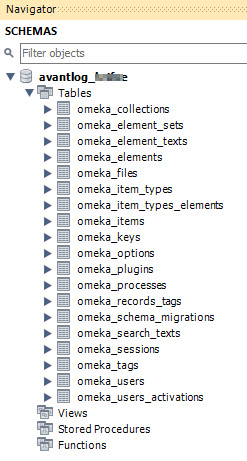

# MySQL Workbench

This page explains how to use [MySQL Workbench](https://www.mysql.com/products/workbench/)
to manage a Digital Archive database.

MySQL Workbench is a tool that lets database administrators and developers visually manage a
MySQL or MariaDB database. As an alternative, you can use [phpMyAdmin](https://www.phpmyadmin.net/),
but MySQL Workbench is more powerful and easier to use in many situations.

!!! warning ""
    AvantLogic uses MySQL Workbench Community edition
    [8.0.18](https://dev.mysql.com/downloads/workbench/). Version 8.0.19 would not load.

---

## Open a database

-   Run MySQL Workbench
-   On the home page, click the box with the name of the Digital Archive installation
-   Ignore a `Connection Warning` if it displays
-   The database should appear at left under the `Schemas` tab of the navigator
-   Click the triangle icons to expand/contract the database, its tables, and table columns

!!! warning ""
    If you can't connect, or you get a `Cannot Connect to Database Server` error, you may need
    to allow remote access to the database as explained in the following section. This can
    happen if your IP address changed since your last successful connection.

## Allow remote access to a database

For security reasons, a web host will not allow remote connections to a database
unless you explicitly grant access from the remote source. Follow these steps to
allow MySQL Workbench to remotely access a database.

-   Get the IP address of the computer on which use MySQL Workbench
    -	In a browser window type `myipaddress` in the address bar
    -   Your IP address will appear, or there will be links to sites that will show the address
-	Go to [cPanel](web-host.md#cpanel)
-	In the `DATABASES` section, click `Remote MySQL`
    -	Paste the IP address in the **Host** field under `Add Access Hosts`
    -	Click the `Add Host` button
-   If your IP address ever changes, you'll need to perform these steps again

## Add a database connection

Before you can work with a database using MySQL Workbench, you need to add a
connection to the database to your MySQL Workbench installation. Follow these steps
to add a database connection.

### Add a new connection

-   Allow remote access to the database as explained in the previous section.
-   Run MySQL Workbench
-	Choose `Database` > `Manage Connections` from the top menu
-	Click the `New` button at the bottom of the `Manage Server Connections` dialog
-	Set:
    -	**Connection Name:** the site name  
        Examples: `mydomain.net` or `mysubdomain.mydomain.net`
    -	**Connection Method:** `Standard (TCP/IP)`
    -	**Hostname:** same as the **Connection Name**
    -	**Port:** `3306`
    -	**Username:** the database username e.g. `swhpl_omeka`
-	Click `Store in Vault` to set the password. On the popup dialog:
    -   Enter the database password in the **Password** field
    -   Click the `OK` button
-	Click `Test Connection` to verify the credentials.
    -   Ignore a `Connection Warning` for incompatible/nonstandard server version.
        It will display if the database is MariaDB instead of MySQL.
    -   Click the `Continue Anyway` button
-   Click the `OK` button on the `Successfully made the MySQL connection` dialog
-	Click the `Close` button at lower right
-	**Quit MySQL Workbench** to work around a bug where new connections don't open
-   Run MySQL Workbench again
-   [Open the database](#open-a-database) to verify that you can connect to it

## Copy a database to use on another server

Follow these steps to copy a production database to use for testing on a local
development server.

### Export SQL database

-   In WHM, open the cPanel for the account
-   In cPanel, choose `phpMyAdmin`
-   Truncate the session table in the left panel
    -   Click `omeka_sessions` table
    -   Click **_Operations_** in the top menu
    -   In the **_Delete data or table_** section (very bottom), click `Empty the table (TRUNCATE)`
    -   Click OK on the confirm dialog
-   Export SQL
    -   Click the database name in the left panel
    -   Click **_Export_** in the top menu
    -   Keep the `Quick` export method and the `SQL` format
    -   Click the **_Go_** button
    -   Save the file on the local computer
    -   Upload the file to the server if it will be imported to a database there

### Create a new database

-   Go to cPanel account for the database e.g. daus
-   In cPanel, open the **_MySQL Databases_** tool
-   Create a new database
-   Add a user to the database
-   Give the database all privileges 

### Import SQL into an existing database using the command line

-   Go to cPanel account for the database e.g. daus
-   Open a Terminal window
-   CD to the folder containing the .sql file
-   `mysql -u root  -p db_name < exported.sql`
-   When prompted, type the root password for the database

To get the root password:

-   Run WHM as root
-   Open a WHM Terminal window (not a cPanel Terminal window)
-   Type `cat /root/.my.cnf`

Example: `mysql -u root -p daus_swhpl < swhpl.sql`

### Import SQL into new local development database

-   Go to phpAdmin on localhost
    -   Run the XAMPP Control Panel
    -   Click the Apache module's **_Admin_** button
    -   Click the `phpMyAdmin` link in the top menu
-   Create a new DB with today's date in the name
    -   Click `New` in the left panel
    -   Type a database name
    -   Choose `utf8_unicode_ci` for the character set
    -   Click the **_Create_** button
-   Import the data    
    -   Run MySQL Workbench for localhost 
    -   Double click on the name of the new database
    -   Choose `File > Open SQL Script`
    -   Locate the exported SQL file and click the **_Open_** button
    -   Click the lightening bolt icon to import the SQL
    -   Click the refresh icon in the Navigator panel to see the tables

### Use the database on localhost

-   Edit `db.ini` to use the new database
    -   Make a copy of the localhost settings
    -   Comment out the original settings
    -   Keep the `host`, `username`, `password`, and `charset` settings for localhost
    -   Change `dbname` to match the new database and make sure `prefix` is set to `omeka_` unless SWHPL in which case it's `omek_`. 
-   Manually run Omeka on localhost (DO NOT RUN FROM PhpStorm)
    -   Go to `http://localhost/omeka/admin/users/login`
    -   Login as a user for the imported database
    -   Go to the **_Appearance_** page and click the **_Navigation_** tab
    -   Change the URL for the `Landing` page to be `http://localhost/omeka/find?query=&view=4'
    -   Click the **_Save Changes_** button
    -   Set the Homepage back to the Landing page and save again
-   Go to the AvantElasticsearch plugin config page and change **_Contributor Id_** to `deva` (or `devb`)
-   Go to the **_Elasticsearch Indexing_** page:
    -   Export all items
    -   Import into new local `devb` (or `devb`)
    -   Import into new existing shared `devshr`
-   Get latest files from the server (just ones added/changed since date of last DB)
    -   Go to the `public_html/digitalarchive/files` folder for the site being imported
    -   [Compress the folder into a zip file](/technology/web-host/#compress-a-large-folder-on-the-server)
    -   Download the zip file into `C:\xampp\htdocs\omeka`
    -   Delete the zip file from the server
    -   Rename `C:\xampp\htdocs\omeka\files` to e.g. `files-swhpl`
    -   Extract or move the `files` folder from the zip file to become the new `files` folder
        (the zip may contain a `files` folder nested in a `files` folder - do the right thing). Extracting a very large zip file can take a long time.
    -   Delete the zip file
-   You should now be able to use the imported site normally on localhost
