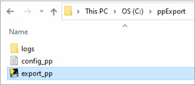
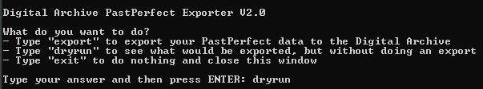
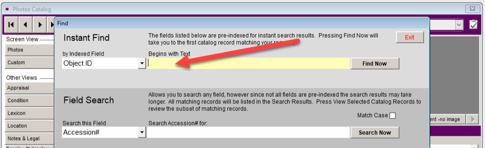

# PastPerfect Exporter

The PastPerfect Exporter is a software program that exports PastPerfect records from
a Windows 10 computer and imports them into the Digital Archive as
[hybrid items](/plugins/avanthybrid/#avanthybrid).

---

!!! note ""
	This documentation is intended for PastPerfect administrators who will use the PastPerfect Exporter, and
	for developers who will set it up and maintain it. Technical information about the export
	mechanism is provided in the documentation [AvantHybrid](/plugins/avanthybrid/).
---

## Periodic export

You should periodically export changes from your PastPerfect database to the Digital Archive.  
How frequently you perform an export is up to you. You could export on a schedule such as
weekly or monthly, or you could export right after making changes.

Changes include:

-	Editing existing records to change metadata
-	Attaching or removing record images
-	Adding new records
-	Deleting records
-	Enabling or disabling web export to PastPerfect Online for a record

When you disable web export for a record, the export removes it from the Digital Archive.
When you enable web export for a record, the export adds it to the Digital Archive.

**The export only modifies the Digital Archive. It makes no changes to your PastPerfect data.**

---

Follow these steps to export your PastPerfect changes to the Digital Archive.

1 &ndash; Web Export your PastPerfect records to PastPerfect Online
:	Before you export to the Digital Archive, you should synchronize your local PastPerfect data and images with your PastPerfect Online website by running the PastPerfect Web Publishing utility.	If you don't do this, the Digital Archive will not be able to display images that you recently added or modified in your PastPerfect desktop installation because those images will not be accessible from PastPerfect Online. If you export a record to the Digital Archive that has never been exported to PastPerfect Online, the item's `View this item using PastPerfect Online` link in the Digital Archive will go to PastPerfect Online but no record will be found there.

2 &ndash; Go to the folder containing the PastPerfect Exporter
: 	On your PastPerfect PC or network, use Windows Explorer to navigate to the `ppExport` folder. In the example below,
	the folder is `C:\ppExport`.

	

3 &ndash; Run the PastPerfectExporter
:	Run the PastPerfect Exporter by double-clicking on `export_pp` as shown in the screenshot above. A Command Window will open as shown below. It will prompt you to type a command:

	- Type `export` to export your PastPerfect data to the Digital Archive
	- Type `dryrun` to see what would be exported, but without actually exporting anything
	- Type `exit` do nothing and close the window

	

	A good practice is to first do a dry run to learn what the export is going to do, and then, if the report looks okay, do the actual export.

4 &ndash; Wait for the export to complete
:	How long the export takes depends on how many records you added, edited, or deleted
	in PastPerfect since the last export. It may take only a few seconds to export a
	small number of records or several minutes to export many records.

	If your PC loses power or the internet goes down during the export process, just
	start again later at step 2. The export will pickup where it left off when
	it was interrupted.

5 &ndash; Exit the Command Window
:	The export is done when the message shown below appears at the bottom of the window.

	

	Close the window by typing `exit` and then pressing the **_Enter_** key.
	
6 &ndash; Log File	
:	Whether you do a dry run or an export, the results are written to a log file located in the `logs` folder as shown in 
the screenshot for step 2 above. The log file name is the date and time when the export began. An example of a log file name is `2022-03-26 02-36 PM.log`. The log file contains the same information that appeared in the command window so that you have a record of the export or dry run. If you do a lot of exports, you should occasionally delete older logs files so that the `logs` folder does not get too cluttered.

7 &ndash; View the exported items
:	Go to the Digital Archive to view the exported items. 

---

## Bad PastPerfect records
The export may report that a PastPerfect record was skipped for various reasons and identify the records as `[No Object ID in catalog L]`. The `L` at the end means that the record is in the Library catalog. A `A`, `O`, or `P` means the Archive, Objects, or Photos catalog.

To find these bad records, go to the catalog and click the **_Find_** button. In the **_Instant Find_** section of the **_Find_** dialog, choose `Object ID` as the field and erase the text area as shown by the red arrow. Then press the **_Find Now_** button to find the records in that catalog that have no Object Id. If those records have other metadata, you can fill in the Object Id, otherwise you can delete the record.



---

!!! note ""
	The remainder of the documentation on this page is intended for administrators and developers.  
	You don't need to read or understand the following sections to simply export your data.

## What gets exported

The PastPerfect Exporter (PPE) exports the following columns from PastPerfect's catalog tables:

-	PPID
-	OBJECTID
-	OBJNAME converted to Nomenclature natural order
-	CAT with `A`, `L`, `O`, and `P` changed to `Archives`, `Library`, `Objects`, and `Photos`
-	SUBJECTS
-	TITLE
-	WEBINCLUDE as `1` or `0`

The PPE rejects any records where:

-	WEBINCLUDE is blank unless the `private` config option is `yes`
-	TITLE is blank
-	OBJNAME is blank
-	OBJECTID is blank
-	OBJECTID is not unique

The PPE exports these pseudo columns:

-	IMAGE as a semicolon separated list of the record's image file names prefixed by their
	PastPerfect Online (PPO) folder number, for example `008/00105612161.jpg`
-	THUMB as a semicolon separated list of the record's thumbnail file names prefixed by
	their PPO folder number	and their PPO thumbnails folder name, for example  
	`008/thumbs/00105612161.jpg`
-	SITE as the PPO folder containing the source record, for example `archive/<hybrid-id>`

The PPE exports other columns as specified by the `fields` config option.

As example of what the PPE exports is shown below as a JSON string.

``` text
{'PPID': 'B427FDC4-5A2A-42AA-A146-337349578482', 'OBJECTID': '001-056-1-2161',
'OBJNAME': 'Annual Meeting report', 'TITLE': 'Annual Meeting of the Garden Club of America',
'IMAGE': '008/00105612161.jpg', 'THUMB': '008/thumbs/00105612161.jpg', 'WEBINCLUDE': '1',
'SITE': 'archive/<hybrid-id>', 'CAT': 'Archives', 'SUBJECTS': 'Gardens;History',
'DATE': '1934', 'PLACE': '', 'CREATOR': '', 'PUBLISHER': '', 'COLLECTION': '',
'DESCRIP': 'Yellow bound yearbook program with pencil reading Garden Club of Mt. Desert.'}
```

---

## pp_config.txt

The `config_pp.txt` file is the "user interface" to the PPE. You edit this file to control
how the PPE operates. Below is a sample file followed by an explanation of each option.

``` text
[data]
pp5data = \\DELL7\PastPerfect\Data
fields =
	DATE
	PLACE
	CREATOR
	PUBLISHER
	COLLECTION
	DESCRIP

[request]
id = ahs
password = aQ75RkG9
url = http://yourdomain/digitalarchive/avant/remote

[admin]
bulk = no
details = no
strict = yes
force = no
limit = 0
private = no
trace = no
```

### Data options

pp5data
:	The `pp5data` option specifies the path to the PastPerfect installation's `Data` folder on the
	Windows computer or network that hosts PastPerfect.

	Examples:  
	`C:\pp5\Data`  
	`\\DELL7\PastPerfect\Data`

	You can determine the folder location by going to the PastPerfect **_System Information_** screen and
	looking at the **_Data Folder_** field in the **_Computer Information_** section.

fields
:	The `fields` option lets you specify which PastPerfect catalog table columns PPE will export
	in addition to the fields that it always exports ([see what gets exported](#what-gets-exported)) above.

### Request options

id
:	The `id` option must be three to six characters that exactly match the
	[**_Import ID_** option](/plugins/avanthybrid/#configuration-options) on the AvantHybrid configuration page.

password
:	The `passsword` option must be eight characters that exactly match the
	[**_Import Password_** option](/plugins/avanthybrid/#configuration-options) on the AvantHybrid configuration page.

url
:	The `url` option specifies the URL of the remote request page on the Digital Archive server.
	It is the URL of the server followed by `/avant/remote`.

### Admin options

bulk
:	The `bulk` option should always be set to `no`. The only exception is if you will be exporting
	hundreds or thousands of items and you want to speed up the export process. This would be the
	case for a new installation or when using the `force` option.

	Read about AvantHybrid [bulk import](/plugins/avanthybrid/#bulk-import) feature to understand
	how it works. As noted in that documentation, when you use this option, you'll need to 
	[rebuild your Digital Archive Elasticsearch indexes](/administrator/reindex) when you are done
	importing.

details
:	Set the `details` option to `yes` if you want to see additional statistics:

	-	OBJECTIDs for records with no Title
	-	OBJECTIDs for records with no OBJNAME
	-	OBJECTIDs for records with non-unique OBJECTID (count appears in parentheses) 

force
:	Force should always be set to `no`. The only exception is if for some reason you need to force
	every hybrid item in your Digital Archive to get updated even if its corresponding PastPerfect
	record has not changed. See the section below on
	[adding a new export column](#adding-a-new-export-column) as an example of when
	you might use this option.

limit
:	Limit should normally be set to `0` which means there is no limit on how many source records will
	be exported to the Digital Archive. You can set the limit to a number when you only want to
	export a limited number or records. This option can be combined with the `dryrun` option when you
	are just trying to get a sense of what will get exported without operating on the entire set of
	PastPerfect records.

private
:	The `private` option controls whether PastPerfect records that have their **_Web Export_**
	option *unchecked* should to be exported to the Digital Archive. Set the option to `yes` to export
	them as non-public Digital Archive hybrid items or set it to `no` to skip them during export.

strict
:	The `strict` option controls whether the exporter will exclude from the export any PastPerfect records having an Object Name that does not conform to Nomenclature 4.0. Set the option to `yes` to prevent export of those records. Set the option to `no` to allow them to be exported. Note that if you set the option to `no` and export some nonconforming records, and then at a later date set the option to `yes` and do an export, the nonconforming records will be deleted from your Digital Archive.

trace
:	This is a developer option that can be set to `yes` to have AvantHybrid report additional information
	about its response to a request.		

## How it works

Here is an explanation of the algorithm PPE performs when you run the `pp_export.exe` program.

-	Make a request to AvantHybrid to fetch a list of all the hybrid items in the Digital Archive
	along with the date and time when each was added or last updated.
-	Read data from the PastPerfect LEXICON table to get a list of Nomenclature terms.
-	Read data from the PastPerfect MEDIA table to get the names of files attached to records.
-	Read data from each of the PastPerfect catalogs (ARCHIVE, LIBRARY, OJBECTS, and PHOTOS).
-	Create a source record for each catalog record and add it to a list of source records, skipping any 
	that are rejected.
	(see the [what gets exported section](#what-gets-exported) above).
-	Analyze the data, convert Nomenclature terms from
	[inverted to natural order](/technology/common-vocabulary-translator/#leaf), and report
	[statistics](/technology/pastperfect-exporter/#statistics) as shown in the next section below.
-	Loop over the source records one at a time. For each source record:
	-	If it does not exist in the Digital Archive, mark it to be added.
	-	If it exists in the Digital Archive, but has been changed in PastPerfect since it was last
		added or updated in the Digital Archive, mark it to be updated.
	-	Otherwise mark the source record as unchanged.
-	Loop over the hybrid items in the Digital Archive. For each hybrid item:
	-	If it has no corresponding source record, add a placeholder record to the list
		of source records and mark it to be deleted.		
-	Loop over the source records. For each that has been marked as add, update or delete,
	make an [HTTP request to AvantHybrid](/plugins/avanthybrid/#http-requests) to perform the
	action. Ignore those marked as unchanged.

If the algorithm gets interrupted before completion, it will pick up where it left off the next
time PPE is run. For example, suppose that while exporting 100 records, the computer crashes, or the
internet goes down, after only 25 records have been imported into the Digital Archive. When the
system is working and PPE is run again, PPE will detect that only 75 records have to be imported
and import them. This is possible because the PPE algorithm is stateless, meaning that it can always
figure out what it needs to do by analyzing the data in both PastPerfect and in the Digital Archive
without needing to know what state it was in when it got interrupted.

## Statistics

Each time PPE runs, it reports statistics that you can use to determine what
improvements you need to make to your PastPerfect data. By copy/pasting the statistics
into some kind of a log document, you can maintain a record of how your PastPerfect collection
has grown and/or gotten cleaned up over time.

Sample statistics are show below for an organization having the **_Import ID_** `ahs`.

``` text
Read data from ahs PastPerfect catalogs: C:/pp5/Data/
=======================================================
Read 13766 records from LEXICON3.DBF............................ 0.41s
Read 7704 records from MEDIA.DBF................ 0.69s
Read 5995 records from ARCHIVES.DBF............ 9.37s
Read 887 records from LIBRARY.DBF.. 1.28s
Read 1453 records from OBJECTS.DBF... 1.98s
Read 6809 records from PHOTOS.DBF........... 10.03s
Completed in 23.86 seconds

PastPerfect statistics for ahs on 2020-09-15
==============================================
Examined 15144 source records
Found 5602 Object Names that are not in Nomenclature
Accepted 12458 source records
Skipped 2686 source records because:
   301 records have Web Export unchecked
   2385 records have no Title
   147 records have no Object Name
   896 records have no Object ID
   244 records use a non-unique Object ID:

```

## Adding a new export column

Ideally, you should plan ahead so that your initial export will contain all of the PastPerfect
columns that you want to have appear in the Digital Archive. However, if later you decide you
want to add a column, follow these steps.

-	Add an element for the column in Omeka
-	Add the element to the [Column Mapping](plugins/avanthybrid/#configuration-options)
	option in the AvantHybrid configuration
-	Add the column to the `fields` option in the `pp_export.config`
-	Set the `force` configuration option to `yes`
-	Set the `bulk` configuration option to `yes`
-	Run the PPE
-	Set the `force` configuration option to `no`
-	Set the `bulk` configuration option to `no`
-	[Rebuild your Digital Archive Elasticsearch indexes](/administrator/reindex)

Assuming that `limit` is set to `0`, the steps above will
update every hybrid item in the Digital Archive to include the new column. Be aware that
if you have thousands of PastPerfect records, this could take a long time. Also, because
you'll be using the `bulk` option, you'll need to rebuild your Elasticsearch
indexes after the updates finish as explained for the `bulk` option.

## PastPerfect Exporter software

The PPE is implemented as a Python 3 program that was developed by George Soules of AvantLogic Corporation.
It was written for organizations who want to continue using PastPerfect as their primary collections
management software, but also want to share their collections online with other other organizations
that use the Digital Archive for online sharing. It is not intended for use as a PastPerfect migration
tool, nor is is suitable for that purpose since it can only export by making HTTP requests one
record at a time to the Digital Archive's AvantHybrid plugin.
The source code is available upon request as open source for use in non-commercial applications.

The program consists of a single Python script named `export_pp.py` that imports a Python package
named `avant_dbfread` which is a near-exact copy of Ole Martin Bjorndalen's
[dbfread](https://github.com/olemb/dbfread). The only modification to dbread is to the
`FieldParser.decode_text` method
so that it handles a `UnicodeDecodeError` exception without terminating processing. All direct
access to and reading of the PastPerfect dBase files is performed by the dbfread logic.

### export_pp.exe

To allow the exporter to run on a Windows 10 computer where PastPerfect is used, without having to have
Python 3 installed on that same computer, `export_pp.py` gets turned into a standalone `.exe`
program using [pyinstaller](https://www.pyinstaller.org). The resulting `export_pp.exe`
file can simply be copied to and run on the Windows computer. It requires no installer and no
changes to the Windows registry.

Follow these steps to create `export_pp.exe`:

-   Go to the folder containing `export_pp.py`
-   Right click and choose `Git Bash Here`
-   Type `pyinstaller --onefile export_pp.py`
-   pyinstaller will create in that folder `\dist\export_pp.exe`
-	Copy `export_pp.config` to the `dist` folder
-	Edit `export_pp.config` if necessary

Follow these steps to run `export_pp.exe`:

-	Open a Windows Command Prompt window
-	CD to the `dist` folder
-	Type `export_pp.exe`

### First-time export

Here are recommendations for how to approach a first-time export of all PastPerfect records into the Digital Archive.

-	Set PPE configuration options:
	-	**_bulk_**: `yes`
	-	**_limit_**: a small number like `10` 
-	Run PPE
-	Verify that everything looks good
-	Increase **_limit_** or set it to `0` for no limit
-	Repeat the steps above until all records for all catalogs have been exported

When the export has completed:

-	Restore normal PPE configuration options:
	-	**_bulk_**: `no`
	-	**_limit_**: `0`
-	Go to the Digital Archive
-	Rebuild the Site Terms table:
	-	Go to the [Vocabulary Editor](/archivist/vocabulary-editor/)
	-	Click the **_Rebuild Site Terms table_** button
	-	You must do this step *before* rebuilding the Elasticsearch indexes.
-	[Rebuild the Digital Archive Elasticsearch indexes](/administrator/reindex/)


  


