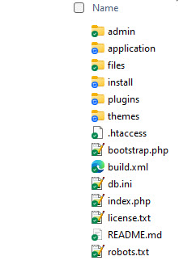
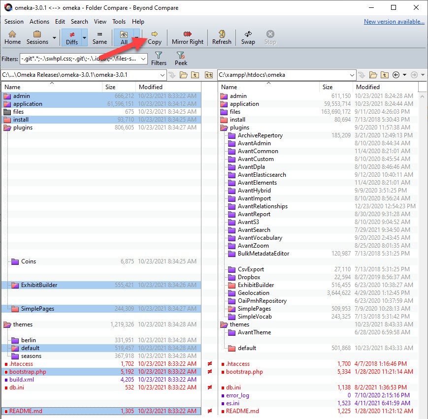

# Digital Archive site maintenance

---

### Editing files
The site maintenance files are located in the `bin` and `bin/python` directories in the daus account.

Use *one* of these methods to edit site maintenance files:

-   cPanel File Manager
    -   Open cPanel for the `digitalarchive.us` account
    -   Run **_File Manager_**
    -   Navigate to the `bin` folder `/home/daus/bin` which contains scripts, python, and data files

-   [Nano editor](https://www.nano-editor.org/):
    -   `nano <file-name>` e.g. `nano digital-archive-sites.csv`
    -   Perform edits
    -   `^X` to exit
    -   `Y` to save changes
    -   Press `Enter` to write to the same file

## Add a new site
To enable site maintenance for a new Digital Archive site:

-   Log in into `digitalarchive.us`
-   Add the site's [organization ID](https://swhplibrary.net/digitalarchive/avant/dashboard) to the site list:
    -   Edit `bin/python/digital-archive-sites.csv` to add the site ID
-   Add the site's cPanel user name to the sync script:
    -   Edit `bin/sync-digitalarchive` to add the user name

!!! note ""
    If the site is a subdomain, add special case login in `bin/sync-digitalarchive` for its path.

!!! note ""
    After you add a new site and then run `sync-digitalarchive`, all of the site's files will get updated because they are syncing with the master copies which have different timestamps than the ones uploaded as part of the manual [site installation](/technology/install-digital-archive/) process.

## Software updates
After making changes to Digital Archive plugins, or after [upgrading to a new release of Omeka](/technology/site-maintenance/#upgrade-to-new-omeka-release), you have to update the Digital Archive sites. There are two steps:

1.   Sync the local and master files
1.   Push the master files to the site(s) to be updated

### Sync local and master files
The master files for a Digital Archive installation are located on the `digitalarchive.us` (daus) server in the `digitalarchive` directory which is not publically accessible.

To update the master files with the local development files:

-   Run Beyond Compare
-   Run the `DAUS\DAUS PLUGINS and THEMES` session
-   **Mirror Right** local `C:\xampp\htdocs\omeka` to `public_html/digitalarchive` on the daus server

!!! warning ""
    **Important**: Be sure to **mirror**, not copy the files.

### Push updates to one site or all sites
You can very quickly push only the updated master files to one or all Digital Archive sites from the `daus` command line.

#### Login

- Login to InMotion WHM as root
- Choose **_List Accounts_**
- Click the cPanel icon for `digitalarchive.us`
- Choose **_Terminal_**
- Navigate to `/home/daus/bin`.

#### Update only plugins and themes

To update just the `plugins` and `themes` folders, choose one of the commands below. The first command has no
parameter and will display all of the valid site names.
```
$ ./sync-digitalarchive 
$ ./sync-digitalarchive <cpanel-user-name> 
$ ./sync-digitalarchive ALL
```

Example to update only the `abc` site:
```
$ ./sync-digitalarchive abc 
```

-   When prompted, type the password for user `daus`
-   Then type an option:
    -   `y` to perform a dry run
    -   `Y` to perform the sync
    -   `n` or any other character to exit
-   Press `Enter`

To be cautious, first do a dry run to see what files will be updated. Then do the actual sync followed by another
dry run to see that no files need updating.

The script will sync these folders:
```
themes/
plugins/
```

!!! Note ""
    If an updated plugin's version number changed, you will need to manually go to each site's plugins page to upgrade the plugin. If you don't do this, the plugin won't work which will probably break the site. A common occurrence of this is an Omeka update to the Simple Pages plugin.

#### Update all installation files

To update *all* installation files and folders, choose one of these commands:
```
$ ./sync-digitalarchive <cpanel-user-name> installation
$ ./sync-digitalarchive ALL installation
```

With the `installation` argument, the script will sync these files and folders:
```
themes/
plugins/
application/
install/
admin/
es.ini
bootstrap.php
index.php
error_log (copies an empty log to the site)
```

The output from a sync operation is written to `bin/logs/sync-HH-MM-SS.log`

## Site requests
From the command line you can send requests to one or all Digital Archive sites. A pyhon script sends the request to a site via HTTP and the site responds to indicate whether and how it handled the request.

From the `daus` command line choose one of these commands:

```
remote-request <request> <site-id>
remote-request <request> ALL
```

Examples of request to a site having ID `abc`:
```
[daus@avantlogic bin]$ remote-request ping abc
[daus@avantlogic bin]$ remote-request es-health-check abc
```

The supported requests are:
```
ping
garbage-collection
es-health-check
vocab-update
vocab-rebuild
```

The output from site request operations is appended to `bin/logs/requests.log`

---

## Upgrade to new Omeka release
This section explains how to upgrade the Digital Archive's Omeka core files to a new release of Omeka.
Updating involves copying Omeka core files from the release to the site folder. Since the Digital Archive
does not modify any Omeka core files, these is no need to review changes to those files.
Read all of these instructions before proceeding. The steps should take about a half hour.

### Download the new release
- View the new release of Omeka Classic on [omeka.org](https://omeka.org/classic/download/).
- Download the latest release from the [releases page](https://github.com/omeka/Omeka/releases) on GitHub.
    - The release file will have a name like `omeka-3.0.1.zip`.
- Put the zip file on the desktop or other folder that is not deeply nested. In a deeply nested folder, some files will get an unzip error because their resulting file path is too long.    
- Unzip the release into a work folder named as the release e.g. `omeka-3.0.1`.
- Delete the zip file.
- Move the work folder to `Digital Archive AvantLogic\Omeka\Omeka Downloads\Omeka Releases`.  
Make sure the folder contains the release files as shown below, not a single folder containing the release files
as sometimes happen when you unzip a file from GitHub.



### Update the local development site

!!! note ""
    Before proceeding, run Omeka on the development site to verify it runs properly with the *current release*. There should be no issues, but if, for example, something in the environment changed that created a problem, find and fix it first so you won't think it's related to the new release.

-   Make a temporary backup copy of the current release folder `xampp\htdocs\omeka`:
    -   Create an empty backup folder on the desktop named `omeka-backup`.
    -   Open the `xampp\htdocs\omeka` folder.
    -   Select all the folders and files *except* for the `files` folder which is huge.
    -   Copy the selected items to the backup folder (takes about a minute).
-   Use [Beyond Compare](https://www.scootersoftware.com/) to compare the current and new release folders:
    -   Run Beyond Compare.
    -   Edit the `DAUS > omeak-3.x <--> xampp\htdocs\omeka` session.
    -   Change the source to the folder containing the new release.

Use Beyond Compare to **Copy** (do not Mirror) the following core files to `C:\xampp\htdocs\omeka`:
```
admin
application
install
plugins/ExhibitBuilder
plugins/SimplePages
themes/default
bootstrap.php
README.md
```
Do not copy any folders or files that are not listed above.
If a folder or file has not changed, you don't need to copy it.
Ctrl-click folders and files to select the ones to be copied as shown below.



---

!!! note "Development Server"
    If you are updating Omeka on the Windows XAMPP development server, edit
    `xampp\htdocs\omeka\application\libraries\Omeka\File\Derivative\Strategy\ExternalImageMagick.php`  
    to define the ImageMagick constant as: `const IMAGEMAGICK_CONVERT_COMMAND = 'magick.exe';`  
    This change ensures that **_ImageMagick Directory Path_** on the Omeka **_Settings_** page works for the ImageMagick executable
    `magick.exe` in Windows folder e.g. `C:\Program Files\ImageMagick-7.1.0-Q16-HDRI`.  
    DO NOT MAKE THIS CHANGE on the Linux server. On Linux, leave the constant defined as `convert`.

### Verify that the new release works properly
Normally the site should just come up, though on releases of Omeka prior to 3.0 you were presented with a dialog to update the database. It appears that 3.0 updates the database automatically.

Verify that the new release is installed by going to the Dashboard page and looking at the Omeka version in the lower right corner.

When you are comfortable that the upgrade is okay, you can delete the temporary backup folder created earlier.

See the [Software updates](/technology/site-maintenance/#software-updates) section for how to deploy the upgrade to all Digital Archive installations.

#### Troubleshooting
Past updates of release Omeka 2 have always gone smoothly, but 3.0 presented problems. When it first came up it reported a Zend_Controller_Exception and then an InvalidArgumentException. The errors appeared to be triggered by a plugin and by AvantTheme, though later there were no issues with either, so it probably had to do with the interim transition from the old to the new release. The solution was to back out the new release, and with the older version running, deactivate all of the Avant plugins and switch from AvantTheme to the default Omeka theme. After updating the site again with the new release, the errors went away and none reoccurred after switching back to AvantTheme and activating the Avant plugins.

---

## Common vocabulary updates

To update the common vocabulary on one or all Digital Archive sites:

-   Make updates to one or more of the following files:
    -   `input-translations.csv`
    -   `input-additional-terms.csv`
    -   `input-nomenclature-sortEn_2020-05-18.csv` (replace with latest version from Nomenclature)
-   Run `build_common_facets.py`. The script:
    - Creates these files:
        -   `digital-archive-vocabulary.csv`
        -   `digital-archive-diff.csv`
    - Uploads the two files to:
        -    `digitalarchive.us/public_html/vocabulary` via FTP         
-   Test the changes locally and build again until satisifed
-   When done making changes:
    -   Delete local file `input-previous-digital-archive-vocabulary.csv`
    -   Rename local file  `digital-archive-vocabulary.csv` to `input-previous-digital-archive-vocabulary.csv`
-   Verify that `digital-archive-diff.csv` was FTPed to `digitalarchive.us/public_html/vocabulary`
-   Make a `vocab-update` site request for one site or all sites (see example below)

Example update request:
``` text
[daus@avantlogic bin]$ remote-request  vocab-update nehl
Request 'vocab-update' to  nehl'? (y/n) y
Post "vocab-update" request to  nehl"
2021-10-24 20:49:00.781881 Request:[vocab-update > nehl]
Response: nehl] Commands processed: 23. Items refreshed: 3
```
In the example above, the site reported back that it processed 23 commands (ADD, UPDATE, or DELETE) and updated 3 items as a result. In this particular case, there were 22 ADD commands and 1 UPDATE command. Since no items could be using the newly added vocabulary terms, none could be affected, but 3 items were using the term that was updated.

If you make the exact same request second time, the same number of commands will be processed, but no items will be affected.

A developer can simulate a remote vocabulary update locally via the query string:

``` text
http://localhost/omeka/avant/remote?action=vocab-update&password=ABC123
```
---

## Nightly cron job
Every night a [Linux cron job](https://www.inmotionhosting.com/support/edu/control-web-panel/cwp-cron-jobs/) runs a python script to send these requests to each site:

-   `garbage-collection`
-   `es-health-check`

You can manually run the cron job like this: 
``` text
[daus@avantlogic bin]$ ./nightly-cron-job
```

The **garbage collection** request tells the site to clean out its sessions table to remove old records, many of which are for visits from bots and crawlers.

The **health check** requests tells the site to compare its Elasticsearch document count to its MySQL records count to verify that they are the same. If the check fails, the script sends email to the Digital Archive administrator as shown in the example below.

``` text
FAIL: SQL:3077 Index:3075 Missing:3054,3080
```

Normally the health check will never fail, but if it does, the email will indicate which MySQL records are missing from the Elasticsearch index. In the message above, the numbers 3054 and 3080 are Omeka item Ids, not Digital Archive item identifiers. To correct the problem, first locate a missing item in the Digital Archive using a URL like the one below.

``` text
https://yourdomain.net/admin/avant/show/3054
```

 Edit the item by making a minor change to a field (e.g. add a blank space to the end of a sentence), and then save the item. This will cause the item to get re-synced with the Elasticsearch index. Run the health check again to see if the problem has been fixed.

---

## Running scripts

### Root privileges
A user with root privileges can run bash scripts that modify files on every Digital Archive installation on the server.

To assign a user root privileges via sudo:
-   Go to WHM and choose `Manage Wheel Group Users`
-   Add a user to the wheel group

A user in the `wheel` group can use the system's `su` and `sudo` utilities.

### Making a script executable
Use the `chmod` command to make a script file executable. For example, you can make file `foo` executable with this command:

```
chmod +x foo
```

To execute the `foo` script type:

```
./foo
```

If a script requires root privileges, use `sudo` to run it. For example:

```
sudo ./foo
```

To add a job:
```
crontab -e
```

See [crontab.guru](https://crontab.guru/).

## Increase max execution time

For long running foreground jobs like a reindex, you need to make sure that the PHP max_execution_time
is high enough to let the job complete. The default of 30 seconds is usually too low.

-   Go to cPanel
-   In the Software section choose “Select PHP Version”
-   Click “Switch to PHP Options” at upper right
-   Click the value of  max_execution_time.
-   Enter a new value, click Apply
-   Click Save

## Reset a MySQL table's Auto Increment

See: <https://viralpatel.net/blogs/reseting-mysql-autoincrement-column/>

    ALTER TABLE table_name AUTO_INCREMENT = n;

where n will be the id for the next record created.


## Backup and restore database

### Restore

- Login to InMotion WHM as root
- Choose **_List Accounts_**
- Click the cPanel icon for `digitalarchive.us`
- Choose **_Backup Manager_** tool
- In the **_Backup Type_** section expand **_MySQL_**
- Choose the restore options and click the **_Restore_** button
---
