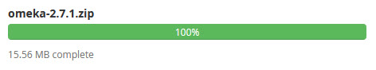

# Web server administration

This page explains how to perform Digital Archive related web host administration tasks
on a [Reclaim Hosting](https://reclaimhosting.com/) web server.

---

!!! warning "Caution"
    This documentation on this page assumes that you already know, or will learn, how to perform basic
    system adminstration tasks. For example, you must be able to navigate the file system, edit and delete
    files, and be familiar with system administration duties such as database management, permissions,
    FTP, and such. If these things are foreign to you, **do not** attempt to perform these tasks.

---

## WHM

WMH stands for Web Host Manager. All of the Digital Archive sites are hosted on a dedicated Linux server which you manage using [WHM](https://cpanel.net/products/). The login page is: <https://avantlogic.reclaimhosting.com:2087 >.

To learn more about WHM, visit <https://docs.cpanel.net/whm/>

!!! note "Tip"
    Use the search box at the top to quickly find a feature. For example, as you type `ftp`,
    the features will immediately narrow down to just those related to FTP. This same technique
    works in [cPanel].

---

## cPanel
cPanel is a control panel that lets you manage many aspects of the
web host environment for a single WHM account. To access the cPanel for an account:

-   Go to [WHM] and choose `List Accounts`
-   Click the cPanel icon in the row for the account
-   The cPanel home page will appear


The cPanel home page is divided into sections like DATABASES, FILES etc.
as shown in the screenshot below. Each section contains a set of related features you can choose from.
To learn more about cPanel, visit <https://cpanel.net/>


---

## Restore a backup
Explain how to use Jetback

---

## Create a new cPanel account
Follow the steps below to create a new cPanel account. Also see the
[WHM documentation](https://docs.cpanel.net/whm/account-functions/create-a-new-account/86/)
                    https://docs.cpanel.net/whm/account-functions/create-a-new-account/86/

### Create the account

-   Go to [WHM] and choose `List Accounts`
-   Click the `Create a New Account` button
-   Enter:
    -   **Domain** = *domain name e.g. historytrust.net*
    -   **Username** = *filled in automatically, but you can change it*
    -   **Password** & **Re-type Password** *automatically filled in when you:*
        -   Click the `Password Generator` button
        -   Copy the password to a safe place
        -   Check the `I have copied this password` checkbox
        -   Click the `Use Password` button
    -   **Email** = `gsoules@avantlogic.com`
    -   **Choose a Package** = `Archive`
    -   **Select Options Manually** = *leave unchecked*
    -   **Settings** panel = *accept defaults*
    -   **Mail Routing Settings** panel = *accept defaults*
    -   **Reseller Settings** panel  = *accept defaults (unchecked)*
    -   **DNS Settings** panel = If using a domain registered:
        -   With reclaim, accept defaults
        -   Another registrar like Godaddy, check the `Use the nameservers` checkbox
-   Click the `Create` button
-   Review the `Account Creation Status` information
    
### Set the name servers

!!! warning ""
    Skip this step if the site will be hosted on reclaimhosting.com

If the domain is registered with another registrar (not with reclaim) e.g. Godaddy or bluehost:

-   Login into the registrar account for the domain
-   Set the name servers to:
    -   `ns1.reclaimhosting.com`
    -   `ns2.reclaimhosting.com`

### Install an SSL certificate
Note that you cannot install the certificate for a non-reclaim domain until the name servers have been
pointed to reclaim.

-   Go to [WHM] and choose `List Accounts`
-   Click the cPanel icon in the cPanel column of the row for the newly created account
-   In [cPanel] choose `Lets Encrypt SSL`
-   In the `Issue a new certificate` section, click te `+Issue` link
-   On the next page, click the `Issue` button
-   Wait for the certifcate to be issued -- it can take a while
-   If you get an error, try again
-   Close the page that says the certificate is now installed

### Add an index.html page
By default, a new account has only an empty `cgi-bin` folder in its `public_html` folder.
Add an index.html page so that something nice appears when someone goes to the site. Below is an
example. Be sure to replace `XYZ` with the organization's name.

```
<html>
<head>
<title></title>
</head>
<body>
<h2 style="text-align: center;margin-top:40px;"><span style="font-family:arial,helvetica,sans-serif;">Future home of XYZ&#39;s Digital Archive site</span></h2>
</body>
</html>
```

### Edit .htaccess to force https

!!! note ""
    To perform this task, you'll need to change the cPanel File Manager settings to `Show Hidden Files`
    in order to be able to see the `.htacces` file.

By default, the site will not use https until you add the lines shown below to the top of the `public_html/.htaccess` file.

```
RewriteEngine On
RewriteCond %{HTTPS} off
RewriteRule (.*) https://%{HTTP_HOST}%{REQUEST_URI} [R,L]
```
Go to the site to verify that the URL is automatially changed to use https.

There is also a [cPanel option](https://blog.cpanel.com/force-https-redirection/) for forcing HTTPS, but Digital Archive installations use the method described above.

---

## Upload and extract a zip file

Follow these steps to upload a zip file to the web server and extract (unzip) its contents.

!!! note
    A zip file's contents are always extracted into a new folder having the same name
    as the zip file. The contents are never extracted directly into an existing folder.
    As such, you may have to move the contents after you unzip them.

### Upload the zip file

-   Go to [cpanel] and choose `File Manager`
-   Navigate *into* the folder where a new folder should be created for the zip file contents.  
    For example, if uploading an Omeka plugin, navigate into the `plugins` folder.
-   Click `Upload` in the top menu        
-	Select or drag-in the zip file to begin uploading it
-   Wait for the upload to complete. When complete, the progress bar will:
    -   Show 100% *and* change color from blue to green  
        
-   Click the `Go Back to` link at the bottom of the page to return to the parent folder
-   Verify that the zip file is there. If not, click `Reload` in the menu above the file list


### Extract the zip file contents

-	Right click on the zip file name and choose `Extract`
-   Click the `Extract File(s)` button
-   On the `Extraction Results` dialog, click the `Close` button
-   A new folder will appear having the same name as the zip file
-   If you don't see the folder, click the `Reload` button

### Delete the zip file
-   Right click on the file name and choose `Delete`
-   On the `Trash` dialog, check the box that says `Skip the trash`
-   Click the `Confirm` button

---

## Create a subdomain
Follow these steps to create a subdomain in an existing account.

-   Go to [cpanel] and choose `Subdomains`
-   In the `Subdomain` field enter the subdomain name
-   Don't change the `Domain` and `Document Root` fields
-   Click the `Create` button
-   Return to the [cpanel] home page and choose `File Manager`
-   Verify that a new folder for the domain exists,  
    for example: `/home/avantlog/mysubdomain.avantlogic.net`

---

## Purchase a domain

-	Login to the AvantLogic Reclaim Hosting account
-   In the Client Area, click `Domains > Register a New Domain` in the top menu
-   Enter the domain name and choose the suffix e.g. `.net`
-   Click the `Check Availability` button
-   In the `Congratulations` section that appears, click the `Continue` button
-   Accept the `Unprotected WHOIS` and click the `Continue` button
-   Check the `I have read and agree...` check box
-   Click the `Complete Order` button
-   Close the `Order Confirmation` page

---

## Create a new Reclaim account
Follow these steps to create a new Reclaim Hosting account. You would do this, for example, if you wanted
to provide a client with their own Reclaim account for hosting their website. You might also create a
separate account for a Digital Archive installation that will not be hosted on the dedicated WHM server.

-   If you already have an account with Reclaim Hosting and want to add another:
    -	Login to your account
    -	Choose `Accounts` > `Add an Account`
-   If you don't have an account:
    -   Find and click the `Sign Up` button
-	Choose `Organization Plan` ($100/year) and click `Order Now`
-	Verify that the domain is available and choose the `Register a new domain` radio button
-	Choose billing cycle $100.00 USD Annually
-	Click `Checkout`
-	On the `Domains Configuration` page click `Continue`
-	On the `Review & Checkout` page
    -	Total should be $100
    -	The `Existing Customer` tab should be selected
    -	For `Payment Method` choose `Use Existing Card (PayPal)`
    -	Click `Complete Order`
-	Open the New Account Information email from reclaim and copy the cPanel information into the passwords spreadsheet.
-	Verify that you can login to cPanel directly as this organization (as opposed to from the administrator account)

--

## Tips & Tricks
-   Use <https://skipdns.link> to access a site that's not accessible before switching DNS or namesevers.
-   Use yum instead of pip to install on centos.
-   Use <https://www.whatsmydns.net/> to see what DNS a site is using from various locations

## Compress a large folder on the server

Use the zip command to avoid issues using the cPanel Compress feature. Also, the zip
command reports what it's doing. As an example, to compress the `files` folder of a Digital Archive
installation:

-   Open a terminal window
-   cd to the `digitalarchive` folder
-   Type the command below

```
zip -r files.zip files
```

## Jet Backup

To get a backed-up file or a database for an account:

-   Log in to WHM
-   Choose the JetBackup feature
-   Click on the **_Restore & Download_** icon (circle with two arrowheads)
-   Type the username of the account into the **_Find Account_** in order to narrow
    the list of accounts to only the one you will be working with
-   Choose what you want to get from the **_Backup Type_** dropdown
-   Check the checkbox for the account
-   Click the **_Choose Other Backup_** button to select the date of the backup to use
-   If getting a file:
    -   Click the **_Browse Files_** button to select the file(s)
    -   Navigate to the file(s)
    -   Click the **_Download_** button to initiate the download
    -   Click the OK button on the `Your download request is in progress` dialog
    -   Click the download file link located in the **_Downloads_** section at upper right
-   If getting a database:
    -   Click the **_Download_** button to initiate the download
    -   Follow the steps below to extract the contents
    -   The contents will be a single `.sql` file that you can then execute in MySQL Workbench
        following the steps for how to
        [copy a server database to use on localhost](/technology/mysql-workbench/#copy-a-server-database-to-use-on-localhost)


##### What to do with the download file

Download files are in tar.gz format. Follow these steps to get the contents.

-   Download the file to the local computer
-   Upload the file to a temp directory on the server
-   Extract the contents on the server
-   Use the files on the server or download them to the local computer

---

[WHM]: #whm
[cPanel]: #cpanel 