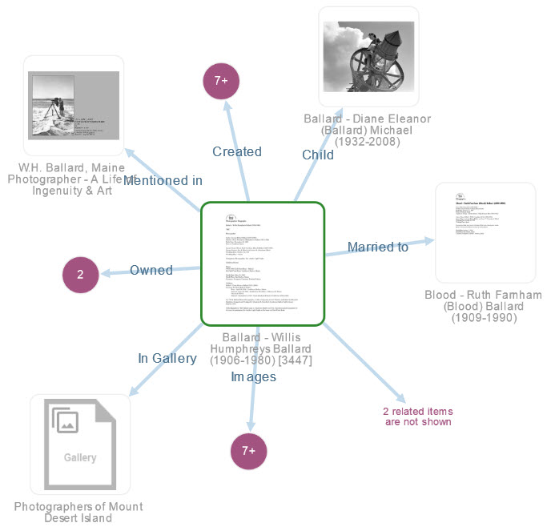

# Relationships

---

The Digital Archive is an online database of historic and contemporary images, maps, articles, documents, publications, and other items. But this isn’t your grandfather’s database. It’s something altogether new and different.

## The Archive is Different

Traditional databases show one item at a time, and the better ones include links to related items. You start by viewing one item and then chase links one by one to view related items. Soon, however, you are far from the original item of interest.

In contrast, when you view an item in the Archive, all its related items instantly appear on the same page. The page even shows a graphical visualization depicting the relationships among items. You never have to chase links or leave the item of interest. Click on the visualization at right to see for yourself.

## It’s All About the Stories Hidden in the Data

Volunteer archivists at the Southwest Harbor Public Library worked for more than 10 years researching people, vessels, houses and more while meticulously recording their findings. The essence of their findings is not simply information about a man or a boat, but the fact that the man owned the boat, and that the boat was designed by another man who was married to a woman and together they had five children! These real-world interconnections are what makes our lives rich today and what make history so fascinating. For a database to display information about a man, a boat, a boat designer, a woman, and five children, without also revealing the relationships among them, is to show the data, but hide the story.

The primary goal in designing the Digital Archive was to develop an Archive Relational Model and Digital Archive Software that record the data and the stories – via the relationships among items – and present both in a visually interesting way that is both enticing and informative. Let us know if you think we succeeded!