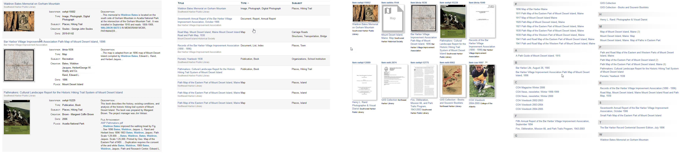
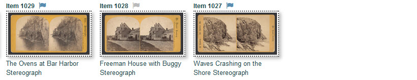

# Getting Started Using the Digital Archive

**New to the Digital Archive?** Here are things that every user can do.

---

Search one collection or many
:   You can search any or all collections in three different ways:

    - Type keywords into the search box
    - Click topics of interest in the **_Refine Your Search_** panel
    - Use the **_Advanced Search_** page

    [Learn how to search](/user/how-to-search)

View search results in different ways
:   You can view your search results in four different ways:

    -   Table view with rows showing thumbnails and metdata
    -   Table view with compact rows showing sortable columns of metadata
    -   Grid view showing only images and titles
    -   Index view (like the index in the back of a book)

        
    [Learn about viewing search results](/user/viewing-search-results)

Flag items to view later
:   You can mark items that you want to view later so that you can
    quickly find them again without doing a new search. Just click the little flag icon beside the item number.

        
    [Learn about flagging items](/user/recently-viewed)

Share search results with other people
:   You can share your search results with a friend or colleage by sending them a link.
    When the recipient clicks the link, they'll see the results exactly the same way as you
    are viewing them.

    [Learn how to share search results](/user/sharing)

Create a PDF report that you can print
:   You can save search results as a PDF document that you print or email to someone.

    [Learn how to create a PDF of search results](/user/pdf-report)

Use the Digital Notebook to save ans organize what you find
:   You can save and organize items that you find in the digital notebook tool. You can
    share the notebook with others online.

    [Learn how to use the Digital Notebook](/user/digital-notebook)

---    

!!! Note ""
    Not all of the features above are enabled in all Digital Archive installations.
    Which features are available depends on which Digital Archive plugins are installed.    