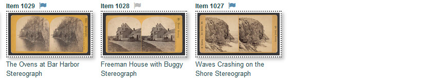

# Getting Started for Users

**Users** are people who use the Digital Archive for research or just for fun.
They can see all public items in a Digital Archive collection, but have
no access to non-public items or private fields. A user cannot edit or add items
unless they log in as an [Archivist](/archivist/getting-started-archivist/) or
[Administrator](/administrator/getting-started-administrator/).

**To get started using the Digital Archive as a user:**

-   Find out what you can do with the Digital Archive by reading the sections below
-   Learn to use specific features by clicking the **_Learn how_** link in any section below

---

> What a user can do with the Digital Archive:

View search results in different ways
:   You can view your search results in four different ways:

    -   **_Table view_** with rows showing thumbnails and metadata
    -   **_Table view_** with compact rows showing sortable columns of metadata
    -   **_Grid view_** showing only images and titles
    -   **_Index view_** (like the index in the back of a book)

    [Learn how to view search results](/user/viewing-search-results)

Flag items to view later
:   You can mark items that you want to view later so that you can
    quickly find them again without doing a new search. Just click the little flag icon beside the item number.

        
    [Learn how to flag items](/user/recently-viewed)

Share search results with other people
:   You can share your search results with a friend or colleague by sending them a link.
    When the recipient clicks the link, they'll see the results exactly the same way as you
    are viewing them.

    [Learn how to share search results](/user/sharing-search-results)

Create a PDF report that you can print
:   You can save search results as a PDF document to print or email to someone.

    [Learn how to create a PDF of search results](/user/pdf-report)

---    

!!! Note ""
    Not all of the features above are enabled in all Digital Archive installations.
    Which features are available depends on which Digital Archive plugins are installed.    