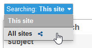
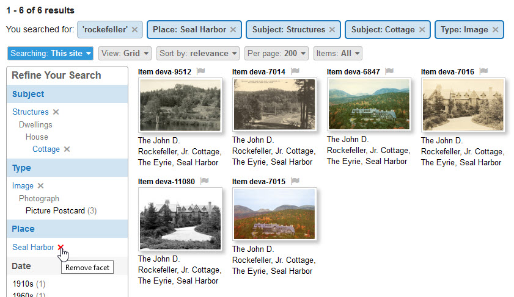
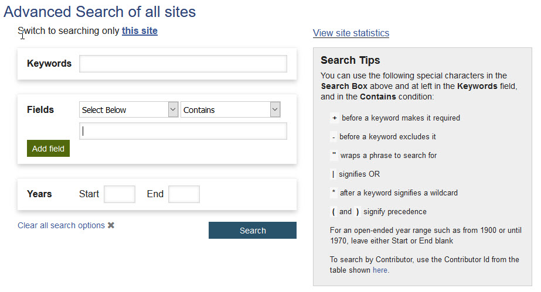

# How to Search

You can search the Digital Archive in three ways:

- Type keywords into the search box at the upper right of every page
- Click facets in the **_Refine Your Search_** panel
- Use the **_Advanced Search_** page

!!! Note "Shared Searching"
    Some Digital Archive sites are set up to share their collections with other organizations.
    If you are searching in a Digital Archive that is sharing, you have the option to search all sites,
    or to only search the site you are you are on. 

    **To search all sites**, use the **_Searching_** selector to choose `All sites`.

    

    **To search just the site you're on**,  use the **_Searching_** selector to choose `This site`.

## Search Using Keywords

**To search using keywords**, type keywords in the search box located in the upper right corner of every Digital Archive page.
Click the magnifying glass icon or press `Enter` on your keyboard.

If you know an item's **_Identifier_**, you can type the number into the search box to go directly to the page for that item.
This only works when searching the site you are on because different sites could be using the same identifer for different items.

You can increase the power of keyword searching by using special characters with your keywords.
See the [Advanced Search](#advanced-search) section below to learn about the special characters.

## Search Using Facets

Facets allow you to narrow down search results that you have already have, or to narrow down all of the
items in the collection to just what you are interested in.

!!! Note "Tip"
    To see all of the items in a collection, click on the magnifying glass icon next to the search box
    with no keywords entered. You can then use facets to narrow down the entire collection.

 Facets appear in the **_Refine Your Search_** panel. They are: **_Subject_**, __*Type*__,
 **_Place_**, and **_Date_**. When searching all sites, the **_Contributor_** facet also appears. 

Facets let you find items of interest with just a few mouse clicks. For example, if you are looking for pictures
of cottages, you can use the **_Type_** and **_Subject_** facets to narrow search results to `Images` of `Cottages`.
You could then further narrow down the results to only items from a specific place such as `Seal Harbor`.
You can also use facets in combination with keyword or advanced searching to limit the results to
items having specific metadata. In the example below, that metadata is the keyword `rockefeller`.

As you click on facets in the **_Refine Your Search_** panel, the contents of the panel shrinks down to only
show facets that apply to the current search results. You can remove facets by clicking the `X` next to their name
in the panel or in the corresponding blue boxes that appear above the search results.

## Advanced Search

Wen you want to narrow search results to something more specific than is possible using either of
these methods, you can click on the `Advanced Search` link that appears under the search box to go
to the  **_Advanced Search_** page. You can use it to specify search criteria for individual 
metadata fields. You can also use it to specify an inclusive range of years.

Typically, you use advanced search to either limit
