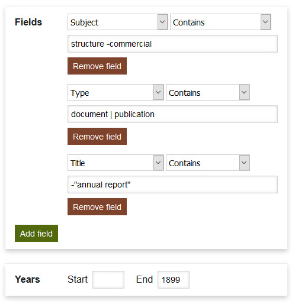
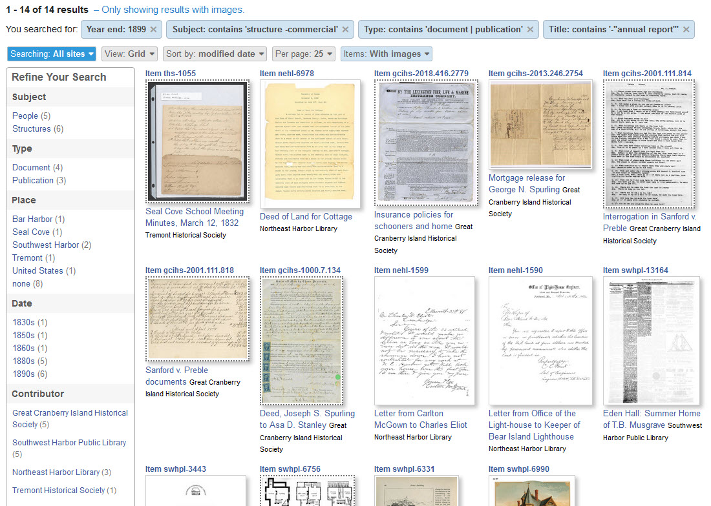
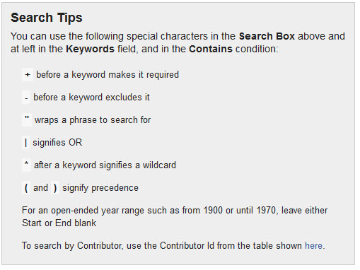
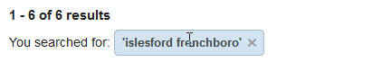
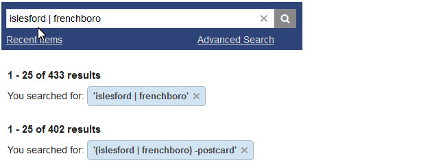

# How to Search

You can search the Digital Archive in three ways:

- Type **keywords** into the search box
- Click **facets** in the **_Refine Your Search_** panel
- Use the **_Advanced Search_** page

## Search Using Keywords

To search using keywords, type words in the search box that is located in the upper right of
every Digital Archive page. Click the magnifying glass icon or press `Enter` on your keyboard.

The search results will be items that contain *all* of the keywords that you entered.
You can search for items containing *any* of the keywords by using special characters.
See the [Special Characters Used for Searching](#special-characters-used-for-searching)
section below to learn how.

!!! Note "Tip"
    If you know an item's **_Identifier_** number, you can type the number into the search box to go
    directly to the page for that item. This only works when searching the site you are on. When
    searching all sites, you'll get search results for items having that number in their metadata.

## What Gets Searched

When you type keywords in the search box, the Digital Archive examines all of the items in the collection
looking for those keywords in *every metadata field* and in every searchable PDF. It does not matter which
metadata field contains the words you are looking for; if the words exist somewhere in an item's metadata,
that item will show up as a search result. However, when the keywords appear in the item's **_Title_** or
**_Description_** metadata fields, the item will likely appear higher up in the search results because those
two fields are the most relevant for search purposes.

Be aware that sometimes the search results will contain items that have metadata that contains words that
are very similar to, but not exactly the same as the words you type. While this can sometimes produce
unwanted results, it's very helpful if you mistype a word or when you don't know the correct spelling.

!!! Note "Shared Searching"
    Some Digital Archive sites are set up to share their collections with other organizations.
    If you are searching in a Digital Archive that is sharing, you have the option to search all sites,
    or to only search the site you are you are on. 

    **To search all sites**, use the **_Searching_** selector to choose `All sites`.

    

    **To search just the site you're on**,  use the **_Searching_** selector to choose `This site`.

## Search Using Facets

Facets allow you to narrow down search results that you are viewing, or to narrow down all of the
items in the collection to just the items you are interested in.

!!! Note "Tip"
    To see all of the items in a collection, click on the magnifying glass icon next to the search box
    *with no keywords entered*. You can then use facets to narrow down the entire collection.

 Facets appear in the **_Refine Your Search_** panel. They are: **_Subject_**, __*Type*__,
 **_Place_**, and **_Date_**. When searching all sites, the **_Contributor_** facet also appears. 

Facets let you find items of interest with just a few mouse clicks. For example, if you are looking for pictures
of cottages, you can use the **_Type_** and **_Subject_** facets to narrow search results to `Images` of `Cottages`.
You could then further narrow down the results to only items from a specific place such as `Seal Harbor`.
You can also use facets in combination with keyword or advanced searching to limit the results to
items having specific metadata. The example below shows use of the **_Type_**, **_Subject_**, and
**_Place_** facets plus the keyword `rockefeller`.

As you click on facets in the **_Refine Your Search_** panel, the contents of the panel shrinks down to only
show facets that apply to the current search results. You can remove facets by clicking the `X` next to their name
in the panel or in the corresponding blue boxes that appear above the search results.

## Advanced Search

Wen you need to narrow search results to something more specific than is possible using either keywords
or facets, click on the `Advanced Search` link that appears under the search box to go
to the **_Advanced Search_** page. That page lets you specify search criteria for individual 
metadata fields. You can also use it to specify an inclusive range of years.

Typically, you use advanced search to either limit results to items containing metadata for a specific
field, or you use it to exclude items that do contain certain metadata.

The example below shows a search for items that have `structure` in their **_Subject_** field, but *not*
`commercial`. In other words, non-commerical strutures. The items must also be either documents or
publications, that is, no images or objects. Futhermore, the **_Title_** field must *not* contain
the phrase `annual report`. Finally, the **_Date_** field year must be before 1900.

The search screenshot below shows the results of the Advanced Search shown above. Notice that no facets are selected, but
you could still use them. For example, you could choose the `Southwest Harbor` facet to narrow the results
to only items from that town that meet the criterion above.

### Special Characters Used for Searching

The right-side of the **_Advanced Search_** page lists the special characters you can use when searching.
You can also use this syntax in the search box that appears at the upper right of every page.

The special characters are especially useful when you want to circument the fact that
by default, keyword search results are items containing *all* of the keywords you specify. For example, a
search for `islesford frenchboro` returns the six items that have `islesford` *AND* `frenchboro` in their
metadata.

When you separate the words by the special `|` character to signify *OR*, the search returns the 433
items that contain either or both words. The addition of `-postcard` eliminates items that contain that keyword.

