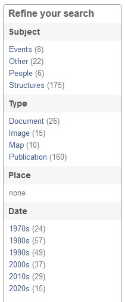
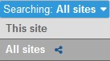

# How to Search

---

**To search using keywords**, click into the search box in the upper right corner of any Digital Archive page. Enter your keyword(s), and click the magnifying glass symbol or press 'Enter' on your keyboard.

**To search by item identifier**, type the number into the search box to go directly to the page for that item.

---

**To narrow search results**, click on the terms in the **_Refine Your Search_** panel on the left. Each time you click one of these terms, your search results are narrowed further. Numbers in parentheses indicate how many items are included in each term.

**To expand search results**, click the X next to its blue label at the top of the screen, or in the **_Refine Your Search_** panel on the left.

[George finish this!]

---

Some Digital Archive sites are set up to share information with multiple organizations. If you are searching in a Digital Archive that is connected to other organizations, you have the ability to search in all sites, or just the one you are on. 

**To search all sites**, use the *searching* menu to select `All sites`. Notice that a dark blue connector icon appears beside options in the selector bar menus as a reminder that you are searching items from all connected sites.

**To search just the site you're on**, use the *searching* menu to select `This site`. 

---

**To search by individual fields**, click the *Advanced Search* link underneath the search box in the upper right. This feature allows advanced users to narrow their search using specific qualifiers and parameters. Learn more about Advanced Search.