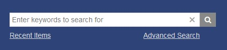
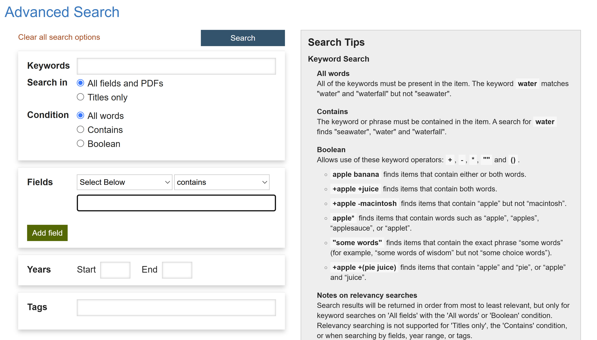

# How to Search

You can search the Digital Archive in three ways:

- Type **keywords** into the search box
- Use the **_Advanced Search_** page

[Learn about what gets searched](/archivist/what-gets-searched)

## Search using keywords

To search using keywords, type words in the search box that displays in the upper right of
every Digital Archive page. Click the magnifying glass icon or press `Enter` on your keyboard to start the search.

The search results will show items that contain *all* of the keywords that you entered.
You can search for items containing *any* of the keywords by using special characters.
See the [Special Characters Used for Searching](#special-characters-used-for-searching)
section below to learn how.

!!! Note ""
    **TIP**: If you know an item's **_Identifier_** number, you can type the number into the search box to go
    directly to the page for that item. This only works when searching the site you are on. When
    searching All Sites, you'll get search results for items having that number in their metadata.

## Advanced Search

When you need to narrow search results to something more specific than is possible using keywords,
click on the `Advanced Search` link under the search box to go
to the **_Advanced Search_** page. That page lets you specify search criteria for individual 
metadata fields. You can also use it to specify an inclusive range of years.

Typically, you use advanced search to either limit results to items containing metadata for a specific
field, or you use it to exclude items that do not contain certain metadata.

---
