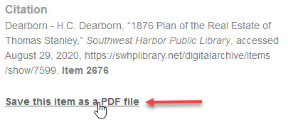
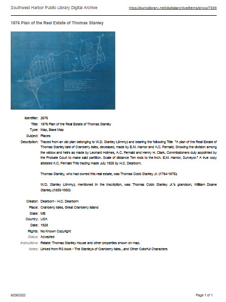
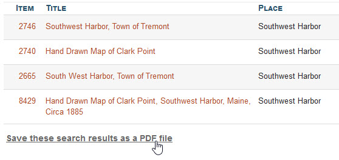
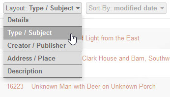
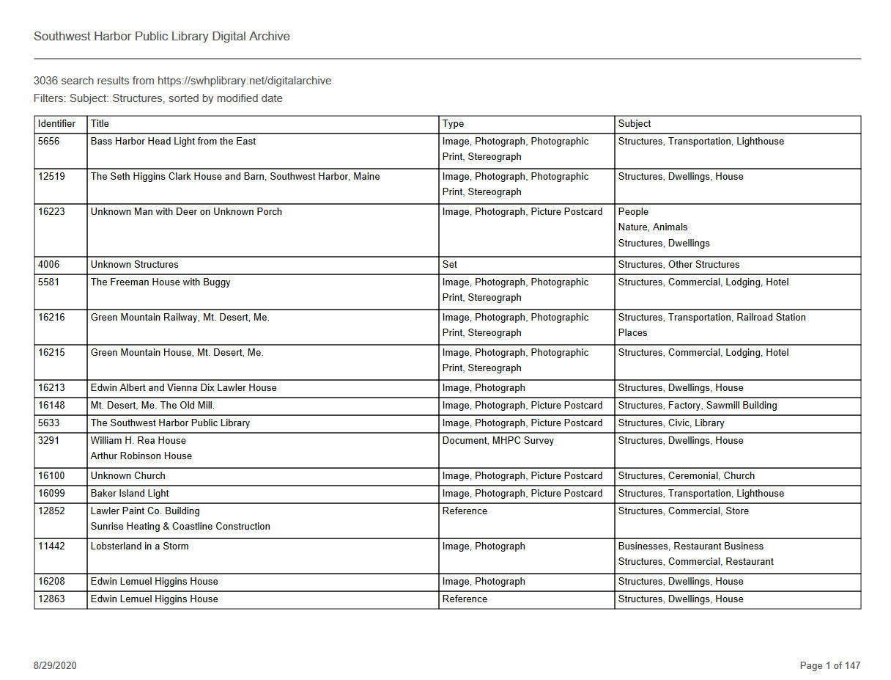
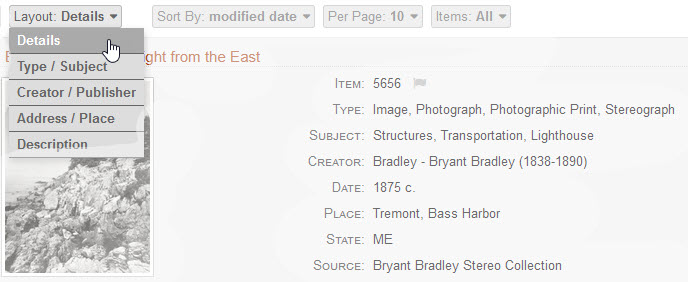
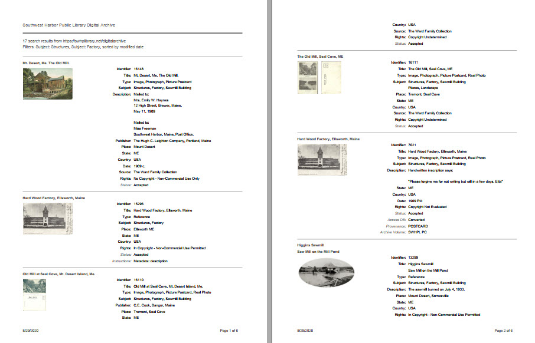
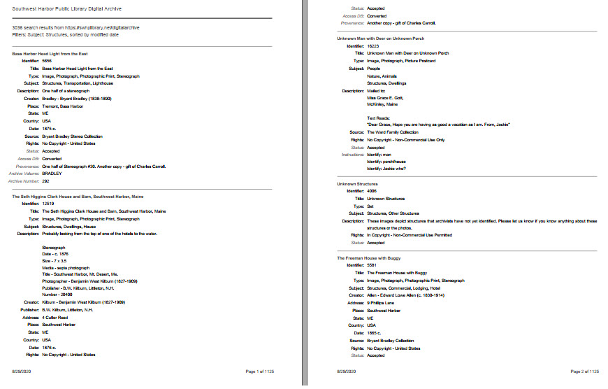
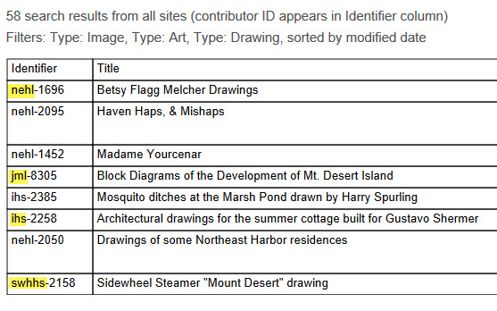

# Create PDF Reports

You can create a PDF file containing the metadata and image for a single item. You can also
create a PDF file containing search results for many items. You can print the PDF file,
email it to someone, or store it on your computer.

The sections below describe the three kinds of PDF reports you can create:

-   Single item report
-   Compact search results report
-   Detailed search results report

## Single item report

Follow these steps to create a PDF report for a single item:

-   [View the item](/user/viewing-items/) of interest
-   On the left side of the item page, below the **_Citation_** section, click the  
    **_Save this item as a PDF file_** link as shown in the screenshot below.

-   Depending on what browser you are using, the PDF file will be saved on your computer
    automatically, or you may be prompted to save the report as a file, open it in your
    browser, or view it using a PDF application. The actual behavior depends on your
    browser and how you have it configured to handle PDF files.

The screenshot below gives you an idea of what a single item report looks like.  
The contents of the report from top to bottom are:

-   The organization name and a link to the item in the Digital Archive
-   The item's title
-   The item's first image
-   The item's metadata fields
-   If you are logged in when you create the report, private fields will appear in gray italics
-   The footer contains the date and page number (some items require two pages)

## Search results reports

The next two sections describe the compact and detailed search results reports. Which kind of report
gets created depends on which layout you are using to display search results as will be explained later.  

To create either kind of report:

-   [View search results in **_Table View_**](/user/viewing-search-results/#table-view)
    (you cannot create a report in **_Grid View_** or **_Index View_**)
-   Scroll all the way to the bottom of the search results
-   Click the **_Save these search results as a PDF file_** link as shown in the screenshot below

After you click the link, a blue message appears saying that the report is being created.
The time it takes to create a report can vary from a few seconds to more than a minute
depending on how many search results there are.

When the message disappears, the PDF file will be saved on your computer
automatically, or you may be prompted to save the report as a file, open it in your
browser, or view it using a PDF application. The actual behavior depends on your
browser and how you have it configured to handle PDF files.

Notes:

 -  The report results will be sorted according to the option specified in the **_Sort By_**
    selector.

-   The report will contain all of the search results regardless of the number specified in the  
    **_Per Page_** option. For example, if the search results page says it is displaying
    1 - 25 of 197 results, the report will contain all 197 results.

 -  The maximum number of results you can save in a PDF report is 10,000. If you have more that that,
    you'll have to refine the search to produce fewer results.

### Compact search results report

The compact search results report displays one item per row in tabular format. You create a compact
search results report by choosing any of the layouts from the
[**_Layout_** selector](/user/viewing-search-results/#compact-table-view-layouts)
*except* for the `Details` layout, and then clicking the **_Save these search results as a PDF file_**
link at the very bottom of the search results.

The screenshot above shows the `Type / Subject` layout being selected. The screenshot below
shows the compact search results report that gets created for that layout.

Because of space limitations on a piece of paper, the report only shows some of the item columns. 

-   Which columns appear depends on which **_Layout_** option you choose.  
    The report has the same columns as the selected layout.
-   The maximum number of columns is eight. If the layout has more than eight columns,
    the remaining columns will not appear in the report. If you need a report that shows metadata for more
    than eight fields per item, create a detailed search results report.
-   The order of columns in the report may differ from the order shown in the online search results.
    The column order in the report comes from the AvantSearch [**_Columns_** option](/plugins/avantsearch/#columns-option).
-   An [administrator](/administrator/getting-started-administrator/) can define custom layouts using the AvantSearch
    [**_Layouts_** option](/plugins/avantsearch/#layouts-option)

### Detailed search results report
The detailed search report shows *all* of the field values for each item.
You create a detailed search results report by choosing  the `Details` layout from the
[**_Layout_** selector](/user/viewing-search-results/#compact-table-view-layouts),
and then clicking  
the **_Save these search results as a PDF file_** link at the very bottom of the search results.

The detailed search results report displays each item in a section that contains:

-   The item's title
-   The item's first image, but only if the report contain <= 1,000 results (see next section)
-   The item's metadata fields
-   If you are logged in when you create the report, private fields will appear in gray italics

The screenshot below shows an example of a detailed search results report with images.

##### Detailed search results report without images

If there are more than 1,000 search results, the detailed search results report will be created without
images. Eliminating the images from long reports prevents the creation of huge PDF files. The screenshot
below shows a detailed search results report for 3,036 items. It has 1,125 pages.

### Contributor ID

Which items appear in a compact or detailed search results report depends on whether you are searching
[one site or all sites](/user/how-to-search/#search-one-site-or-all-sites).
When searching All Sites, you can tell which result came from which organization by
looking at the **_Identifier_** field for the item. The **_Identifier_** will be
prefixed with the ID of the contributing organization.

The screenshot below shows a compact search results report containing eight items from four different
organizations. The text highlighted in yellow is the contributor ID prefix.  
To learn what the IDs mean, see the [site statistics](/user/how-to-search/#site-statistics) page.

A contributor ID prefix will also appear on the **_Identifier_** fields in a detailed search results report.

The prefix will not appear in a report containing results for just one site because it is not necessary.
However, when viewing search results from multiple sites, the prefix is important because two different
organizations may be using the same **_Identifier_**. In other word, the
**_Identifier_** values are not unique across organizations.

---

!!! note ""
    To use the PDF Reports feature, the [AvantReport](/plugins/avantreport/) plugin must be installed and activated.

