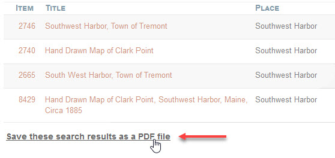
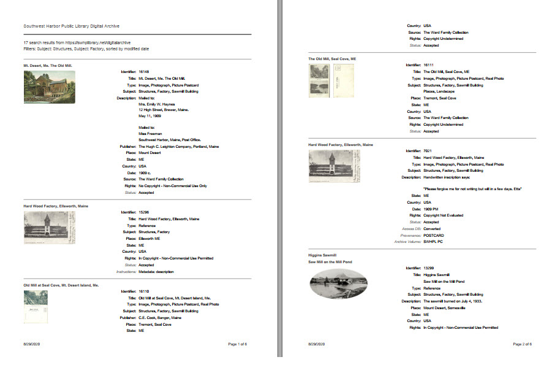

# Creating a PDF Report

You can create a PDF file containing either the metadata and image for a single item,
or search results for many items. You can print the PDF file, email it to someone, or
store it on your computer.

The sections below describe the three kinds of PDF reports you can create:

-   Single item report
-   Compact search results report
-   Detailed search results report

## Single item report

Follow these steps to create a PDF report for a single item.

-   [View the item](/user/viewing-items/) of interest
-   On the left side of the item page, below the **_Citation_** section, click the  
    **_Save this item as a PDF file_** link as shown in the screenshot below.

-   Depending on what browser you are using, a PDF file will be saved on your computer
    automatically, or you may be prompted to save the report as a file, open it in your
    browser, or view it using a PDF application. The actual behavior depends on your
    browser and how you have it configured to handle PDF files.

The screenshot below gives you an idea of what a single item report looks like.  
The contents of the report from top to bottom are:

-   The organization name and a link to the item in the Digital Archive
-   The item's title
-   The item's first image, if it has one
-   The item's metadata fields
-   If you are logged in, the item's private fields will appear in gray italics
-   The footer contains the date and page number (some items require two pages)

## Search results reports

The next two sections describe the compact and detailed search results reports. To create either kind
of report:

-   [View the search results in **_Table View_**](/user/viewing-search-results/#table-view).  
    You cannot create a report from search results in **_Grid View_** or **_Index View_**.
-   Scroll all the way to the bottom of the search results
-   Click the **_Save these search results as a PDF file_** link as shown in the screenshot below

After you click the link, a blue message appears asking you to be patient and wait for the report to
be created. The time it takes can vary from a few seconds to more than a minute, depending on how many
search results there are.

When the message disappears, the PDF report will have either been automatically
saved on your computer, or you will be prompted for what to do with it as explained above for the single
item report. 

The maximum number or results you can save in a PDF report is 10,000. If you have more that that,
you'll have to refine the search to produce fewer results.

### Compact search results report

The compact search results report displays one item per row in tabular format. You create a compact
report by choosing any of the layouts from the [**_Layout_** selector](/user/viewing-search-results/#compact-table-view-layouts)
*except* for the `Details` layout. The screenshot below shows the report when the `Type / Subject` layout is selected.

Because of space limitations, the report only shows a few of the item's columns. 

-   Which columns appear depends on which **_Layout_** option you choose
-   An administrator can define custom layouts using the AvantSearch
    [**_Layouts_** option](/plugins/avantsearch/#layouts-option)
-   The order of columns in the report may differ from the order shown in the online search results.
    The column order in the report comes from the AvantSearch [**_Layouts_** option](/plugins/avantsearch/#layouts-option).
-   The maximum number of columns in a report is eight. If the layout has more than eight columns,
    the remaining columns will not appear in the report.
-   If you need a report containing more than eight columns per item, create detailed search results report.

##### Contributors

### Detailed search results report
The Detail report lists all of an item's elements, not just the ones that are configured to appear in
the Detail layout.

The order of public  elements is as specified in the **_Display Order_** option of the AvantElements configuration page 
The order of other elements is as ordered on the Edit Item Type page

Without images

---

