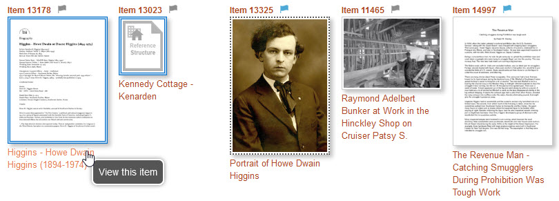
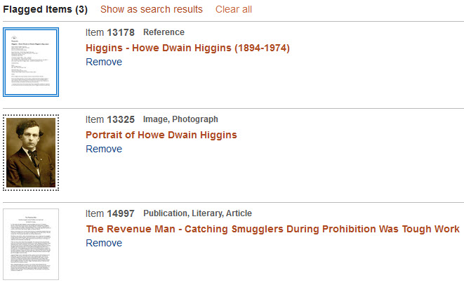

# Flagging Items to View Later

You can flag items in search results to add them to your flagged items list. This feature
makes it quick and easy to find items again without having to do another search.

!!! Note ""
    This flagging feature works ony when you are searching the site you are on.  It does not work when
    you are [searching all sites](/user/how-to-search/#search-one-site-or-all-sites).

The example below shows search results in [Grid View](/user/viewing-search-results/#grid-view)
for five items. Suppose you want to learn more about item 13178 by clicking the title of the first item as shown below.
However, before clicking the title, you could click the flag icons on items 13325 and 14997 to mark
them for viewing later. A blue flag indicates that an item is in the flagged items list
(even if you have not actually viewed its item page). You can unflag an item by clicking it again
which resets the flag to gray and removes the item from the flagged items list.

You can also flag an item while you are view an item by clicking the flag that appears next to the item's identifier. For this example, lets suppose that while viewing item 13178 you clicked its flag.

### Flagged items page

Continuing with the example above, after viewing item 13178, you could click
the **_Flagged Items_** link, located under the [search box](/user/how-to-search/#search-using-keywords), 
to go to the **_Flagged Items_** page. That page shows the items you flagged earlier.

On the **_Flagged Items_** page, you can:

-   Click a title to go to that item's page
-   Click a thumbnail to view the item's image in the popup lightbox 
-   Click the `Remove` link to remove an item from the list
-   Click the `Clear all` link to remove all items from the list
-   Click the `Show as search results` link to view all of the items as search results

### Show Flagged Items as search results

You can use the flagging feature as way to create a set of results that you want to share with someone else.
A common sequence for using the feature is to:

-   Clear all the flagged items
-   View and/or flag items that you want to share
-   Click the `Remove` link on any items that you don't want to keep in the list
-   View the list as search results
-   Send the search results to a friend or colleague

When you click the `Show as search results` link in the example above,
the three items appear as search results as shown below.
You can share results with someone else by sending them the URL for the search results page. 
[Learn about sharing search results](/user/sharing-search-results).

!!! Note "Notes"
    The list of flagged items is stored in [browser cookies](https://en.wikipedia.org/wiki/HTTP_cookie).
    If you clear your browser's cookies, or switch to a different browser, or don't
    look at the **_Flagged Items_** page for several days, the list will be empty.

    The flagged items list only tracks items that you have viewed or flagged when searching
    `This site`. It does not track items when you are viewing `All sites`.

---