# Searching

Some users may utilize the Digital Archive purely for exploration and discovery. In these cases, a user is likely to follow the relationships between a variety of items, clicking on and taking different paths forward as they are curious. In many other cases, however, you are here because you are curious about a specific person, place, object, or location and want to learn more information about it. There are a variety of ways to begin this exploration, outlined in detail on this page.

---

## Quick Search

To search for an item in the Archive, simply click into the Search box in the upper right corner of any Digital Archive page. Type a keyword or words into the search box, and click the magnifying glass symbol, or hit 'Enter' on your keyboard. As you type, suggestions for AutoComplete may appear in a clickable list below the search box. Click on any of these items at any time to navigate directly to that item's page.

**Note:** If you know the Identifier (ID) of an item you are searching for, you can enter that in the Search box and be immediately directed to the page for that item (and bypass a list of search results).

## Search Locations

While individual organizations have their own collections, the Archive provides a way for them to share information and data with each other to reveal bigger pictures and deeper connections. By default, the software presents search results specific to the organization's collection from which you accessed the Archive initially, for example, your local library. To expand your results and search from a pool of all items within multiple collections - such as a statewide history consortium - , use the `Searching:` menu bar to select `All sites`. Notice that a navy connector icon appears beside options in the `Layout` and `Sort by:` menus as a reminder that you are searching items from all connected sites.

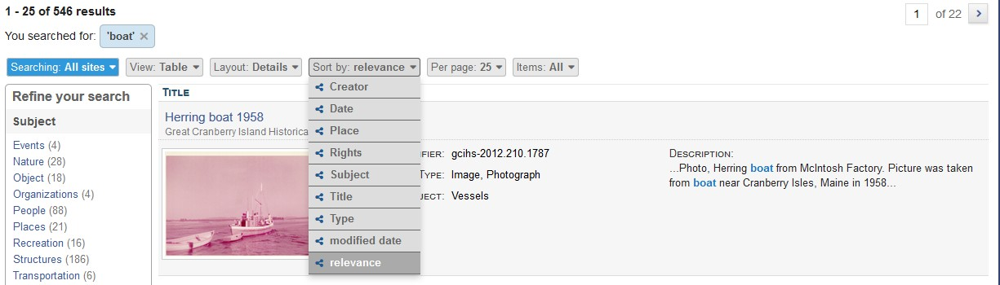

## Viewing Search Results
The Digital Archive has the ability to display search results in many different ways which you can customize to meet your needs and help you find what you are looking for most efficiently. Search results can be displayed in [Table View](#table-view), [Grid View](#grid-view), or [Index View](#index-view).

When the list of search results returned exceeds a certain amount, the results will extend to additional pages. You can see how many pages of results were generated, and navigate between them by using the arrows at the top right, or typing a specific page to jump to and pressing 'Enter' on your keyboard. 

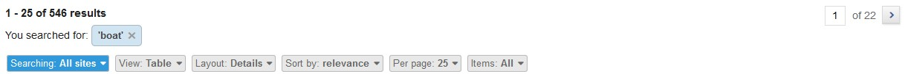

By default, the Archive shows 25 search results per page. You can adjust this by using the `Per page:` menu option to show 10, 50, 100, or 200 results per page instead.

### Table View

Table View is the default view for a set of search results. In a Table View list of search results, items are listed one at a time, each item occupying an individual row. You can further customize the results in Table View, by adjusting the Layout. Each Layout option displays the same list of search results, but with differing types of information visible in the list of results. 

Layout options in Table View are:

**Detail:** (default) provides a compact presentation of key information about an item, including a thumbnail image.

**Type/Subject:** lists item titles with their [type(s)](../../concepts/types/#types) and [subject(s)](../../concepts/subjects/#subjects)

**Creator/Publisher:** lists items alongside their creator(s) and/or publisher(s)

**Address/Place:** lists items with their associated place and/or address

**Description:** lists items and their description, which may be shortened into a preview

To switch between views, use the `Layout:` tab in the menu bar that appears at the top of 
your search results.

You can narrow this search further by selecting 'With Images' from the `Items:` tab to show only results that have images attached.

The screen shots that follow show the same search results in three different Table View layouts. 

**Table View with Detail Layout**

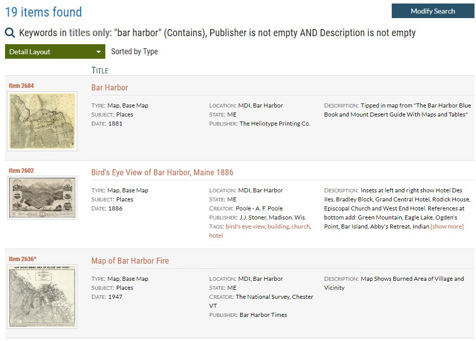

---

**Table View with Type/Subject Layout**

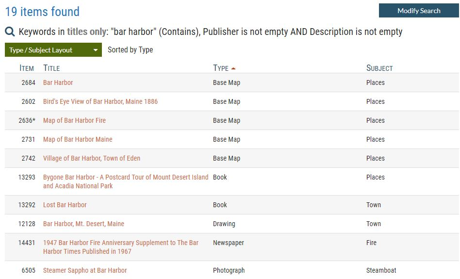

---

**Table View with Creator/Publisher Layout**

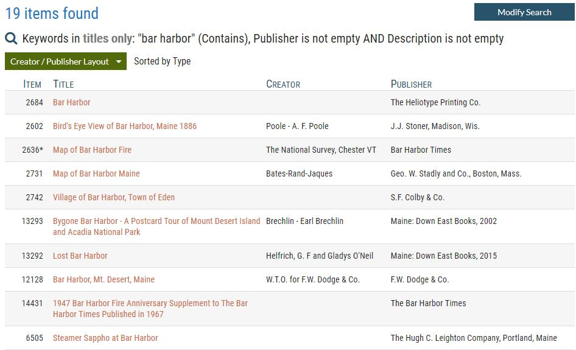

---

### Grid View
Grid View displays search results as a grid of thumbnails. It's a more compact way to view results when the image is most important for identifying items of interest. You can narrow this search further by selecting 'With Images' from the `Items:` tab to show only results that have images attached.

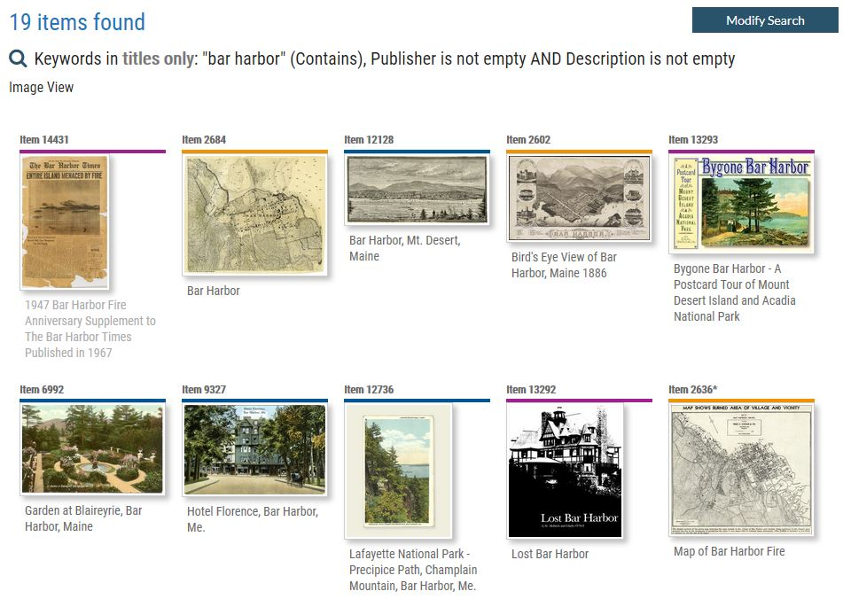

### Index View
Index View displays information like the index in a book. It consolidates items into unique groups alphabetically or numerically. As in Detail View and Grid view, the user can choose to sort items in Index view in multiple ways. 
The screen shot below shows a list of search results in Index View sorted alphabetically by Subject. 

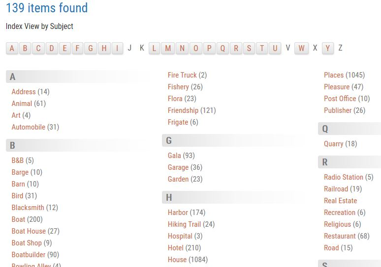

In this example, notice that there are numbers in parentheses to the right of each Index entry. This is to indicate that there are multiple items that fit that criterion. For example, of the 139 items found in the search above, 14 items included 'Address' as the subject. Clicking on an Index entry that includes multiple items results in a new set of these narrowed search results in Table View. 

## Lightbox
Both the Table View Detail Layout and the Grid View display thumbnails for an item's image, if it has one. If the item has no image, a placeholder image is displayed. When you click on a thumbnail, a large version of the image is displayed without leaving the page you are currently on. Click the arrows to the left and/or right of the image to preview the other item images in the search results. Doing so only changes the image preview - you are still on the page with your initial search results. 

Each Lightbox image is displayed with a set of metadata, including the item title, ID, and image link that opens the image by itself on a new page. Click 'View Item' To view the full page the image is associated with. 

Close the Lightbox image and return to search results by clicking the red X in the information bar, or by clicking anywhere outside of the image. 

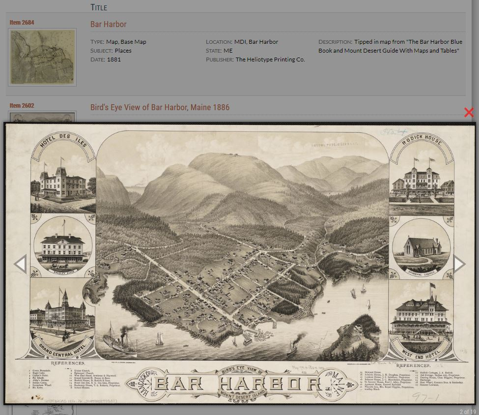

## Sort By options

Table (and all of its layouts), Grid, and Index Views can all be sorted to further organize search results. Sorting options include *Title*, *Date*, *Relevance*, *Creator*, and other categories as appropriate to the collection you are viewing. 

When you select a category to sort by, the list of search results will update to reflect this new organization, either numerically or alphabetically, depending on the sorting criteria. 

To reverse the order of research results displayed (switch from ascending to descending, or descending to ascending order), simply click the option in the `Sort by:` menu again. For example, if you want to sort your search results by date, select `Date` from the `Sort by:` menu. By default, the oldest items appear first. To see the newest items first in the list of results, use the `Sort by:` menu to click `Date` again. The results will update to show the reverse order.

When viewing search results in Table View layouts *other than* Detail View, additional column headers appear to indicate information such as Subject or Creator. You can organize results based on these column headers by using the arrows that appear when rolling over the column header with your mouse. Clicking an arrow switches between ascending and descending order. A red arrow appears next to the column header that is currently sorting items; the arrow points up to indicate that results are listed in ascending order, and points down to indicate descending order.

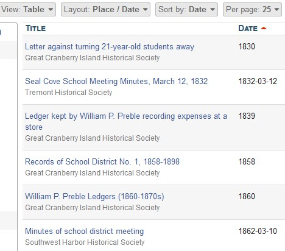

In the example above, search results are displayed in Table View with a Place/Date layout, and sorted by date. The red arrow next to the Date column header points up, indicating that items are listed in ascending order (oldest to newest) by date.

## Refine Search

Large lists of search results can be difficult to navigate, especially if your search terms are general or yielded many matching items. The Refine Search tool becomes very useful in these cases to help narrow your search, and discover other areas that may be of interest. 

Using Refine Search can be likened to shopping for clothing on a store's online website. Your initial search for 'shirt' may yield dozens of results, not all of which are what you are really looking for. Fortunately, there are options that allow you to refine 'shirt' further: selecting 'Women's' instead of 'Men's' narrows the results by half, and choosing 'sleeveless' instead of 'short-sleeve' or 'long-sleeve' narrows the results again so that you are only faced with a handful of the most relevant options, not multiple pages that may not contain any of your desired results. 

In the example below, the search for 'boat' yielded 546 total results, as shown in the top left of the screen. 

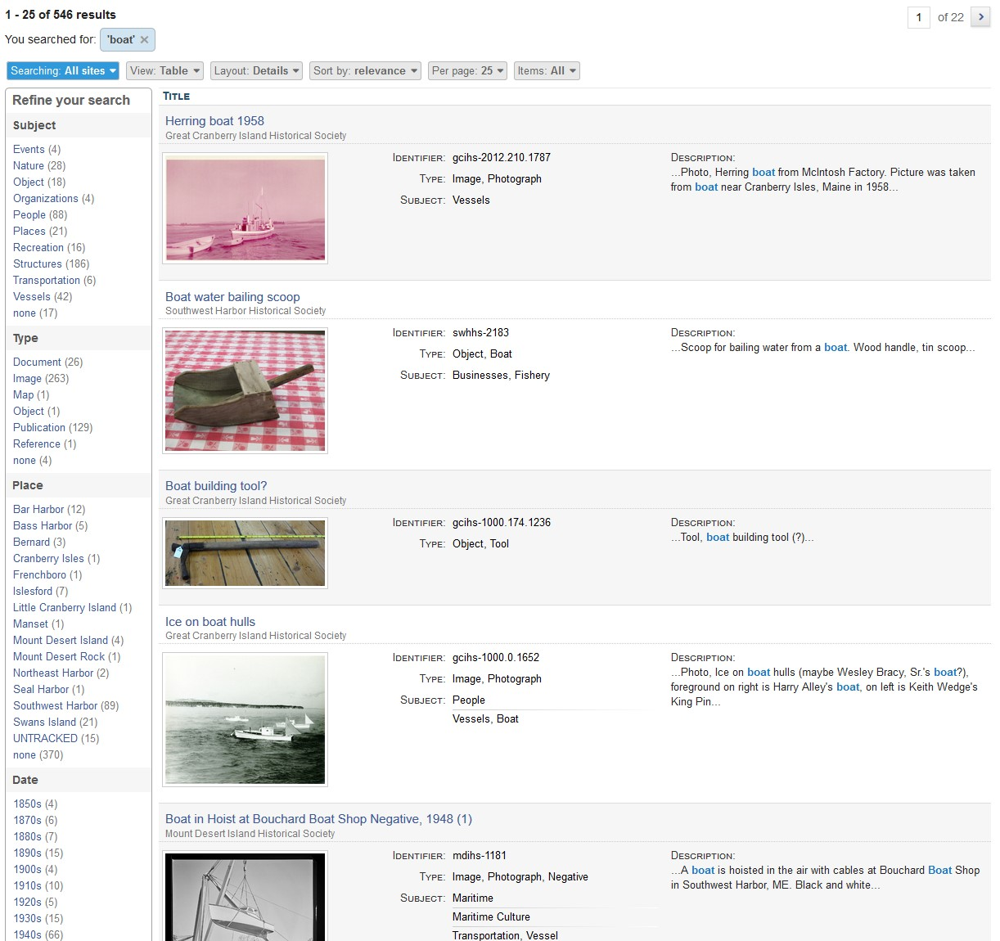

Study the `Refine your search` column on the left of the page above. Notice that this user can now see the frequency of the search 'boat' within multiple categories, like Subject, Type, Place, Date and more. Like the online search for the perfect shirt, this user can now decide what kind of information they want in relation to the search for 'boat'. Numbers in parentheses indicate how many items match that criteria. For example, there are 186 items for which 'boat' is listed with the Subject *Structures*. 

Clicking on *Structures* yields a new list of those 186 results, shown in the screen shot below. You can see that *Structures* can be further broken down into subcategories - in this case *Ceremonial*, *Commercial*, *Dwellings*, etc., and their respective subcategories *Church*, *Lodging*, *House*, etc. - which will return results narrowed even further. 

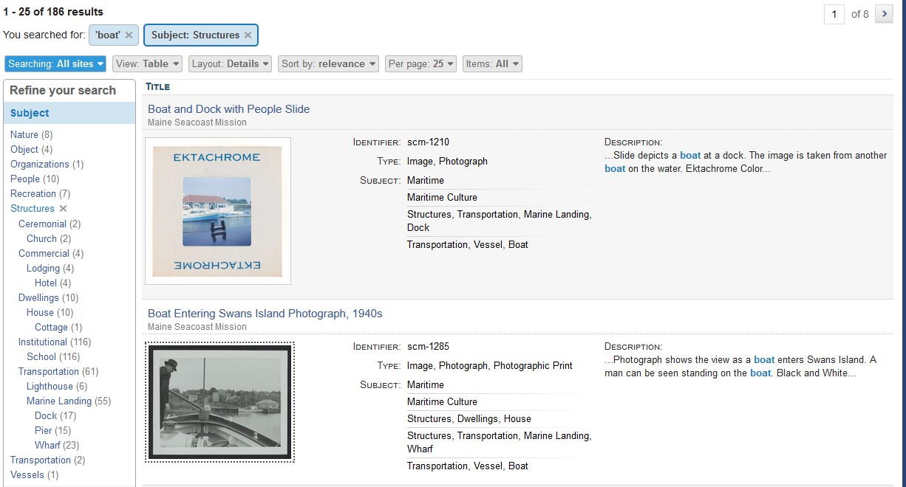

Notice that as you select more categories to refine the search, those categories appear in individual buttons at the top of the search screen, and the total number of results updates to reflect only the items that match all of the criteria you have selected to search from. In the example below, you can see that the original search for 'boat' has been refined to search for 'boat' in items with the Subject of Structures, Subject Transportation, Subject Marine Landing, and Subject Pier, resulting in only 15 items that meet all of these criteria.

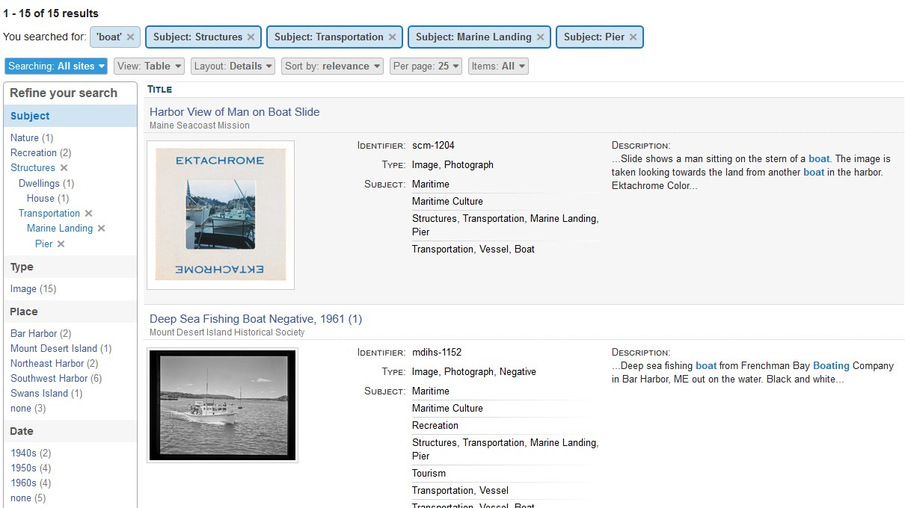

If at any point the search becomes too limited, or the categories you have refined by don't yield what you are looking for, you can eliminate one or more refinements by clicking the X next to its label in the `You searched for:` list at the top of the screen, or in the `Refine your search` list on the left. An updated list of results will populate to reflect this change. 

## Advanced Search
AvantSearch provides its own Advanced Search page. You access this page by either clicking on the Advanced Search
link that appears below the simple search box in the header of every page, or by clicking the Modify Search button
that appears on search result pages.

The screen shot below shows the search conditions that were
specified to generate the Table View Custom Layout - Type / Subject screen shot shown earlier.

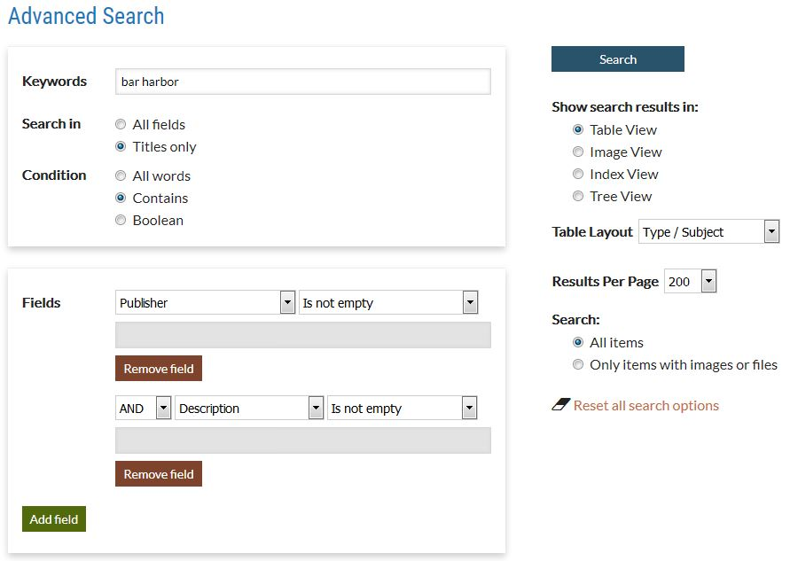

## Date Range Feature
When AvantCommon is configured to provide Start and End years, year start and end text boxes will appear as
filters at the bottom of the Advanced Search page. A user can provide values for both the start and end years to
limit search results to items in that range inclusive. For example if you specify 1900 for the start year and
1940 for end year, search will find items with start year greater than or equal to 1900 and less than or equal to 1940.
If you only provide a value for the start year, the search will find items where the start year is that date
or more recent. If you only provide a value for the end year, the filter will find items where the end year is that
date or older.

## Differences from Omeka

AvantSearch completely overrides Omeka's public search features. It provides its own
[Advanced Search](#tadvanced-search-page) page
and presents search results in a wide variety of ways. It does not affect Omeka's admin search.
The table below highlights the differences between AvantSearch and Omeka's native search.

Feature | AvantSearch | Omeka Search
--------|------------ | ------------
[Quick search](#quick-search) |  **Yes** - Feature | No
[Simple search for All Words](#simple-search) |  **Yes** - Feature | No
[Search in Titles only](#titles-only-option) | **Yes** - Advanced Search page option | No
[Search only items with images or files](#advanced-search-page) | **Yes** - Advanced Search page option | No
[Date range search](#advanced-search-page) | **Yes** - Advanced Search page option | No
[User can specify number of results](#advanced-search-page) | **Yes** - Advanced Search page option | No
[Tabular results](#table-view) | **Yes** - Feature | No
[Custom Results Layouts](#table-view-custom-layouts) | **Yes** - Congfiguration option | No
[Image View](#image-view) | **Yes** - Feature | No
[Index View](#index-view) | **Yes** - Congfiguration option| No
[Relationships View](#relationships-view-option) | **Yes** - Congfiguration option | No
[Integer sorting](#integer-sorting-option) | **Yes** - Congfiguration option | No
[Address sorting](#address-sorting-option) | **Yes** - Congfiguration option | No
[Lightbox](#lightbox) | **Yes** - Feature | No
Search by File, Collection, Featured | No | Yes

---