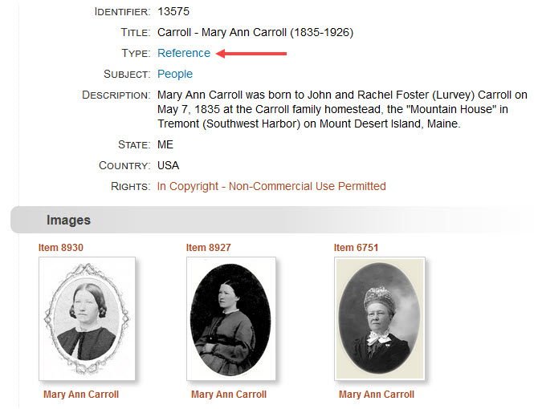
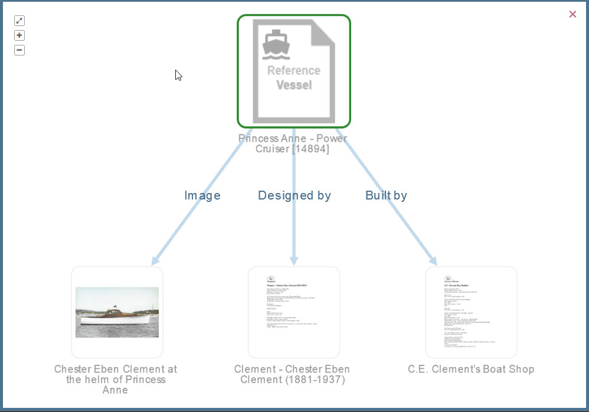
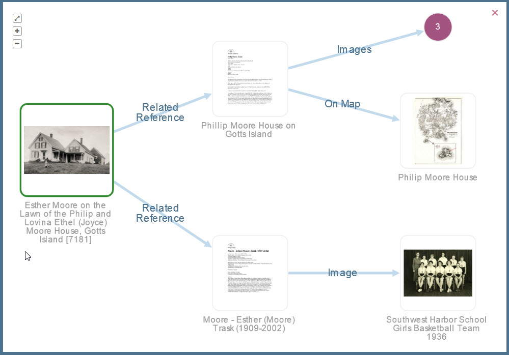
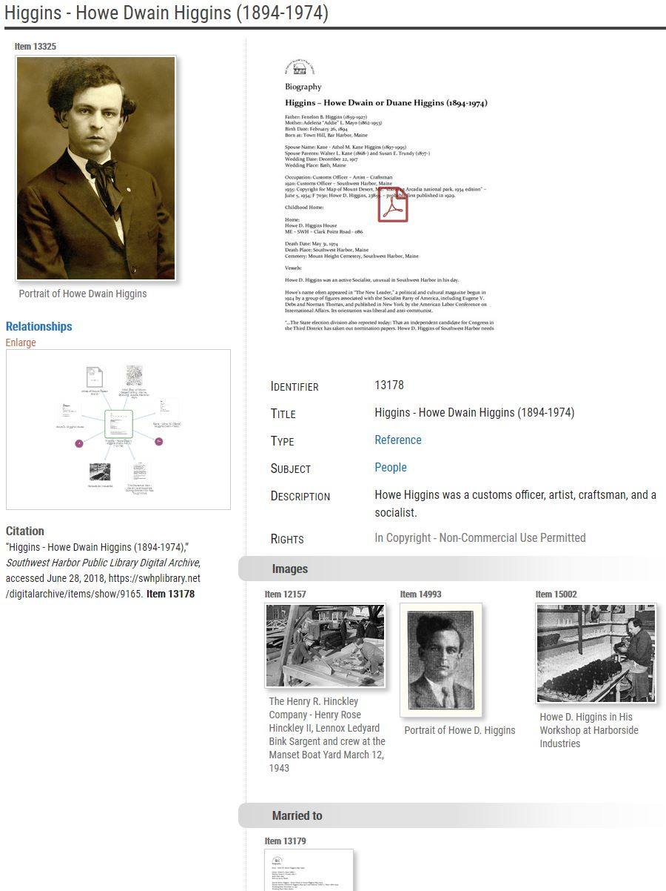
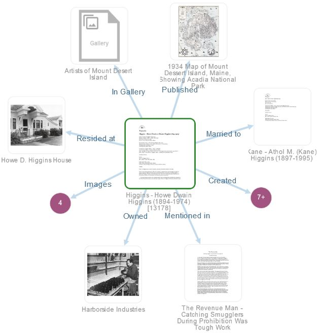
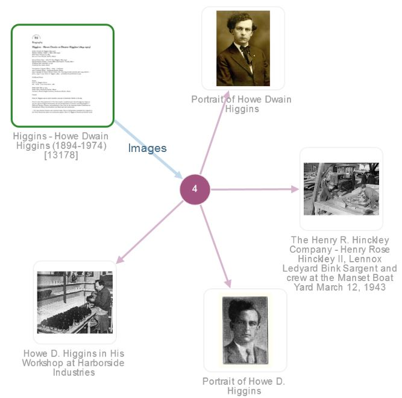

# Understanding Relationships

Relationships are the heart and soul of the Digital Archive. They are what make the
Digital Archive different from other databases or [Omeka](https://omeka.org/classic) projects
you may have worked with. Relationships are like the lines that connect the dots in those
puzzles you did as a kid. Until you drew the lines, all you saw was dots and numbers,
but once you connected the dots, you saw a picture!

Relationships in the Digital Archive are like relationships in the real world. They tell us how
two or more people, places, or things are connected to each other. For example, a man owned
a boat, resided in a house, and was married to a woman. The words *owned*, *resided in*, and
*married to* name the relationships that tell us how the man was connected to the boat
and the house and the woman.

[Learn more about The Archive Relational Model](/archivist/archive-relational-model).

## Reference Items

Reference Items serve as the “glue” that binds other items together. A Reference Item is simply an
item that has its **_Type_** metadata field set to `Reference`. [Learn about items and metadata](/).
These special items serve as stand-ins for things in the real world that are typically not part of
a collection, but that tie other items in the collection together via relationships.

The most common use of Reference Items is to provide biographical information about a person, or to
provide historical information about a structure, vessel, business, organization, or event. The *amount*
of information contained in a Reference Item is not always as important as the relationships between
the Reference Item and other items in the collection. As such, a Reference Item
with very little metadata still plays a key role in “connecting the dots” between related items.

To better understand the importance of Reference Items, consider a collection that has three photographs
of the same women. Even if you only knew the woman's name, a Reference Item could be used to tie the
photograps together. In the example below, item 13575 has its **_Type_** set to `Reference` (red arrow).
Items 8930, 8927, and 6751 each have a *depicts* relationship to item 13575 which automatically binds
the four items together such than when you find one of the items, you find them all. Item 13575
itself contains very little information. In a case where you have a lot of information, you could
attach the information to the Reference Item as a PDF file. Learn about [Learn about attachments](/).

[Learn more about Reference Items](/archivist/archive-relational-model/#reference-items).

## Relationship Types

An item in a Digital Archive collection can have a relationship with one or more other items.
A relationship's type indicate how two items are related. For instance, a relationship can exist
between two people (Mary is married to John), between a person and a thing (John designed a house),
between a thing and a place (John’s house was located in a village) and so on. To only say that
Mary has a relationship with John, or that John has a relationship with a house, without stating
the nature of the relationship, would not tell the whole story.

The visualization graph below illustrates the **direct** relationships between Reference
Item 14894 titled *Princess Anne Power Cruiser* and three other items directly related to it.
From left to right, the directly related items are an image that *depicts* the boat, a
Reference Item about the man who *designed* the boat, and another Reference Item about the
business that *built* the boat. Those last two Reference Items each have a PDF attached to them
which you can see as their thumbnails in the graph. Item 14894 has no attachment which is
why its thumbnail ishas a placeholder image.

## Indirect Relationships

When one item is related to another, it is inevitable that the other item is related to yet another
item and so on. The idea of [six degrees of separation](https://en.wikipedia.org/wiki/Six_degrees_of_separation)
makes for interesting reading on this topic and illustrates how seeing too many relationships
would get confusing. In the Digital Archive, when viewing an item, a user sees at most two degrees
of separation to related items. The first degree is the direct relationship from the item being viewed to
a directly related item. The second degree is the direct relationship from a directly related item to
an indirectly related item.

The visualization graph below illustrates the **indirect** relationships a user sees when viewing item 7181,
a photograph of Esther Moore as a small child in front of her home on Gotts Island. The graph shows two
direct relationships from item 7181 to Reference item for the house and the child. Each Reference item
is in turn directly related to other items shown at the far right: a map of showing the location of the
house on Gotts Island, and a school photograph showing Esther as an adult when she was the girl's
basketball team coach at Southwest Harbor High School. The basketball team photograph and the map
are *indirectly* related to item 7181.

## Genealogical Relationships

While the Digital Archive is not intended to be a genealogy tool, it automatically finds ancestor
and descendant chains. This ancestry feature works for Reference Items
having a subject of `People`. It automatically follows *child of* relationships to
locate parents, grandparents, and so on until the chain ends. It follows the inverse relationship
parent of to locate children, grandchildren, and so on. The mechanism also automatically identifies siblings.

## Viewing Relationships

When you view an item in the Digital Archive, you also see thumbnails and titles of related items along with a graphical visualization depicting the relationships among items. You instantly see how the item you are viewing fits in with the rest of the collection. You can view a related item by clicking on its thumbnail image or title. Clicking on a thumbnail shows you a large version of that item’s image and lets you quickly browse every other image on the page. The screenshot below shows the page for an item and its relationships.

### Visualization

The image below shows the visualization you see when you click the `Enlarge` link on the visualization
preview shown in the screenshot above (just below the **_Relationships_** section at left). The item
you are viewing, known as the primary item, appears with a green border around it. In this example, the
primary item is 13178.

To keep the graph from becoming too cluttered, groups of two or more items having the same relationship to the primary item are consolidated into expandable purple dots. When you click on the dot, the graph changes to show those items. The screenshot below shows what you see when you click on the purple dot showing `4` in the center.
 

In the expanded graph, clicking on the purple dot in the center, or on the primary item
at upper left, takes you back to the previous graph. In any visualization graph, you can
click on a thumbnail to go to the item's page.

---
