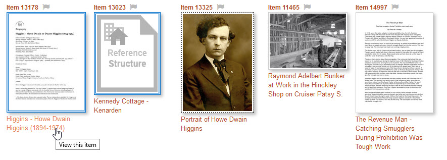
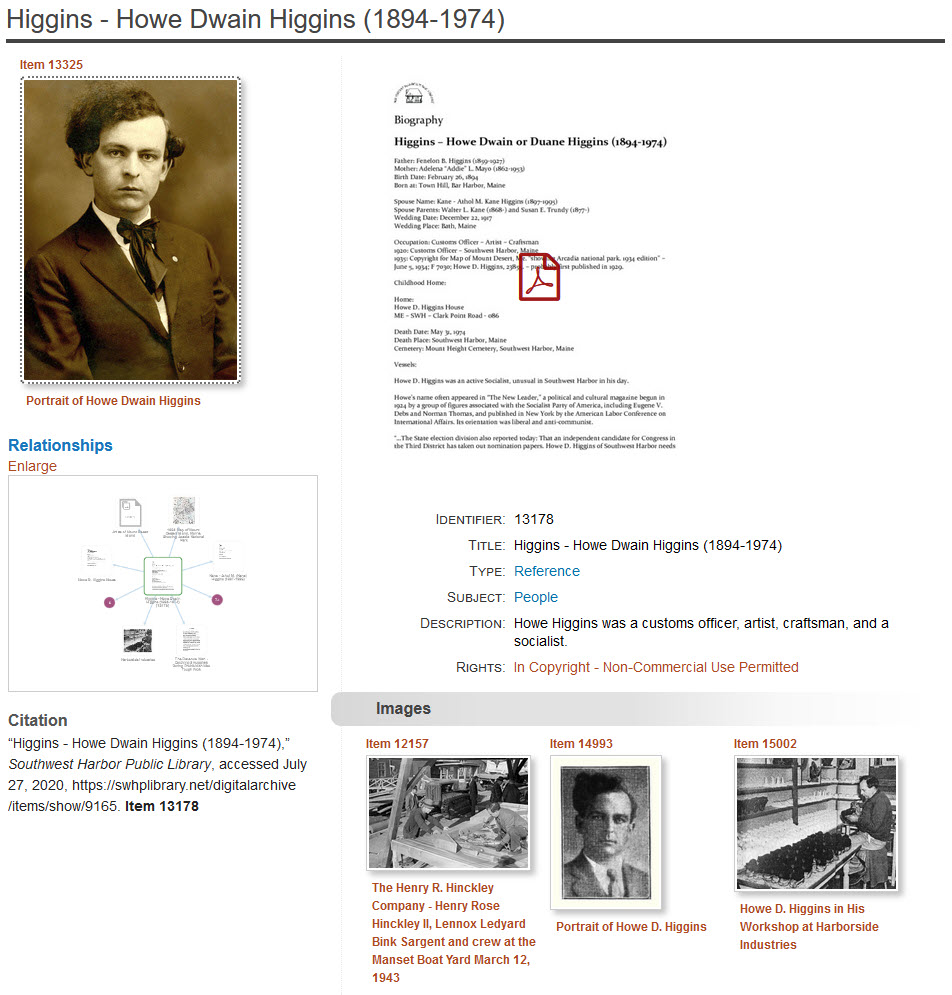
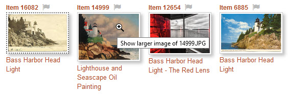
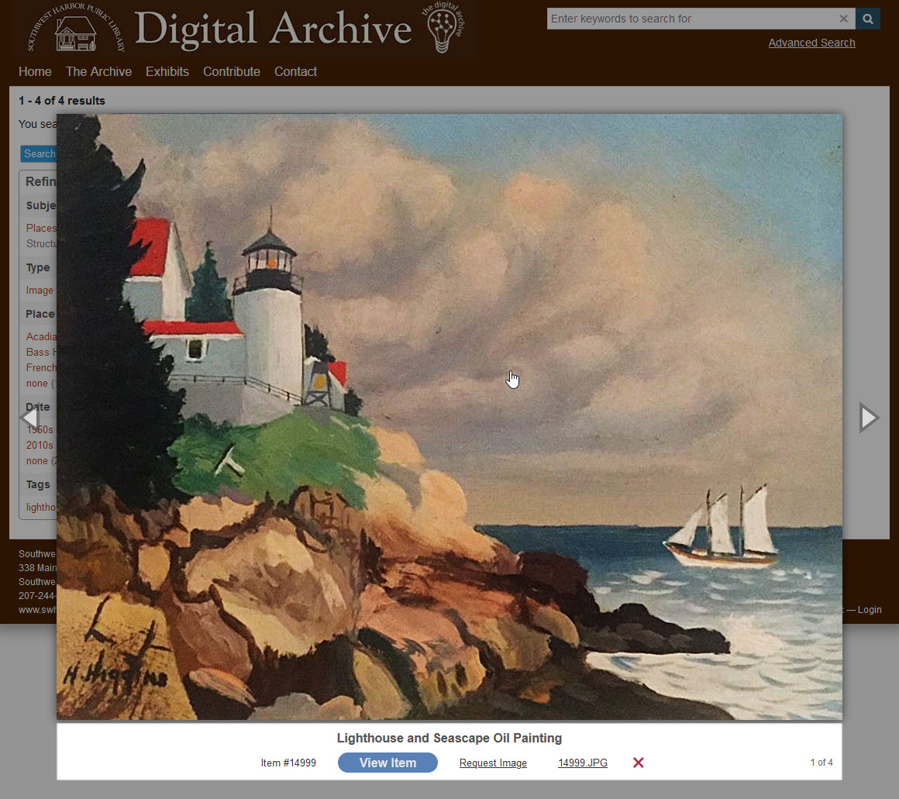
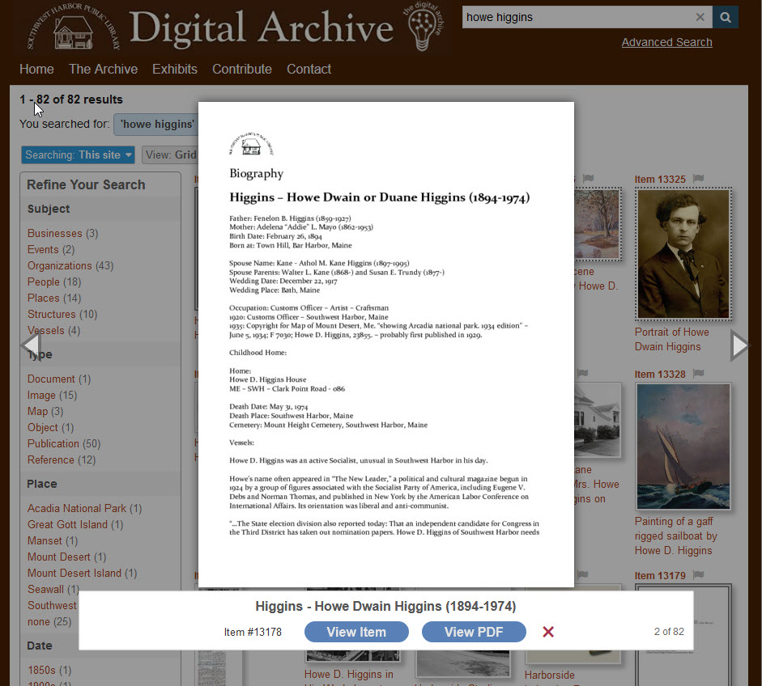
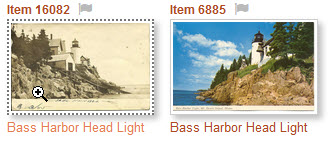
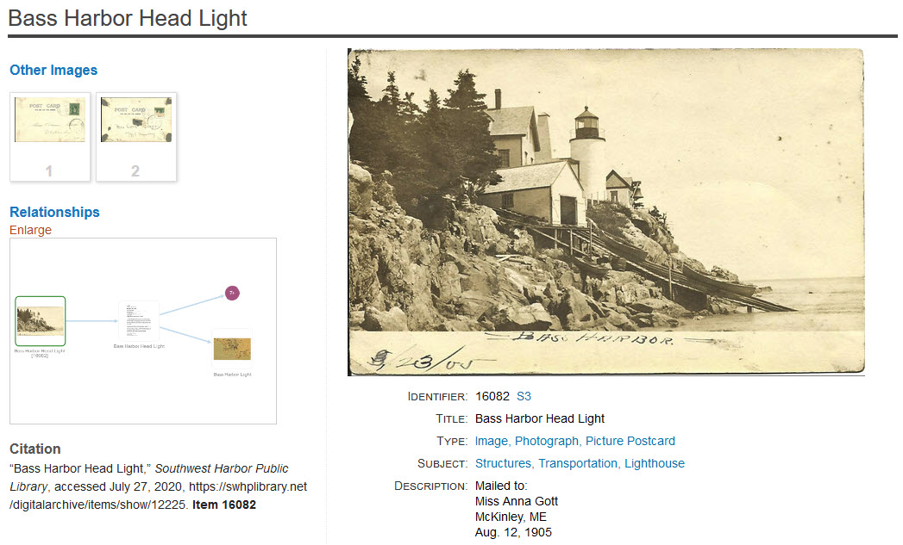
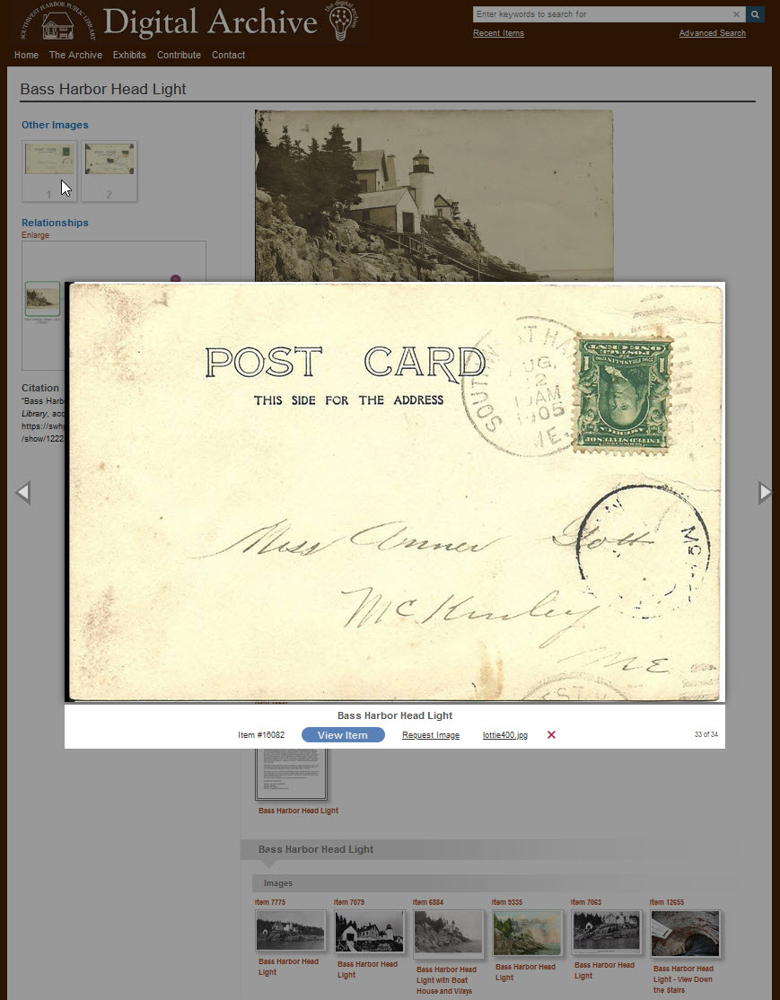

# View an Item

You can view one item from search results in these ways:

- Click on the thumbnail title to view the item on its on page
- Click on the thumbnail itself to see a larger version of the image
- Click on the flag icon to mark the item for viewing later

The appearance of an item's thumbnail tells you something about the item:

-   A blue double border (items 13178 and 13023) indicates that it's
    a [Reference item](/user/relationships/#reference-items).
-   A dotted border (item #13325) indicates that the item has two or more attachments.
-   A placeholder thumbnail indicates that the item has no attachments. The placeholder
    for item 13023 indicates that it's Reference item for a structure.
-   A blue flag (items 13325 and 14997) indicates that the item has either been marked to view
    later or that it is already on the recently viewed items list. A gray flag indicates that
    the item is not on the recently viewed items list. [Learn about flagging items](/user/recently-viewed).

## Click the title to view the item

Click an item's title to go to that item's page. The example above shows the cursor
on the title for item #13178. When you click the title `Higgins - Howe Dwain Higgins (1894-1974)`,
you go to the page shown below.

The item page shows the item's:

-   Metadata fields **_Identifier_**, **_Title_**, **_Type_**, **_Subject_**, **_Description_**, and **_Rights_**.
-   An image of the first page of a PDF file attachment which you can click to open the PDF in
    a separate browser tab.
-   Its cover image (a feature that uses another item's image to annotate
    a [Reference item](/user/relationships/#reference-items)).
-   Its relationship visualization (at lower left below the cover image).
-   Its related items (only three are shown before the screenshot gets cutoff at the bottom).

You can click the title of a related item thumbnail to go to its page, or you can click
its thumbnail to see a larger image. [Learn about relationships](../relationships).

## Click the thumbnail to see a larger  image

When you hover your mouse over a thumbnail, a small magnifying glass icon appears to indicate
that you can click the thumbnail to see a larger image in a pop-up lightbox window as shown below.

To see larger images of the other thumbnails do one of the following:

-   Click the currently displayed image to see the next image
-   Click the arrow icons that appear to the left and right of the image
-   Press the left and right arrow keys on your keyboard

##### Caption area

The caption area below the image shows:

-   Item title
-   Item identifier number
-   `View Image` button you can click to view the item on its own page
-   `Request Image` link (only appears for organizations that have that feature enabled)
-   Link to the item's file that you can click to see the image in its own browser tab
-   Red close `X` to close the lightbox window
-   Indication of how many thumbnails appear on the page

##### Quick PDF view

If the item's attachment is a PDF file, the caption area shows a `View PDF` button
that you can click to open the PDF file in its own browser tab without having to
first go the item's page.

## Viewing all of an item's images

The lightbox window only displays an item's first image. To see all of an item's image
and PDF attachments, go to the item's page by clicking its thumbnail title or by clicking the the `View Item`
button in its lightbox window caption. You can tell that item 16082 below has multiple images
because of its dotted border. The solid gray border for item 6885 means it has just one image.

When you click on the title of item 16082 shown above, you go to its item page shown below. The item
page shows a medium size version of its first image, and thumbnails at left of its other images.

You can click on the other images to view them in a popup lightbox window. While the lightbox
is being displayed, you can view all of the images on the page by clicking the left and right
arrows (or by pressing the arrow keys on your keyboard). The lightbox caption indicates that the
postcard back is image 33 of 34 being viewed. There are many images on this page because
the item is related to other items as you can see at the bottom of the screenshot where six
related item thumbnails appear before the screenshot is cutoff.

---