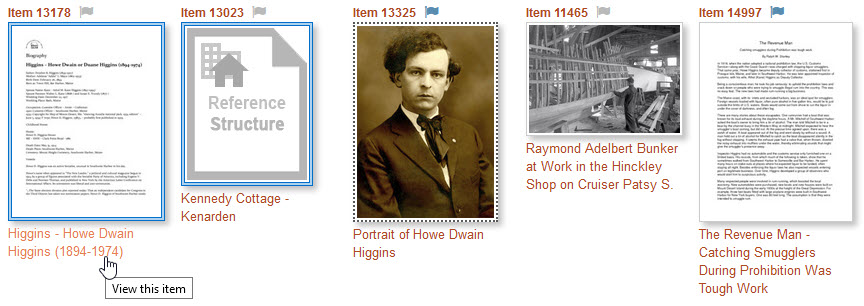

# Viewing Items

Search results present you with many items to choose from. The screenshot below
shows five search results in [Grid View](/user/viewing-search-results/#grid-view).

You can view more about a specific item these ways:

- Click its title to view the item on its own page
- Click its thumbnail to see a larger version of the image
- Click the flag icon to mark the item for viewing later

The appearance of an item's thumbnail tells you something about the item:

-   A blue double border (items 13178 and 13023) indicates that the item is
    a [Reference item](/relationships/reference-items).
-   A dotted border (item 13325) indicates that the item has two or more attachments.
-   A placeholder thumbnail indicates that the item has no attachments. The placeholder
    for item 13023 indicates that it is a Reference item for a structure.
-   A blue flag next to the item number (items 13325 and 14997) indicates that the item has either been marked to view
    later or that it is already on the recently viewed items list. A gray flag indicates that
    the item is not on the recently viewed items list. [Learn about flagging items](/user/recently-viewed).

## Click the title to view the item

Click an item's title to go to that item's page. The example above shows the cursor
on the title for item 13178. When you click the title *Higgins - Howe Dwain Higgins (1894-1974)*, the page shown below displays. [View this item in the Digital Archive](https://swhplibrary.net/digitalarchive/items/show/9165).

The  page for item 13178 (above) shows the following:

-   [Cover image](/relationships/reference-items/#cover-images-for-reference-items) at upper left
-   Relationship [visualization](/user/viewing-related-items/#visualization) (below the cover image)
-   PDF file attachment (upper right) which you can click to open the PDF in a separate browser tab
-   Metadata fields: **_Identifier_**, **_Title_**, **_Type_**, **_Subject_**, **_Description_**, and **_Rights_**
-   [Related items](/user/viewing-related-items/) (three related images are shown before the screenshot gets cut off at the bottom)

You can click the title of a related item thumbnail to view that item's page, or you can click
its thumbnail to view a larger image. [Learn about relationships](/relationships/getting-started-relationships/).

## Click the thumbnail to see a larger  image
The screenshot below shows four search results in [Grid View](/user/viewing-search-results/#grid-view).

When you hover your mouse over a thumbnail, a small magnifying glass icon appears to indicate
that you can click the thumbnail to see a larger image in a pop-up lightbox window as shown below.

To see larger images of the other thumbnails shown in the search results do one of the following:

-   Click the currently displayed image to see the next image
-   Click the arrow icons that appear to the left and right of the image
-   Press the left and right arrow keys on your keyboard

##### Caption area

The caption area below the image shows:

-   Item title
-   Item identifier number
-   **_View Image_** button - click to view the item on its own page
-   **_Request Image_** link (only appears when the
    [request image feature](/plugins/avantcommon/#request-image-url-option) is enabled)
-   Image file name as a link - click to see the image in its own browser tab
-   Red X to close the lightbox window
-   Indication of how many thumbnails appear on the page (lower right corner)

##### Quick PDF view

If the item's attachment is a PDF file, the caption area shows a **_View PDF_** button
that you can click to open the PDF file in its own browser tab without having to
first go the item's page.

## Viewing all of an item's images

Some items may have multiple image and/or PDF attachments. You can tell that item 16082 below has multiple images
because of its dotted border. The solid gray border for item 6885 means it has just one image.

The lightbox window only displays an item's first image attachment. To see all of an item's image
and PDF attachments, go to the item's page by clicking its thumbnail title or by clicking the **_View Item_**
button in the lightbox window caption.

When you click on the title of item 16082 shown above, you go to its item page shown below. The item
page shows a medium size version of its first image, and thumbnails at left of its other images.

You can click on the other images to view them in a popup lightbox window. Within the lightbox
you can view all of the images on the item's page by clicking the left and right
arrows (or by pressing the arrow keys on your keyboard). The lightbox caption indicates that the
postcard back is image 33 of 34 being viewed. There are many images on this page because
the item is related to many other items as you can see at the bottom of the screenshot where six
related item thumbnails appear before the screenshot is cutoff. The lightbox window lets you scroll through all
of the images associated with an item.

## Viewing zoomable images

Some items have an image that you can zoom into to see more detail. The first screenshot below
shows an item with a zoomable images that is zoomed, that is, the entire item is visible.
The second screenshot shows the same item with the image zoomed in to near the center of the
photo where two men are standing.

### Zoomed out image

### Zoomed in image

In the screenshot below, the image inset in the upper right corner shows a red
rectangle indicating which part of the entire image is visible. You can click-drag
the red rectangle within the inset to see detail in other parts of the image.

### Navigating a zoomable image

-   Zoom in or out using the scroll wheel on your mouse  or  
    click the **+** and **-** buttons in the controls at upper left
-   Click the rightmost control to make the image display full screen
-   Click the house icon to return the image to fully zoomed out
-   Pan the image by click-dragging the image itself or the red rectangle in the inset

### Multiple zoomable images

You can make more than one image zoomable as shown in the two examples below.
The first example has two zoomable images and the second has eight.
This feature lets you zoom and pan all of the images together without having to view each one individually.

[Learn how zoomable images get created](/administrator/zoomable-images/).

---