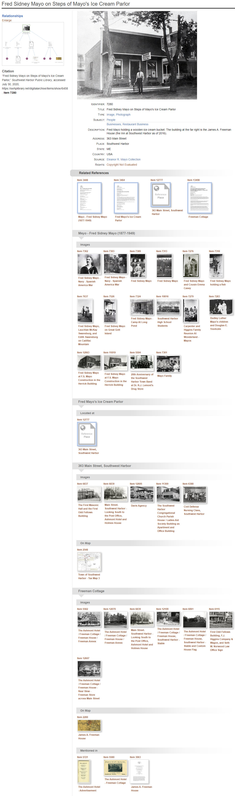
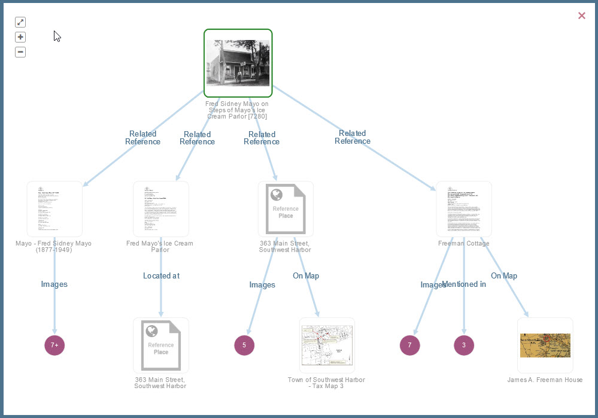
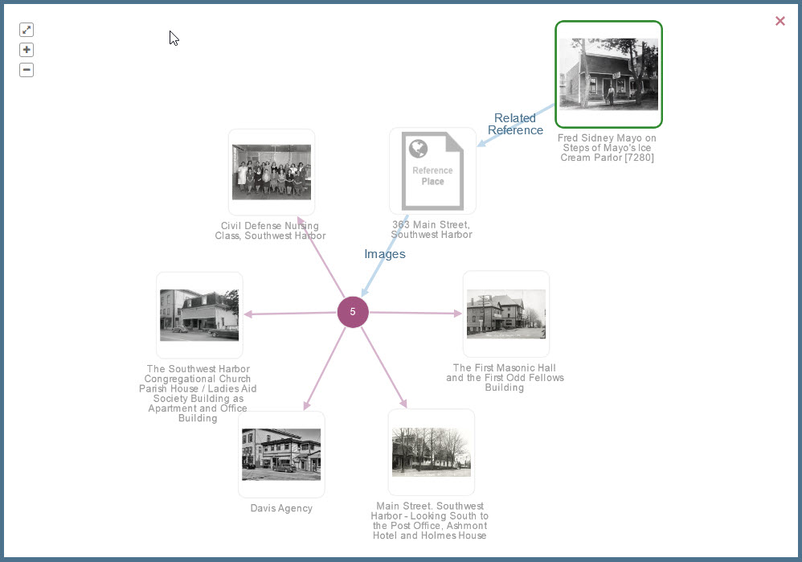

# Viewing Related Items

When you view the page for one item in the Digital Archive, you also see other items in the
collection that are related to the item you are viewing. Not every item has related items,
but some have quite a few as shown in the very long screenshot below for item 7280.

On the left side of the screen, in the **_Relationships_** section, a *visualization* preview 
graphically depicts all of the this item's related items. A
[closeup of the visualization](/user/viewing-related-items/#visualization) appears after the screenshot below.
Thumbnails for each related item display under the item's metadata, grouped by the type of relationship.
The groups are separated by horizontal gray bars.

Every item page has this same form. The [visualization](/user/viewing-related-items/#visualization) provides a high level
view of the item's relationships, and the thumbnails provide an image and title for every related item.
You can click the title of a related item to go to that item's page, or you can click its thumbnail to see
a larger picture.

[View this item in the Digital Archive](https://swhplibrary.net/digitalarchive/items/show/6458).

## Visualization

When you click the **_Enlarge_** link just above the visualization preview shown in the screenshot above, you see a larger version of the visualization as shown below. In a visualization,
the item you are viewing, known as the *primary* item, appears with a green border around it.
In this example, the primary item is 7280. In this visualization the primary item appears at the top, but 
the it can appear anywhere within the visualization depending on the layout and the number of related items.

This visualization reveals that item 7280 has
[direct relationships](/relationships/kinds-of-relationships/#direct-relationships) to the four items on
the middle row, and [indirect relationships](/relationships/kinds-of-relationships/#indirect-relationships)
to all of the items on the bottom row.

To keep the diagram from becoming too cluttered, groups of two or more items having the same relationship
to their primary item are consolidated into expandable purple dots. The number inside the purple dot indicates the number of items in the group.

When you click on a purple dot, the graph
changes to show those items. The screenshot below shows what you see when you click on the purple dot
that has "5" in the center.
 

In the expanded graph, you can click on the purple dot in the center, or click on the primary item
at upper right, to go back to the previous graph. In any visualization, you can
click on a thumbnail to go to that item's page.

---
