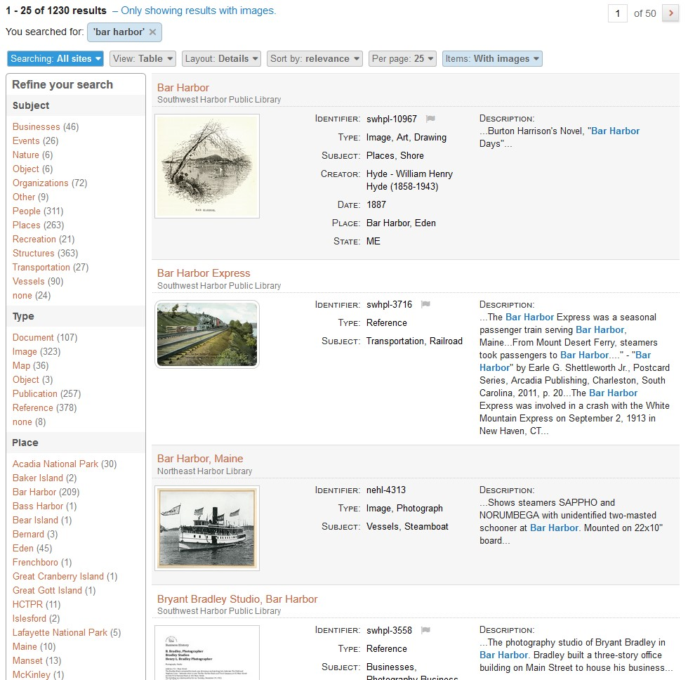
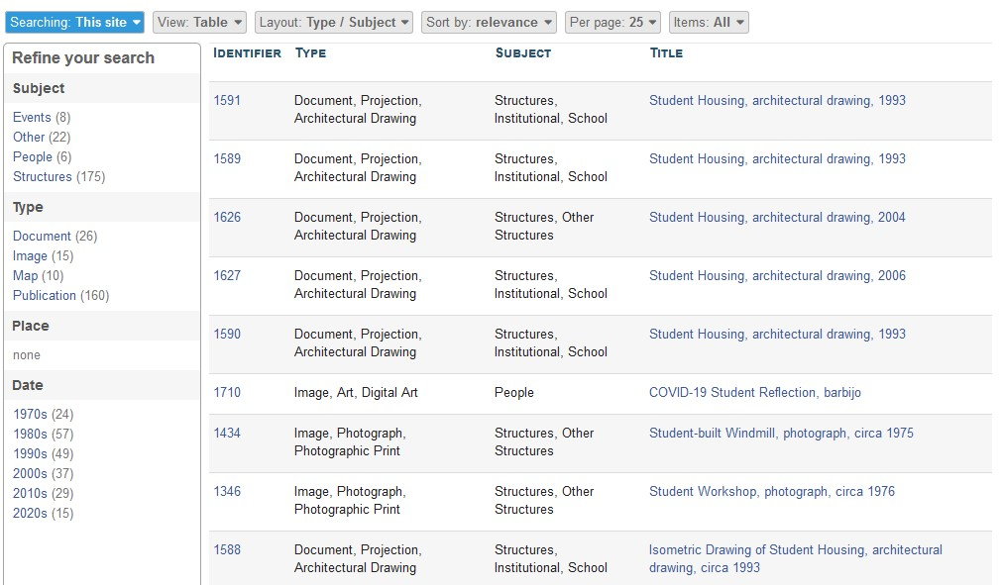
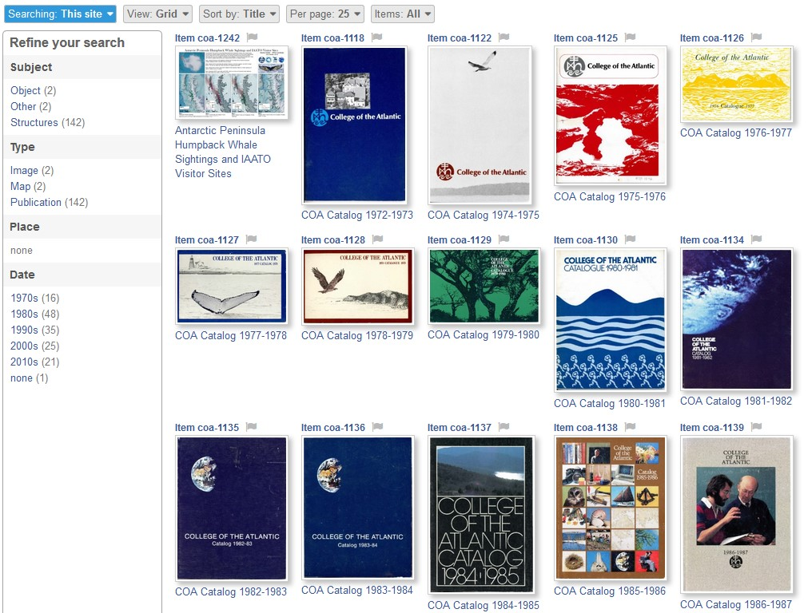
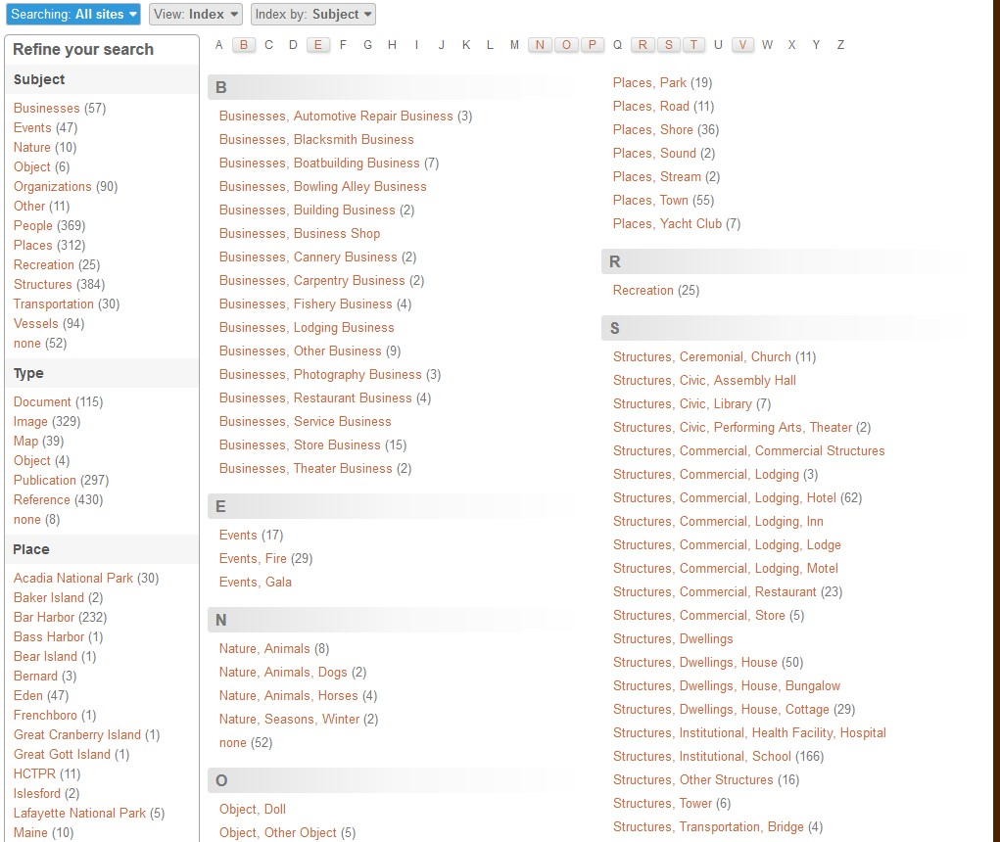

# Viewing Search Results

You can view search results in three ways:

- Table View
- Grid View
- Index View

Within each view, you can choose how to sort the results to further organize the information.

---

**To manipulate the different view options and layouts**, use the selector bar at the top of the search results page.

---

### Table View

**Table View** is the default view for a set of search results. Items are listed one at a time, each item occupying an individual row. 

**To view only items with images**, use the Items menu to select *With Images*.

**To customize the results in Table View**, use the Layout menu on the selector bar. Each Layout option displays the same list of search results, but with differing types of information visible in the list of results. The screenshot below shows results in Table View, with a Type/Subject layout.

**To change the display order of search results in Table View**, click the red arrow that appears next to the column heading that you are sorting by. 

Click the arrow again to reverse the order. The arrow points up or down to indicate ascending and descending order, respectively.

---

### Grid View

**Grid View** displays search results as a grid of thumbnails. 

**To sort items in Grid View**, choose an option from the Sort By menu. To reverse the order the items are displayed in, click on that menu option again.

**To view only items with images**, use the Items menu to select *With Images*.

---

### Index View

**Index View** displays search results consolidated into unique groups, alphabetically or numerically. Numbers in parentheses indicate how many items belong to an individual group within the index when there is more than one item per group.

**To change how search results are grouped in Index View**, use the Index By menu on the selector bar. You can nagivate through the Index using the letters or numbers along the top of the page.

---

### Good to Know

**To preview an image** without leaving the search results, click on its thumbnail from the search results or on an item's individual page. Use the arrows to the left/right of the image to preview other item images in the search results. 