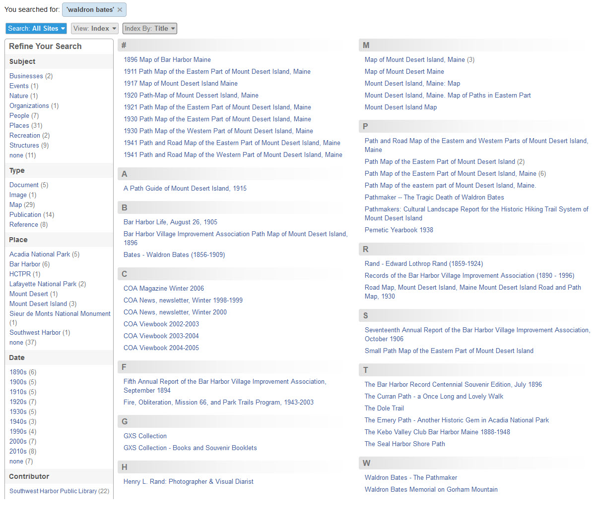
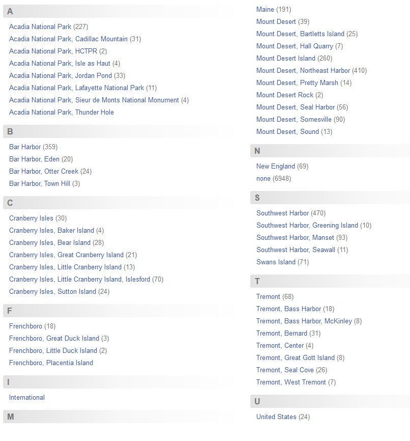
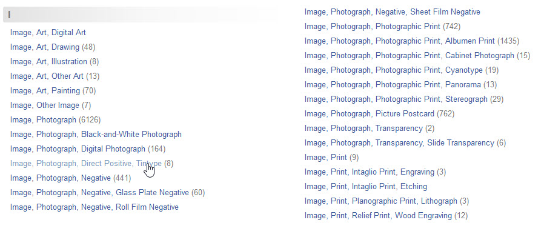

# Viewing Search Results

You can view search results in three ways:

- **Table View**
- **Grid View**
- **Index View**

Use the **_View_** selector to choose how you want to view results. The selector is located in the options bar at the top of
the search results page. You can use the other selector bar options to sort and further organize results.

[Learn about viewing items](/user/viewing-items)

## Table View

**Table View**, with the Details layout, is the default view for search results. This view displays each item in 
a separate row, showing a thumbnail image and many of the item's metadata fields.

If the keywords you searched for occur in the item's description, or in its PDF file attachment, they appear
highlighted in blue in the **_Description_** and **_File Attachment_** sections of the search results.
In the example below, the search keywords `waldron` and `bates` appear in blue.

If the item has a PDF attached to it, the PDF's file name appears at the top of the **_File Attachment_**
section. In the example above, the third item has a PDF file named `ANP Pathmakers.pdf`.
You can click the file name link to open the PDF in your browser's PDF viewer.

#### Compact Table View layouts

You can see the same results in a more compact layout by choosing a different option from the **_Layout_** selector.
The example below shows the same results in the `Type / Subject` layout. Digital Archive administrators can create custom layouts. 

You can sort the columns in a compact layout by clicking on a column header. In the example above, the
results are initially sorted by relevance, not by any column. You can change the sort order by
clicking on a column header. For example, clicking on the **_Type_** column header sorts the results by the item type field. 

You can also sort by choosing a metadata field
name using the **_Sort by_** selector. To change the sort from ascending to descending and vice versa,
use the selector and choose the field again.

---

## Grid View

**Grid View** displays search results as a grid of thumbnails.

You can sort items in Grid View by choosing a metadata field name using the **_Sort by_** selector.  
To change the sort from ascending to descending and vice versa, use the selector and choose the field again.

#### Hiding items that have no image

In the example above, notice the second item in the first row. This is an example of an item 
that has no image or PDF file attached to it, so a placeholder icon for the map displays
instead. You can hide items with no image or PDF file attachment by choosing `With Images`
from the **_Items_** selector. This works in both Grid View and Table View.

---

## Index View

**Index View** displays search results as an alphabetized index of unique values for a
single metadata field. You choose the metadata field you want to index by from the
**_Index by_** selector.

The example below shows the same search results as the Table View and Grid View examples
above, but the results are indexed by the **_Title_** metadata field.

The next example shows all of the items in a collection with type `Image`, indexed by the **_Place_** metadata field.
Numbers in parentheses indicate how many items have that Place. For example, there are 30 photographs of Acadia
National Park when it was known as Lafayette National Park.

The example below shows the same search results as above, except the results are indexed by the **_Type_** field.
Because all the types are images, they are all indexed under the letter `I`, but the index shows what kinds of
images are in the collection and their quantities.

 You can click on an entry, such as the one for `Tintype`, to see its eight items as shown below.

